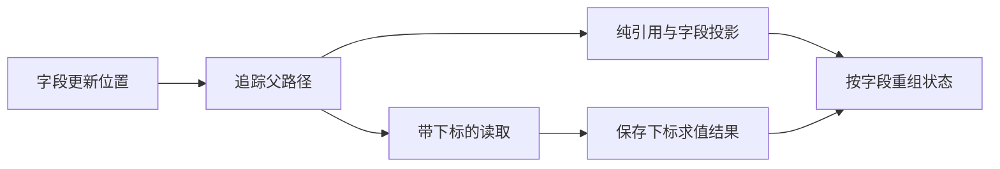
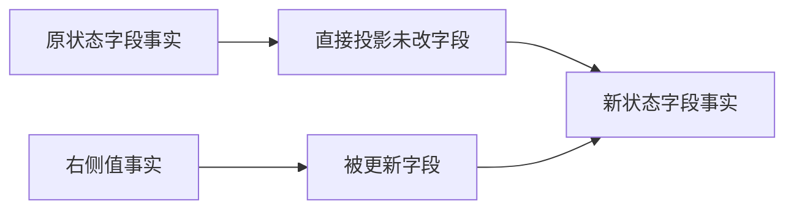

# 字段更新来源保留

## Intent

修复循环字段更新时编译器临时变量冻结整个聚合，导致未更新兄弟字段失去 owned 来源的问题。优先处理专项反馈，再继续流程状态迁移。

## Data

独立验证在 f5657370c 后报告 24 项中 2 项失败；不含后续 index 更新的 do-map 控制通过。iteration/update.prepare 对字段 parent 无条件 read_value=true；temporary 将 reference/field 标为普通借用，随后 ScopeResult 冻结对应整树。

## Edges

只移除无须求值缓存的字段父路径临时借用；保留下标表达式的求值一次性与下标越界先于赋值右侧的顺序。不能放宽用户借用 Freeze、所有权检查或修改用例期望。复用对方已有专项源码，不新增测试，不运行全量测试。当前 FlowState 及列表 with 改动未提交，修复提交应与其隔离。

## Answer

字段的纯 reference/field/tuple_field 路径直接作为投影来源；遇到 index 边界仍保存索引访问值。运行反馈中现有专项与相关所有权专项，成功后单独提交并 push。

