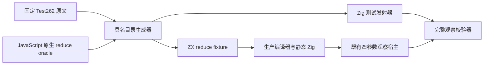
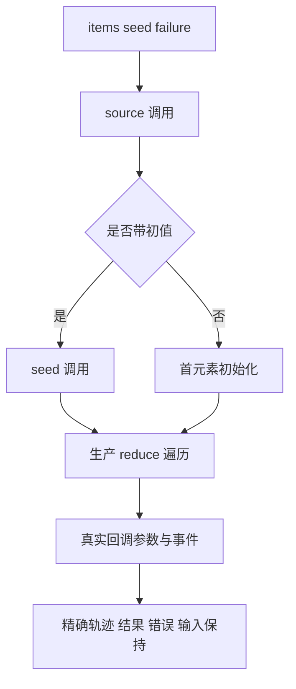

# 归约初值与回调轨迹

- **Intent：** 将带初值和省略初值的 reduce 真实回调轨迹接入正式具名目录，补齐只观察最终值无法完成的原文适配。
- **Data：** 固定源码 `5ae6c495990a40d219232fe8d796b8f87b5d9bba`；完整阅读固定 Test262 快照中的 `9-c-ii-19`、`9-5`、`8-b-iii-1-2`、`9-c-i-2`、`5-1` 五条原文；沿用 `reduce_initial` 的真实四参数记录宿主、native 编译工具和执行器。
- **Edges：** 仅修改测试包。回调主体仍由 ZX 表达，并调用测试宿主记录实际参数；宿主只记录观察与注入错误，不实现 reduce 遍历。原文不观察的 undefined 返回改为 current；空输入 TypeError 对应 zxc 的 IndexOutOfBounds，明确记为适配。混合数组、稀疏数组、arguments 不在本部分支持范围。
- **Answer：** 按 seeded/unseeded 分类的具名 JSONL 目录及生成源头；完整比较结果或错误、调用次数、previous/current/index/source[index]/source.length、初始化事件及源指针身份。源码与编译库消费路线各在 Debug、ReleaseSafe 执行全部用例。保存原文、执行证据、草稿和发布范围，正常 hooks 后英文规范提交并 push。

## 实施步骤

1. 在新固定工作树开发，所有草稿先存于本目录。全 review 路径去重后登记五条原文身份。
2. 新增独立 JavaScript reduce oracle、目录生成器、Zig 测试发射器和观察校验器。复用既有宿主、声明及执行器，避免增加另一套回调实现。
3. 增加 `reduce_trace` 目录类型和正式 `test-reduce-traces` 构建入口，并接入 `test-runtime`。普通目录仍走既有通路。
4. 用官方 harness 执行原文普通与严格模式；重新生成当前编译器模块。对空输入、单元素、多元素、长数组、不同 seed 及 source/seed/callback 失败做具名执行。
5. 核对完整用例名称、实际退出状态、签名、静态链接及生成一致性。仅通知确认的新实现缺陷。
6. 发布已执行草稿，保护外部修改；提交后范围核验终止成功，再 push 并核对远端。

## 架构图

## 数据流图

ZX fixture 是一个集合观察算法，算法循环保留在生产生成代码；不引入 RX 空包装或新运行时。本次 native 宿主仅属于测试观察边界。

## 自我批判

不能用最终结果 9 代替 `called===1` 和首回调累加值 11 的断言。新增目录须直接登记这些观察字段，并由实际宿主记录比较。不能将原文 `new Array(10)` 变为空密集数组后声称保留稀疏语义，因此只适配真正的 `[]` 空输入原文。新增内部错误名与原文错误类不同，必须标为 adapted。目录审计不计为执行，完整目标仍包含未审阅原文与尚未覆盖的语言特性。
