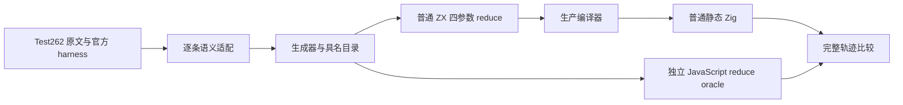
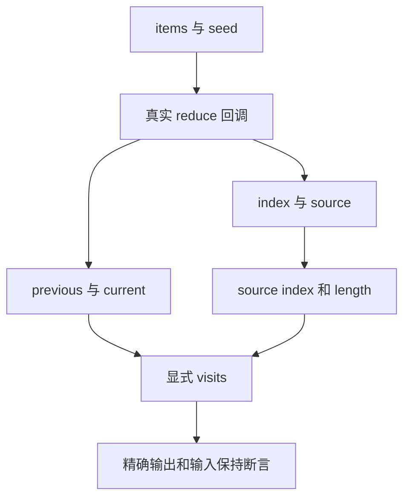

# 归约回调完整观察

- **Intent：** 将现有 reduce 观察目录扩展到真实四参数回调，完整适配三条尚未归类的 Test262 原文，并保留既有回归。
- **Data：** 固定源码 `71ffb73876388a145a9fe99ae5253c23eeb6990c`；上游固定快照 `7ab7fafa0003f73fc85c1b95d88094d33f7eb8bd`。已完整阅读 `15.4.4.21-9-c-ii-4/5/13.js`，并对所有 review 文件做路径去重。
- **Edges：** 仅修改测试包。原文外部可变观察状态转换为显式返回轨迹，数字累加值保存在观察状态中。原文隐式 undefined 返回改为 current；本次三条原文断言不依赖替换后的返回值。不会声称支持 arguments、稀疏数组或动态对象；省略初值原文仍待单独适配。
- **Answer：** 66 个具名目录用例，每次记录 previous、current、真实 index、source[index]、source.length；Debug 与 ReleaseSafe、源码与编译库消费四种组合实际执行全部用例。保存原文、真实 harness 结果、生成源码、命令、退出状态与 SHA。完成后按英文 Conventional Commits 提交并 push。

## 执行步骤

1. 保留旧工作树版本，创建本次固定工作树；草稿、实施与执行记录存于本目录。
2. 从生成源头扩展现有 observer，不新增运行时机制。保留全部旧输入和补充边界，增加原文三条输入。
3. 运行原文 normal/strict 与官方 harness；重新生成当前编译器模块。
4. 通过真实分析、IR 校验、Zig 生成与静态编译执行用例。编译库路线先释放提供者和库，再由解码结果独立消费。
5. 检查用例名、完整输出、输入保持、签名、生成一致性、ZX 物理行数与矩阵审计。只将确认的新实现缺陷通知实现会话。
6. 复制已执行草稿到正式测试包，验证提交范围和外部修改保护；正常 hooks 提交，提交后核验终止成功后再 push，核对远端 HEAD。

## 架构

## 数据流

测试 fixture 是一个内聚集合观察算法，循环留在 ZX；不引入 RX 空包装，也不修改编译器的 RX/ZX 编排。

## 自我批判与验收边界

轨迹比原文断言更强，但新增字段不代表原文也断言过这些字段。原文 4/5 仅依赖索引与调用发生，原文 13 仅依赖初次 previous 和源元素对应关系；review 理由分别记录这种对应。source[index] 数值相等不证明指针身份，本次不作此声明。目录数量不等于已执行数量，矩阵审计不能替代四组合执行。全部 Test262 与全部 zxc 特性尚未完成。
