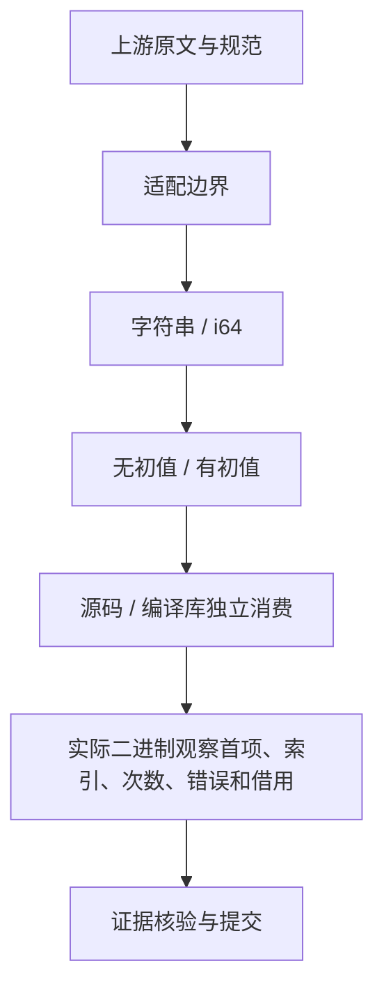

# 归约省略初值

## IDEA

- Intent：验证 reduce 无初值与有初值的真实运行差异，对齐上游首项/首回调/单元素语义。
- Data：固定 a740d201b；Test262 7ab7fafa 原文；当前 lower 使用首项与索引 1；既有 observer 始终有初值。ECMAScript reduce 算法：https://tc39.es/ecma262/multipage/indexed-collections.html#sec-array.prototype.reduce。
- Edges：静态齐次列表不伪装 JS 稀疏数组、动态原型、混合元素或 undefined；空输入使用现有 IndexOutOfBounds。源码与库消费均需实际执行。ZX 不超过 120 行，不改生产实现。
- Answer：原文正常/strict 完整断言、两种值类型和两种初值模式的原生回调观察、源/库路径与 Debug/ReleaseSafe 门禁；保存证据后英文规范 commit / push。

## 自我批判

单元素只比较结果不足以证明零回调，必须让回调可观察且可配置失败。两个元素的返回值不能替代首个 accumulator / current / index 和次数；这些观察需来自独立宿主。目录计数不证明执行通过。
