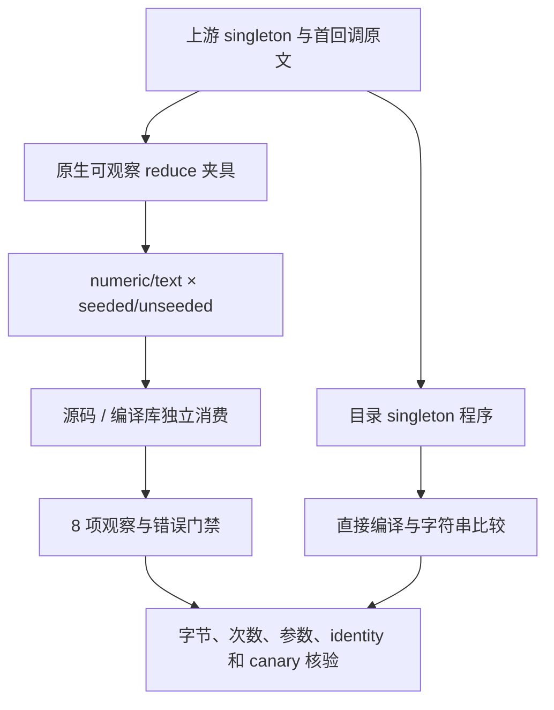
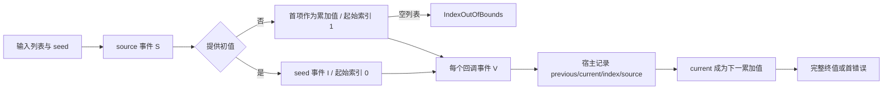

# 归约省略初值执行记录

## IDEA

- Intent：对齐 reduce 无初值的首项初始化与首回调边界，并验证当前实现提供的四个回调参数。
- Data：固定 a740d201b；锁定 Test262 原文两项；普通/strict 共 4 次执行，6 个完整原断言通过；第二轮重新生成 81 个模块；Debug / ReleaseSafe 各 8 个原生二进制 × 8 项命名测试全部通过，加各 1 个实际目录源码二进制；共 18 个实际运行二进制、130 次命名测试执行。
- Edges：i64/string 齐次密集列表，不冒充稀疏数组、undefined、原型属性或混合 JS 值。无初值空列表按当前 zxc 契约返回 IndexOutOfBounds，不能宣称同名 TypeError。正式源码只改测试包。
- Answer：源码及编译库独立消费、Debug/ReleaseSafe、两类值与有/无初值的真实原生观察；额外编译实际目录 cases.zx，执行原字符串比较；全部通过、正常 hooks、保护他人文件后英文 Conventional Commit / push。

## 原文与适配

`15.4.4.21-7-11.js` 保留原 singleton 字符串和省略初值。原空函数不会被执行；静态类型需要明确 string 返回值，使用返回 current 的回调。目录程序直接调用 reduce，没有按测试输入设置分支。原生夹具令回调可观察并可失败，验证该 singleton 无初值时回调为 0 次；有初值对照为 1 次。该文件新增 adapted 分类。

`15.4.4.21-9-c-ii-19.js` 的原输入 [11,9]、首回调 previous=11/current=9/index=1、一次调用均在原生门禁中观察。宿主为继续验证多步累加链而返回 current；原文回调返回 undefined 且第二项之后没有回调。本批保留原文及对应观察证据，但不新增该文件的分类行，避免目录中的单个最终值代替原文 true/called 两个完整观察。

## 实际运行范围

4 个程序：numeric/text 各 seeded/unseeded；每个同时经源码与 link→encode→decode→独立消费路径；每种 host 编译模式生成 8 份。库路径释放 provider 与编码缓冲后才分析消费者，沿用既有 predicates/compile.zig，未复制库联结实现。

每个生成程序实际运行 8 项命名测试：空输入、单元素、首回调、顺序与源数组身份、多次独立执行、source/seed 错误顺序、逐位置回调失败及 4096 项遍历。宿主记录每个 previous/current/index/source 和 S/I/V 顺序，检查独立循环推导的期望及输入 canary；返回 current 使每步 previous 的预期来自前一个输入元素，避免调用被测 reduce 作 oracle。

实际目录 `without_initial/cases.zx` 还通过 compiler.compile 编译并执行独立 singleton 测试；不以宿主夹具等价推断目录源码已执行。正式构建添加 `test-reduce-initial`；原有 runtime suite 也注册新增目录用例。直接 API 门禁不代表完整 zig build 回归。

## 预备失败与修正

首轮 Debug / ReleaseSafe 生成均在声明文件处失败，尚未产生运行用例。原因是我误加了当前声明语法不支持的 readonly 修饰符；并非实现错误，也不只是顺序错误。去掉该修饰符，宿主使用 Zig 的 const 参数和视图保持只读。两轮输入、实际原声明、原失败日志和草稿均保留，第二轮使用新 durable 目录，未覆盖第一轮证据。

## 架构与数据流

## 分类计数与发布边界

独立矩阵审计：目录 128615（增加 1），adapted 824（增加 1），excluded 2081、equivalent 103，未审查上游 50589（减少 1），上游关联目录项 6954。该计数检查不测量执行状态。

验证期间主分支前进到 bbc16a941，新增 RX artifact plan 集成。本批固定 a740d201b，不宣称覆盖该后续生产变更；发布保护保存当前主分支新增/变更包文件，后续专门验证新集成。正式修改 19 个测试包路径；ZX 实际总行数 5—9，未修改生产包。

## 自我批判

8 项名称在不同路径重复执行不能当作 128 个独立设计用例；应分别报告 8 项行为模板和实际执行次数。仅分类 singleton 上游文件，不借这项宣称稀疏/原型/混合值语义已对齐。省略初值仍可能发生编译器生成状态的初始化分配，不宣称零分配。目录计数与实际二进制证据分别记录，目标仍未全部完成。
