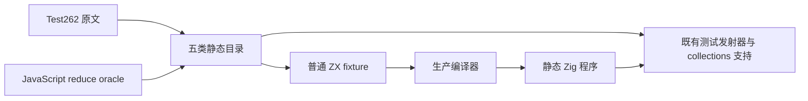
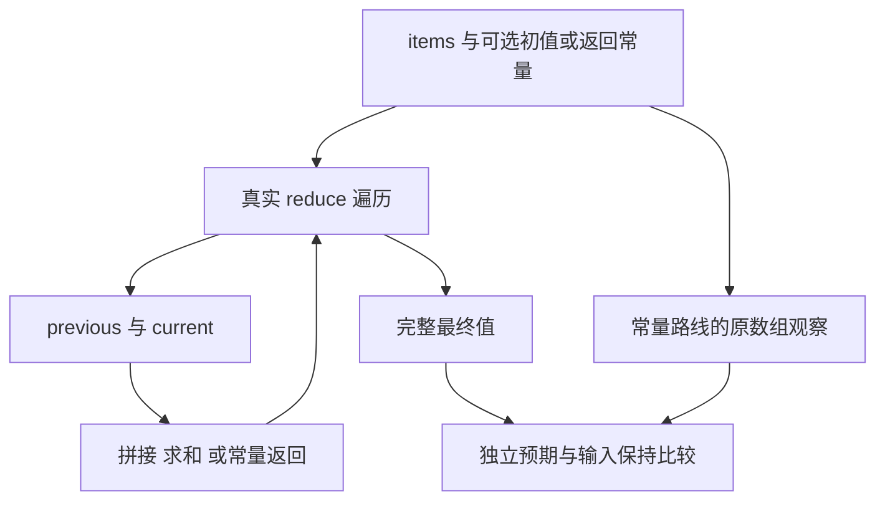

# 归约计算与输入保持

- **Intent：** 验证回调返回值成为下一次累加值的真实归约计算，补齐省略初值的字符串拼接顺序和常量回调不改变源数组的原文。
- **Data：** 固定源码 `a95899844a6f4dab79340287cf616c873ffc51ce`。完整阅读 Test262 `15.4.4.21-10-1.js` 与 `10-2.js`；全 review 路径检索确认二者未登记。已有字符串顺序目录使用显式 seed，本次补齐省略初值路线。
- **Edges：** 只修改测试包。字符串 `+` 转为 zxc 模板拼接，保留原字符串列表与结果；常量 1 改为输入字段 returned=1，其他 returned 控制验证通用算法。整数求和属于 zxc 补充用例，不把 subclass、动态原型或混合类型原文算为适配。
- **Answer：** concat seeded/unseeded、sum seeded/unseeded、constant unseeded 五类具名目录，约 206 个用例；每类在 Debug/ReleaseSafe、源码/编译库消费四种组合全部执行。保存原文、完整返回值、输入保持检查、命令、实际退出状态及 SHA，完成后英文 Conventional Commits 提交并 push。

## 执行计划

1. 创建固定工作树；先在本目录保存草稿与纯 JavaScript oracle。
2. 用同一目录生成源头生成五类普通 ZX fixture 与 JSONL；沿用 collections 支持和正式发射器，不新增目录执行机制。
3. 常量回调 fixture 返回实际归约值及原输入数组，完整保留原文五个元素断言；输入保持支持额外对可写副本做执行前后比较。
4. 执行原文普通／严格模式；重新生成当前编译器模块，走生产分析、IR 校验、静态 Zig 编译和独立编译库消费。
5. 检查具名用例完整性、错误、输出、输入保持、签名、跨优化模式生成一致性、严格类型和登记审计。只有确认的新实现缺陷才通知实现会话。
6. 发布已执行草稿并保护其他修改；正常 hooks 提交，提交后核验终止成功再 push，核对远端 HEAD。

## 架构图

## 数据流图

每个 fixture 是一个内聚集合算法，不引入 RX 空包装、运行时调度或生产数据复制。测试用输入副本用于检测意外写入。

## 自我批判与成功边界

字符串拼接顺序原文必须保留省略初值，不能用 seed="" 冒充；常量回调原文必须完整检查五个源元素，不能只观察返回值 1。带初值、整数求和、不同 returned、UTF-8/NUL 和长输入均为独立补充控制。输入保持不等于所有权、内存成本或所有分配失败路径已证明；这些不在本部分作完成声明。全部 Test262 和全部 zxc 特性仍待持续覆盖。

## 实现迁移后的复验

执行期间实现会话提交 `30fa25f4b14cf092cb28a5bf98fa3754440c0d60`，迁移了流程状态、回调作用域与事实操作。迁移前固定版本的 20 个二进制、824 次执行已全部通过并归档到 `迁移前固定版本/`。

另建固定工作树 `reduce-fold-flow-state-conformance`，保持本部分 15 个测试文件逐字节不变，复验迁移后的真实消费者。重新从当前源码生成词法器和 88 个语法／分析文件，共 89 个 Zig 生成模块；另从当前源码生成标准接口目录；不引用已移除的 flow_state/flow_workspace 模块。辅助工具依赖按当前正式构建记录中的 compiler 闭包解析，去除无关 CLI 专用依赖与日志前缀。

本部分最终交付以迁移后固定版本的实际执行结果为准，迁移前结果仅作为对照。完整 Build 图不在本次实际执行范围。
