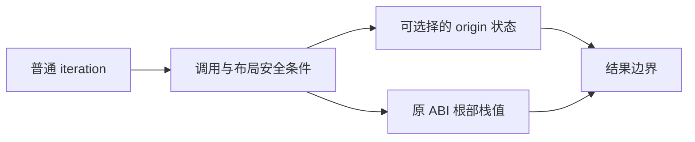

# 循环来源身份边界

## Intent：最终目标

普通循环保留未改变的借用对象及其指针身份，保持局部栈状态和已有缓冲复用，不用逐轮物化代替问题修复。

## Data：可用证据

数组恢复节点已让可选择的 state_value 根使用保留 origin 的表示。剩余 legacy deep 要求 pure 且根未选择 state_value，会递归解包 boxed 类型并在出口重新构造。已有 value_return/borrowed_objects/loop.zx 每轮把源 Cell 指针存入 saved；外层 Result[] 导致 State 和 Cell 使用 boxed ABI，旧 deep 路径可能丢失 saved 的身份。既有测试检查 saved 的深值，没有直接断言 saved 指针，需要检查真实产物，不扩大测试结论。

## Edges：边界与限制

不删除列表、外部接口和别名类型的 boxed 规则。不向局部布局保存临时借用地址；不能为追踪 origin 引入悬空指针。优先尝试根部使用现有 ABI struct 的栈值循环，子对象继续持有原指针，复用既有 value_call 与缓冲证明。需要检查调用、退出物化及分支边界。若安全证明不足，不贸然推广。

不新增测试用例、不执行全量测试，仅复用相关既有专项。

## Answer：交付标准

交付最小代码改动、既有 borrowed_objects 生成前后证据、相关值返回和循环调用专项结果；引用保留与性能证据分开记录。

## 自我批判

不能因为浅层布局更简单就推断其适用于所有循环；跨调用返回别名与实际终止路径必须核对。新 origin 元数据并非天然安全：临时 ABI 借用地址不能成为跨轮或返回结果的来源指针。

## 实施细节

根部浅层布局沿用 local_calls 门控。scope 内只把与返回根同类型的中间状态作为根快照，或把已由现有 projections 证明仅字段投影使用的绑定放栈；不能把所有聚合局部变量直接转成副本。特别是 saved 来源 Cell 的局部绑定会作为引用结果逃出 scope，必须保留原指针。optional 聚合根不是本次 aggregate gate 范围，后续单独审查。

## 容量反馈后的完整路径

值返回 14 模式通过，但 iterate_calls 四种已有模式发现逐轮 Leaf 分配，不能把值正确视为完成。补充严格消费端证明：结果仅包含标量/原表示的基础列表投影、它们组成的新对象/元组及独立子表达式时，循环内部可保留原有深层值布局。独立不代表纯，独立表达式必须在原出口按原顺序执行。出口使用现有结果投影与缓冲交接逻辑，不对新对象调用只能读取单个 projection 的接口。

深层表示只用于上述消费端或丢弃结果，不再用于返回聚合引用的 reference 路线。调用证明额外传递检查函数主体及 contracts，拒绝能观察聚合身份的比较，并继续沿用原生参数和 listEscape 门禁。

## 集合上下文原生捕获反馈

另一测试会话在 294a5cbab 重生成消费者后发现：只读原生 predicate 接收词法捕获的对象时，every 访问 0/1/64/257/4096 项的 arena 容量为 60/160/14868/17672/330548。值、指针和次数正确，但存在逐轮参数元组与循环根分配。原证据位于主目录 `docs/2026-10-09/集合上下文借用与库消费/容量观察/`。

修复分两层：expand_tuple 原生包装只传递成员，不传递参数包地址，因此临时参数包可放栈，成员仍按既有 ABI 传递。循环根另作类型边界证明，只允许不会接收或返回根类型及其容器的调用；这不把原生函数标记为 pure，也不放宽深层表示或缓冲别名规则。异步、捕获和共享状态边界仍拒绝。复用反馈提供的测试，不修改测试源与其他会话产物。
