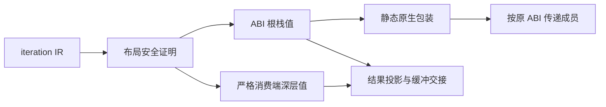

# 循环来源身份边界实施记录

## Intent：最终目标

循环保留借用子对象的原始引用；只读原生回调携带集合上下文时，生成代码不再按访问次数分配临时参数包和状态根。遵守普通 Zig 静态代码生成、无专用运行库、无负载复制。

## Data：可用证据

基于 `294a5cbab` 修复。源码范围为 genz 的循环布局、循环消费端、scope 根快照以及原生多参数调用封装。

| 专项                                    | 实际结果                            | 证据目录                      |
| --------------------------------------- | ----------------------------------- | ----------------------------- |
| 值返回 14 模式 × source/library         | 28 组、116 个既有测试通过           | 最终值返回复核                |
| 循环调用 6 模式 × source/library        | 12 组、118 个既有测试通过           | 消费端复核                    |
| 上下文 3 形状 × 4 方法 × source/library | 24 组、144 个反馈提供的既有测试通过 | 上下文修复复核                |
| 对象 every 容量，source/library         | 2 个反馈测量均通过                  | 上下文修复复核/object-every-* |

前两组在追加原生捕获修复前完成；后两组使用包含全部修改的新生成工具重新生成实际消费者。未运行全量测试，未新增或修改测试用例。测量和上下文测试源只读复用另一会话提供的文件，复核脚本仅生成、编译和运行它们。

原反馈在本工作树完全复现：访问 0、1、64、257、4096 项时容量分别为 60、160、14868、17672、330548 字节。修复后两种消费路径所有长度均为 60 字节；原测量同时断言结果、原上下文指针及准确调用次数。常数 60 字节仍是初始化捕获所需的当前产物分配，不能写成零分配。

上下文专项覆盖 list/object/nested，every/some/map/filter，空集合、多个数据变体、echo 失败、各个可达回调失败位置、短路、输入与上下文不变、同 arena 多次执行和 4096 项遍历。

## Answer：实施与交付

循环根使用浅层 ABI struct 时，子对象继续保存原 ABI 指针。scope 只将同根类型的状态快照以及已证明只做投影的局部聚合值放栈。对象被存入 optional 或其他引用结果时继续保留指针。

旧深层值布局只保留在不导出聚合身份的消费端或丢弃结果路径。消费端允许组合标量与基础列表投影，独立表达式仍在出口按原顺序执行。函数主体与 contracts 的调用关系需传递满足不观察聚合身份的证明；原生和列表逃逸门禁保持生效。

原生 expand_tuple 封装只把成员传给宿主，宿主无法得到封装元组本身的地址，因此字面参数元组使用栈临时值；成员仍按正常 ABI 求值，不改变宿主的效果、错误或返回分类。

新增浅层调用边界证明仅授权循环根布局，不更改 pure/local 分类：调用参数和返回类型都不得等于根或包含根；异步、捕获和共享状态相关表达式仍拒绝；涉及根的比较与 match subject 拒绝；body 所有返回分支必须构造新根。无法证明时沿用已有保守路径。

## Edges：边界与限制

borrowed_objects 的旧断言检查 saved 的深值，并未直接断言 saved 指针；本次通过真实生成代码确认出口不再 create Cell，不能将这一源码证据冒充运行时指针断言。上下文测试对其自己的借用指针有直接断言。

这不是通用的循环身份形式化证明，也不表示所有循环零分配。新调用边界证明按根类型保守拒绝，不分析更精细的函数实参来源。初始捕获仍有常数分配；未处理的所有权字段精度与自举迁移继续属于后续工作。

文档、草稿和生成证据均保存在本目录。提交格式化钩子可能整理生成源码的格式，编译与运行日志对应格式化前生成产物的实际执行。

## 自我批判

首次只改浅层布局后，循环调用中四种已有容量用例失败；失败记录保留在“循环调用专项”，之后补充受约束消费端并重新通过。值正确不能代替身份正确，容量恒定也不能代替引用生存期证明，因此新布局没有放宽原生安全分类，并显式排除根身份比较与原样返回根。

此次修复仍在手写 Zig 生成器中，属于自举前的语言正确性完善，不宣称这些编译器职责已经完成 RX/ZX 自举。
