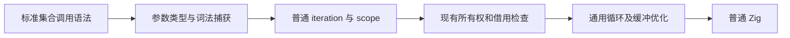
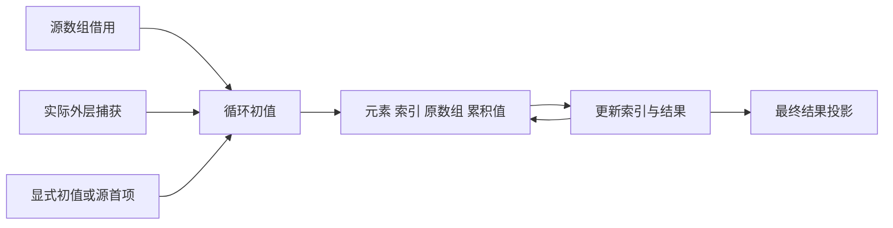

# 数组回调语法恢复

## Intent：最终目标

撤销 map、filter 等方法把 callback 第二参数定义成 context 的改动，恢复惯常的元素、索引、原数组参数及 reduce 累加参数。用户以正常词法引用获取外层值，由编译器将回调静态展开为现有 loop 语义，不引入动态闭包运行库。

## Data：可用证据

用户明确要求撤销接口魔改，并提示集合方法本质上是 loop 语法糖。当前 transforms.zig 把非 reduce 的第二实参当 context，callback 严格限定一或两个参数；reduce 强制 initial；scope_floor 禁止捕获。现有 iteration、scope、列表 push、索引及借用校验已能承载静态循环展开。

标准参数依据：[ECMAScript Array 方法](https://tc39.es/ecma262/multipage/indexed-collections.html)。map/filter/every/some 的 callback 参数为 value、index、array；reduce 为 accumulator、value、index、array，可省略 initial。此处保持 zxc 的静态类型、稠密不可变数组与显式错误约束，不宣称实现 JS 动态对象、稀疏槽或原型系统。

## Edges：边界与限制

- callback 可只声明需要的参数前缀；不能再以 context 占用第二参数。外层值按词法 SymbolId 捕获，嵌套回调和同名遮蔽必须正确。
- 捕获只读绑定，数组与对象借用原值；Task 句柄不能被循环重复消费，Store 权限继续遵守显式授权。
- 收窄后的可空捕获在外围求值为确切类型，再进入循环，不在循环内伪造非空证明。
- source、初值及方法参数按调用顺序各求值一次。filter 的 index 是输入位置。
- 无 initial 的 reduce 以 source[0] 为初值，从 index=1 开始；空源通过既有索引错误机制失败，不能返回伪造初值。
- loop 的 source、实际捕获值和 output 都是显式状态；scope 绑定必须携带借用语义，不能仅修改符号 metadata。
- 现有 loop 对结果所有权和错误效果较保守；不得隐瞒新增错误集合、额外分配或退化的二次复制。先从真实生成证据核对，再按通用循环性质完善编译器，不为具体用例加白名单。
- 未提交 Fold 及相关 reduce 缓冲扩展已退回 docs 草稿；不将它们混入本次接口恢复。
- 不新增测试用例，不执行全量测试；迁移已有调用与既有专项，报告实际覆盖范围。

## Answer：交付与成功标准

正常回调签名和静态捕获前端、loop 展开、旧 context 调用迁移、缓存版本隔离、配套参考文档及真实生成证据。必须检查参数、捕获生命周期、空 reduce、输入只求值一次，以及 map/filter 的线性生成路径；不能仅用语法通过宣称完成最佳性能实现。

## 自我批判

先前以无捕获回调减少编译器实现工作，再引入自定义 context，是把实现限制转移给语言使用者。本次不能重犯：loop 展开只是统一语义入口，不能因现有 loop 优化覆盖不足而接受隐蔽性能退化，也不能靠放松借用检查换取原地更新。
