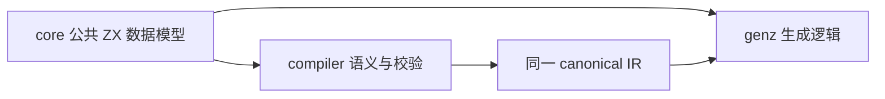
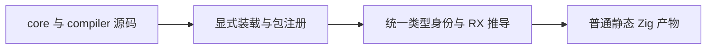
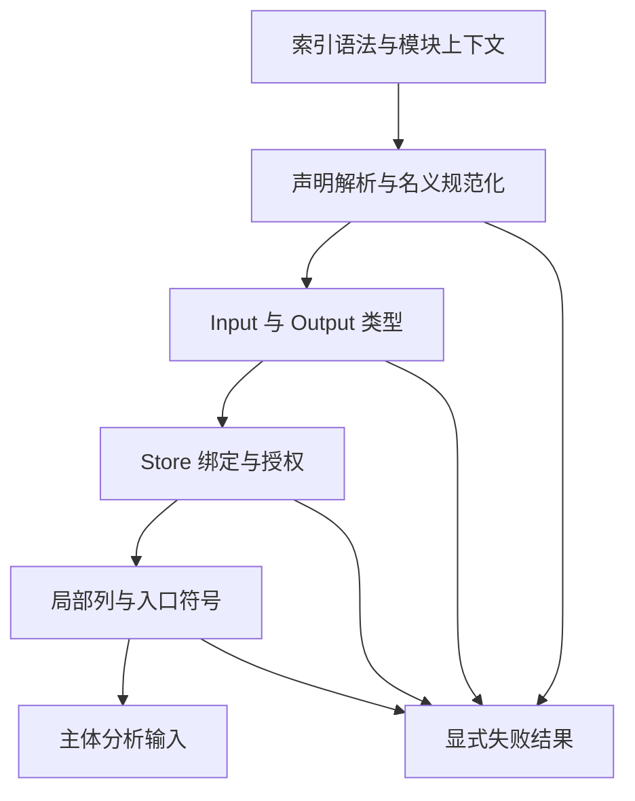
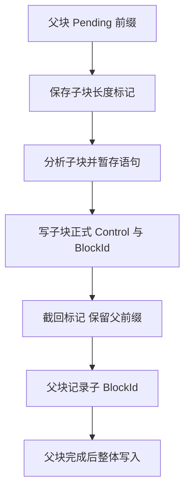

# 数据与模块契约实施记录

- **Intent：** 让编译器和 genz 依赖同一份公共 ZX 数据模型，继而闭合完整分析状态与静态模块消费。
- **Data：** 现有 canonical 列模型仍位于 compiler，core 已拥有对应 Zig IR；生成入口已有显式普通包注册和跨包 lint 源码装载。
- **Edges：** 模型移动不迁移校验算法、不改字段与枚举顺序、不复制类型定义；完整块闭合之前不运行构建和专项。
- **Answer：** 公共模型单一来源、消费者统一引用、构建依赖可追踪；随后完成分析状态和调用协议，集中验收后提交。

## 当前实施顺序

1. 把公共 Body、表达式、控制、符号、Store 与类型表迁至 core；验证上下文与分析状态保留 compiler。
2. 修改 RX/ZX 消费者的普通包引用，生成器显式装载 core 源码，追踪文件变动。
3. 以现有类型与所有权契约收口主分析状态和统一库静态调用。
4. 完整块集中检查模型身份、生成 ABI、库消费与数据生命周期。

## 批量修改方式

已检查 grit 支持的语言，未覆盖 ZX、RX 或 Zig。采用按真实源文件路径解析 import 的限定脚本迁移，只有解析目标命中迁移清单才修改，不进行全仓字符串替换。

## 执行状态

实施中。已迁移 Body、Symbols、Expressions 及枚举、Control、Stores、签名列；拆出公共类型表、名义来源、Contracts 和 native 列。compiler 的查找结果、构造候选、验证上下文保留原包。

生成器新增 core 源码装载与显式普通包注册，构建追踪 core 的 RX/ZX 输入。约 200 处消费引用改为统一包身份。限定导入检查未发现缺失模块或缺失导出；已格式化修改过的 RX/ZX。

主分析器的输入、函数上下文、局部状态、捕获归属、输出已形成普通 ZX 模型；声明阶段通过 RX 直接调用既有 resolve 流程。它们是整块实现中的源码，尚未替换旧 Analyzer 正式入口。

类型解析 Request 现显式接受 delta 与 cache，让新分析器能够持续持有增量 owner。旧 host 调用与 native 声明入口显式传入空增量，保持当前追加方式；新分析器后续解析可接回已有增量，不需要每次合并复制基表。

已补充[状态字段契约](状态字段契约.md)，明确授权 Store 类型上限、函数传递依赖、捕获所属帧和契约局部隔离。尚未运行构建或测试，尚未证明整个 A 块完成。

## 准备阶段接线

`analysis/analyzer/prepare.rx` 已连接声明解析、Input/Output 类型解析、Store 解析与资格检查、局部状态及入口符号初始化。每阶段失败由 RX 短路，统一形成 Prepared 失败结果。

- 声明初始化只在该阶段规范化名义类型；后续命名请求携带已持有的 delta/cache，保持已有 ID。
- Store 绑定从已初始化的声明缓存、共享解析缓存或导入别名查名，不重新创建同值类型表；校验原始授权类型上限、重复句柄/路径、native reference 与 Object 类型。
- 局部绑定检查、列追加和可见符号查询由普通 ZX 完成；core 提供表达式表和控制表的空值构造。
- 这些模块仍在整块实现中，尚未替换正式 Analyzer，也未运行构建或测试。主体、回调、控制流、契约、所有权和发布仍需继续实现。

统一库核对确认已有 linker 自动发布函数 Input/Output，并保留名义来源。当前准备阶段可直接用 RX 连接已有 RX 模块，无需预先新增专用库或跨语言桥；主体遍历中若确需调用多阶段模块，继续使用已有统一库静态消费。单一集合算法可直接复用其 ZX 逻辑，不能为满足文件后缀而重复算法。

## IR 写入与字面量规则

表达式列新增普通 ZX 写入实现，按行头、标量、单引用、序列和各复合载荷分文件。静态字段核对覆盖 Expressions 的全部列；各写入函数返回更新后的表和 ID，不调用旧 Zig Storage。此处是源码覆盖核对，尚不是编译或行为验收。

optional 强制转换使用普通类型表遍历，先确认完整嵌套路径，再从内向外追加 Some；失败不追加表达式。数字规则保留已有默认类型、整数上下界、f32/f64 选择、有限值与整数精确表示要求。整数精度核对用 32 位 limb 的普通 ZX 集合算法表达原 u1024 范围，不新增大整数原生语义桥。

原生 floats 仅补充无分配的标准 parseFloat32/64 转换，返回 optional 数值，不选择语言类型、不生成诊断、不持有编译器状态。数字规则、下划线处理、精度与范围诊断仍由 ZX 决定。普通数字和无需转义的字符串保留输入视图；需要去除浮点分隔符或解码转义时才构造新字节列。

已追加数字、布尔、null、字符串的语义原子操作，尚未将它们作为完整表达式遍历入口发布。源码格式检查发现 match 必須使用最终 `_` 分支，已按受限枚举的最后一种情况修正；`.d.zx` 使用原生声明语法，不能交给普通源码 fmt。其余本轮 42 个新增或修改源文件通过格式、依赖、导出及 120 行静态检查。

## 控制流暂存约束

当前 Control 校验要求每个 kind 的 payload 在 statement 扫描中严格递增，block segment 连续，子块先于父块。不能在进入子块之前把父块已完成语句直接写入正式 Control。

后续实现采用按语句种类分列的 Pending scratch：只存未发布的 IR 引用与小型边表。每个块保存分组长度标记；子块完成时按自己的 statement 后缀写正式表，再截回自身标记。父块前缀保留，父 branch 在得到两个子 BlockId 后才追加 pending。这样无需宽泛的全字段语句记录，也不复制既有 Control、表达式或语法树。

PendingMark 保存 statements、evaluations、constants、destructures、destructure_symbols、branches、selections、cases、setters、results 的长度。同组等长列共用标记。switch 的父 case 前缀先保留，再取得子块 mark，保证嵌套 case 数据不会被错误回收。

state_block 是另一种算法：它产生 scope/conditional/match 表达式，应只保存 symbols/values/borrows 的绑定 scratch，不伪装成普通 Control block。

本阶段仍未运行构建或测试，未提交零碎节点；完整主体及正式入口尚未闭合。

## 自我批判

移动文件仅解决模型归属，不能单独证明主分析器或后端自举。后续必须接通实际共享状态、统一库消费与正式入口，不能用目录变化作为架构完成证据。
