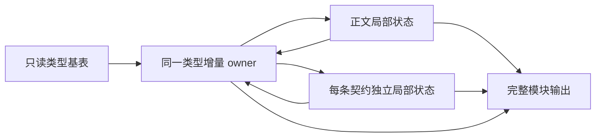

# 主分析状态字段契约

- **Intent：** 按实际语义读取建立主分析器状态，支撑整个 indexed syntax 到 IR 的实现。
- **Data：** analyzer、types、store、calls、tasks、capture、collections/captures、expression_binding 与 contracts 的当前实现。
- **Edges：** 字段是实现契约，不代表新分析器已接线；continuation 的具体节点步骤随遍历实现确定，不提前构造万能 opcode。
- **Answer：** 输入、类型状态、局部状态、捕获链、契约和输出的确定字段与不变量。

## 1. 模块输入

| 字段                         | 类型或模型                                                  | 用途                                                     |
| ---------------------------- | ----------------------------------------------------------- | -------------------------------------------------------- |
| source、file_name            | string                                                      | 源文本与来源身份                                         |
| syntax                       | parser/syntax.Program                                       | 复用全部索引语法列，不重复 declarations、contracts、body |
| type_base                    | core/type_table.Table                                       | 输入类型只读基表                                         |
| aliases                      | resolving.Cache                                             | 导入类型名称与 ID                                        |
| nominal_base、nominal_origin | core/type_table/nominal.Bindings、Origin                    | 名义来源及当前模块身份                                   |
| shared                       | bool                                                        | 明确是否启用共享语义，不能以空表推断                     |
| function_imports             | namespace?、name、id、input_type、output_type 的列          | 词法名称到函数 ID                                        |
| functions                    | 完整函数上下文                                              | 调用、任务与错误集合的传递分析                           |
| store_bindings               | handle、path、type_name?、type_id?、readable、writable 的列 | 授权能力                                                 |
| store_type_count             | u64                                                         | 授权时基表上限，不随本模块新增类型增长                   |

普通源码模块不启用 native_interface。原生接口分析仍拥有自己的入口和规则。

表达式入口另有 binding_names、binding_types、unit_bindings、nonnull_bindings、expected?、linking；不为复用模块入口伪造正文。nonnull 注入受 linking 资格限制。

## 2. 函数上下文

只有 FunctionImport 不足以分析任务或捕获；当前四列 effects 视图也不是完整函数表。

至少需要 input_types、output_types、stores、expressions、control、roots、contracts、external_present、external_expand_tuple、external_concurrent、external_fallible、external_errors。错误集合保留 `string[]?`，区分未知集合与已知空集合。复用 core 中既有列定义，不再复制 Expressions、Control、Stores 或 Contracts。

## 3. 类型状态

Tables（base 与 delta）、resolved、aliases、visiting、Origins（base 与 delta）、nominal_origin、shared、native_interface。

resolved 是解析结果缓存；aliases 是上下文允许的名字绑定，不能合并。主体和契约共享类型 ID 空间与增量 owner，契约的名称环境独立。

索引类型来源直接组合 source 字节、syntax.types、type_order、declarations、members；不经过递归 Zig View 或专用 Reader。

## 4. 局部状态

Symbols、Expressions、Control、active、scope_floor、lambda_depth、expression_bindings、expression_units、Refinement、current_capture?、output_type、Stores、allow_store。

expression_bindings 存 SymbolId，名字来自 Symbols；expression_units 是不产生 symbol 的路径名。解析路径仍遵守局部遮蔽，不能当作全局字典查找。

Refinement 直接复用既有 facts/marks 模型。普通作用域截短 active；回调退出还要恢复 scope_floor、current_capture、lambda_depth 和相应事实标记。

## 5. 捕获关系

CaptureFrames：starts、floors、parents?、first?、last?。

CaptureBindings：sources、targets、values、next?。

对子回调进行名称解析时，可能先向父帧新增 capture，再向子帧新增 capture。因此每个帧用 first/last 和绑定的 next 显式记录归属，不假定记录始终连续，也不复制整段绑定。帧 ID 在模块内保持稳定；退出仅恢复 current，不重用旧 ID。

values 是细化后表达式的 ID，可能已经包含 optional unwrap；不能用 source SymbolId 替代。查重沿当前帧绑定链比较 source，枚举保持同帧的插入顺序，避免扫描所有历史捕获。

## 6. 契约隔离与结果

每个契约新建局部符号、表达式、事实和捕获状态，只接入统一类型存储。aliases = 输入 aliases + 模块 exports；绑定 in，ensures 再绑定 out；谓词期望 bool。

不得继承正文的 active、facts、function_imports 或 Store。契约结果分别持有 symbols、expressions、predicate、span，各自局部 ID 从自己的表读取。

模块输出为 type_delta、nominal_delta、Body、Contracts、export_names、export_types、input_type、output_type、output_ownership、type_only、Diagnostic。失败不发布不完整增量；输出文件来源沿用输入，不在阶段间反复复制字符串。

## 7. 自我批判

这些字段来自真实调用，不等于最终容器算法已完成。捕获查询、类型查找等热点不能因普通数组易表达就长期保留退化复杂度。后续应根据完整调用和 owner 路径决定索引表示；不增加编译器专用原生表作为捷径。
