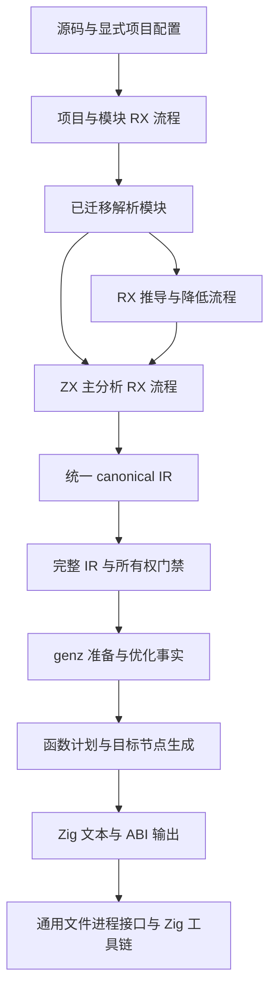
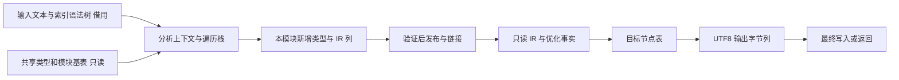
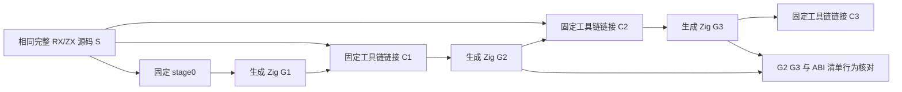

# 整体自举方案

- **Intent：** 把 zxc 的自有编译规则、状态和生成逻辑完整迁入统一 RX/ZX 模块，按大块职责推进，最后完成真实三阶段自编译。
- **Data：** 当前正式调用链、现有索引语法树与 canonical IR、统一库消费实现、已完成的语义子模块，以及本日两项只读主链审计。
- **Edges：** 遵守 zero runtime、静态链接、数据零额外复制、模块无环与 ZX 120 行限制。保留必要资源和标准原生边界；不新增专用解释器、Analyzer/Writer 桥。禁止全量测试，不新增用例。
- **Answer：** 本方案、状态与模块契约、大块执行计划。先完成设计，再整块实现；每块完成后集中构建和运行有代表性的既有专项，成功后提交并推送。

## 1. 策略变更

用户明确要求“大步迭代实现模式”：先设计，再实现，一大块功能完成后再针对性测试。

本方案替代此前按小谓词、小文件、小桥接连续构建和提交的推进节奏。已有成果保留复用，不重新实现。设计阶段只查阅与分析，不构建、不测试。实施期间按模块批量编辑和静态复核；块闭合后进入一次集中验证窗口。失败后按原因成批修复，只重跑受影响的检查。

“大块”按完整输入输出与传递依赖划分，不按行数、文件数或固定时间切片。内部仍按语义拆成小文件；每个 ZX 文件最多 120 行不意味着每个文件都成为一次交付。

## 2. 当前起点

已迁入的主要部分：词法/语法阶段、类型解析与规范化、所有权、refinement/scopes、类型合并与名义来源状态、多个 IR 子检查。近期 artifact 的来源与依赖资格规则已迁入，失效过渡桥已清理。

尚未闭合的主要部分：ZX 主分析器、RX 推导与降低、项目模块与缓存调度、genz 优化与 lowering、目标输出、部分 lint/包管理/CLI 自有规则。当前构建仍是 seed 生成部分模块后与手写核心混合链接。

现有 `bootstrap-parser`、`bootstrap-lexer` 不能替代完整自编译。完整进度证据见[当前职责核对](../当前自举职责核对.md)。

## 3. 最终架构

RX 显示阶段顺序、依赖、失败分支和结果汇合。ZX 承担节点遍历、集合算法及原子语义。解析、主体分析、契约、所有权、发布不能被合并进一个 ZX 总控函数。

## 4. 大块划分与顺序

| 块               | 完整交付边界                                                                                         | 前置                     |
| ---------------- | ---------------------------------------------------------------------------------------------------- | ------------------------ |
| A 数据与模块契约 | 统一模型归属、借用/增量/发布协议、统一库静态调用与构建分层；只补有证据的通用能力缺口                 | 本设计                   |
| B ZX 主分析器    | indexed syntax → 完整单模块 IR，含表达式、语句、绑定、作用域、调用、集合回调、循环、Task/Store、契约 | A                        |
| C 项目与 RX 编译 | 模块依赖、接口/类型推导、RX 降低、链接与缓存规则，输出同一 IR                                        | A、B                     |
| D genz 完整后端  | IR 准备、全部优化事实、函数计划、lowering、目标节点及打印；生成和 fingerprint 同步切换               | A；正式接入使用 B/C 产物 |
| E 编译器产品闭合 | lint、包管理、CLI/构建等剩余自有规则，完整 IR 发布门禁，固定源码清单与平台边界                       | B、C、D                  |
| F 完整自编译验收 | 固定 seed 与源码闭包，stage 1 → 2 → 3，依赖闭包、产物和代表行为核查                                  | E                        |

主实施顺序为 A → B → C → D → E → F。A 稳定后可独立查阅 D 的设计，但不靠并行启动大量构建追求速度。D 的事实分析、lowering 和打印在同一个后端大块内完成，不把几个资格布尔值分别作为“后端自举完成”。

## 5. 统一模块调用：优先已有能力

当前 ZX 相对源码导入固定为 `.zx`，不能直接导入 RX；正式源码没有 Fold 标签。不能按现有 Zig 互递归文件关系照搬，也不能据此直接新增循环标签。

现有统一库能够把 RX 与 ZX 实现共同导出为普通模块；`tests/library/runtime/replay_import.zig` 已有 ZX 默认导入并调用 RX 实现公开模块的消费代码。基线方案采用普通模块接口和静态编译产物分层，功能模块内部保留 RX+ZX，不按语言拆库。

主体遍历中需要调用类型构造等现有 RX 模块时，通过统一公开接口静态调用，不复制其流程回 ZX、不增加编译器专用 native 桥。输入/输出模型由同一模型模块提供，不能手工在消费者重声明名义类型。

A 块需要一次性核对大型状态、名义身份、buffer 所有权和包导出是否完整覆盖这种调用。如果确有不可表达的源码装载需求，再完善通用混合模块 DAG；保持静态目标、统一包边界和无环约束，不默认引入 Fold 或动态调度。

## 6. 自举闭合与 seed 边界

迁移期间，旧实现可以作为 stage0 编译新模块。新块通过验收后，正式入口整体切换到生成实现；旧实现只留在 seed。不能按节点种类“新实现处理不了就回旧 Analyzer”。

最终冻结完整源码清单 S、允许的平台模块 P、工具链和构建配置：

S 包括前端、主分析器、RX 编译器、模块/缓存/诊断规则、优化、genz 与产品入口。不能只重复生成 parser，也不能从旧 build 隐式带入手写 genz 或 RX analysis。

先比较约定的生成源码、ABI、模块清单和行为；在路径、调试信息和时间戳可复现后，再比较二进制。产物一致和无旧语义依赖必须同时成立。

## 7. 原生边界

允许：标准分配器、文件/字节 I/O、通用路径和哈希原语、显式静态原生 ABI、最终 Zig 编译器/链接器。

不因使用 Zig 就允许保留：符号查找、类型布局、诊断选择、模块顺序、缓存失效、哈希输入组成、优化资格、目标语法和打印规则。它们都属于 zxc 自有规则。

标准 Zig ArrayList 持有生成列的内存可以是资源适配；决定追加什么、何时恢复事实、如何合并类型，必须在 RX/ZX 中。不得把专用运行库嵌入产物规避约束。

## 8. 自我批判

本次设计不证明全部大模型已在现有语言中编译成功。已确认的约束与待验证的性能/表示问题见[状态与模块契约](状态与模块契约.md)。验证安排在完整块的集中窗口，不再为每个小模型反复启动整仓构建。

大步推进不能靠扩大一个 ZX 总控文件实现。代码仍须按语义分层，验收看正式调用闭包；无法闭合时明确列出缺口，不用通过部分案例代替完成。
