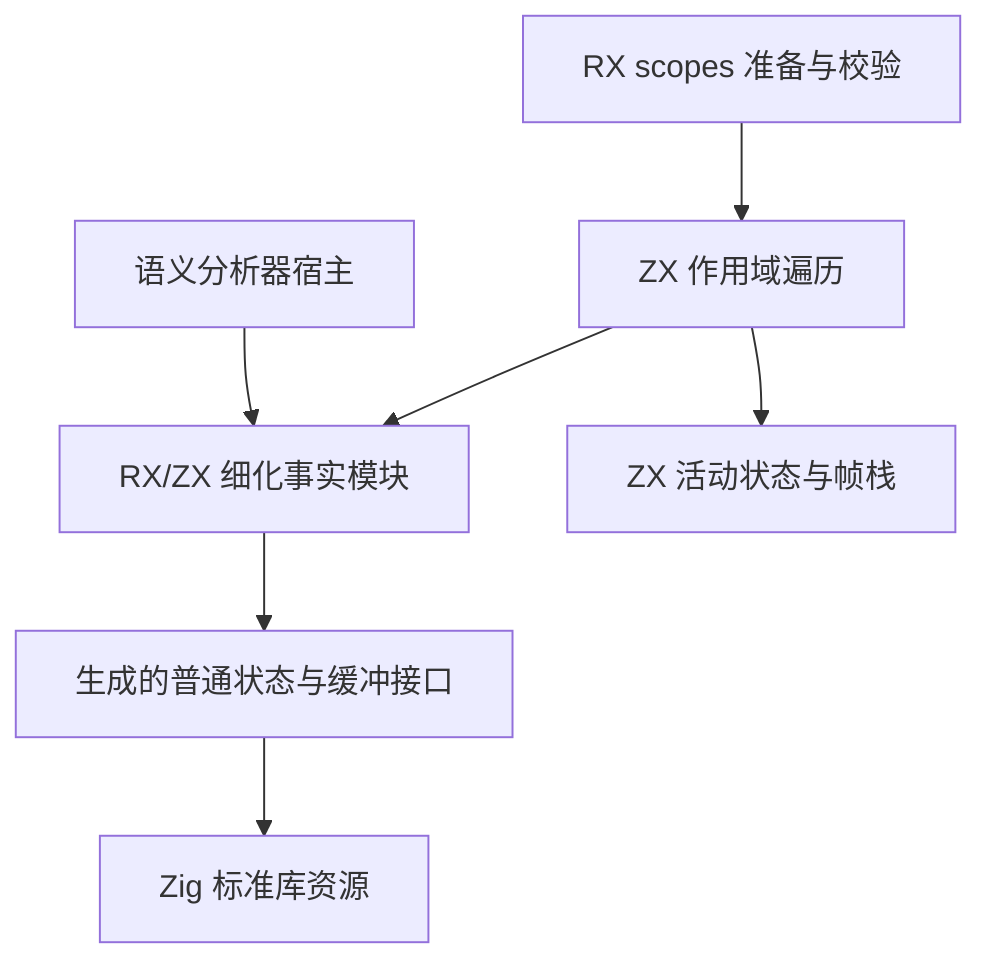
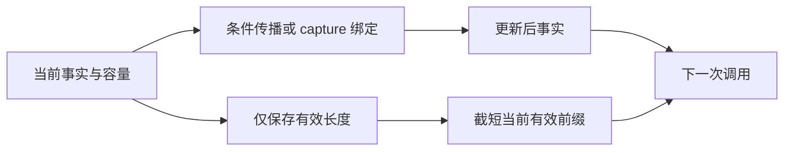

# 流程状态自举执行计划

## Intent：最终目标

把细化事实、作用域活动状态、声明归属、回滚历史和遍历栈迁入普通 RX/ZX，移除正式路径对 flow_state 专用原生桥的依赖。范围同时覆盖语义分析器与 IR scopes 校验，不能只替换一个入口后宣称完整迁移。

## Data：可用证据

- 基线 f5657370c 已完成聚合字段事实与循环固定点，正式构建和 175 项现有专项通过。
- flow/workspace.zig 保存 active、declared、owners、history、events；setActive/restoreActive 含自有回滚规则。
- core/refinement.zig 保存 nonnull/captures，flow_state 承担查询、追加、截断；目前 ZX 仅表达部分规则，状态仍在原生代码中。
- 分析器多次调用 bind/assume/mark/restore/typeOf，状态跨调用保留。scopes 单次检查也使用同一事实规则。
- assume 只处理自己压入的条件事件，可以独立使用局部工作栈，不能误清 scope 调度帧。
- genz 已有内部函数 callBuffered/callValue 及普通 std.ArrayList 缓冲参数，但常规根导出仅 execute；是否能以现有导出保持容量与所有权需由实际生成物确认。

## Edges：边界与限制

1. 不新增 refinement_writer、state_workspace 等替代专用桥。ZX 持有规则和状态模型；宿主只承担普通资源生命周期与 ABI 调用。
2. 跨调用不复制旧事实列表，不保留单次临时 arena 的悬垂切片。旧版本仅保留 mark 长度，不能作为活跃别名继续读取。
3. 只读 contains/typeOf/mark 不引入堆分配；恢复只改变有效长度，不复制有效前缀。
4. 生成普通 Zig、静态链接、无专用 runtime。容量缓冲采用已有标准库与编译器静态证明，不能由宿主凭 lane 编号猜测所有权。
5. OOM 后停止本次分析并统一释放资源，不引入隐式继续执行或部分提交恢复协议。
6. 不新增测试用例、不执行全量测试；使用正式生成物、现有相关专项及生产消费者验证。
7. 每个 ZX 至多 120 行，按语义拆分；RX 显式组织准备、执行、结果检查，不制造仅转发入口的模块化表象。

## Answer：实施与验收

先完成状态接口及根导出缓冲能力证据，再接入两个生产消费者。若现有普通导出不能保持跨调用缓冲，则完善通用生成接口后再迁移，不以扩大宿主 arena 或保留专用 Writer 代替最终设计。

- 事实模型：nonnull、capture_errors、capture_results 三列，mark 保存非空事实和 capture 的有效长度。
- 原子规则：查询、关联绑定、前缀恢复、条件传播与可选类型收窄。
- 分析器：拥有生成状态与标准资源，调用显式状态接口，移除对原生事实字段的直接访问。
- scopes：显式携带同一事实模型，以及局部 active/declared/owner、history 与 Frame 栈。
- 最终移除正式 flow_state 接线；seed 路径单独保留。检查生产传递依赖和分配行为后提交、push。

## 自我批判

把 Writer 改为切片接口只改变了表面形状；只有跨调用状态生命周期和缓冲复用得到生成物证据，才能称为正确迁移。草稿和能力观察不等于生产路径已经自举；两个消费者及桥接删除必须分别核验。
