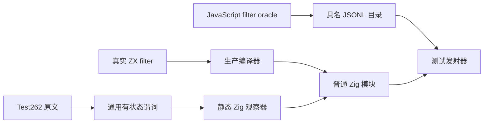
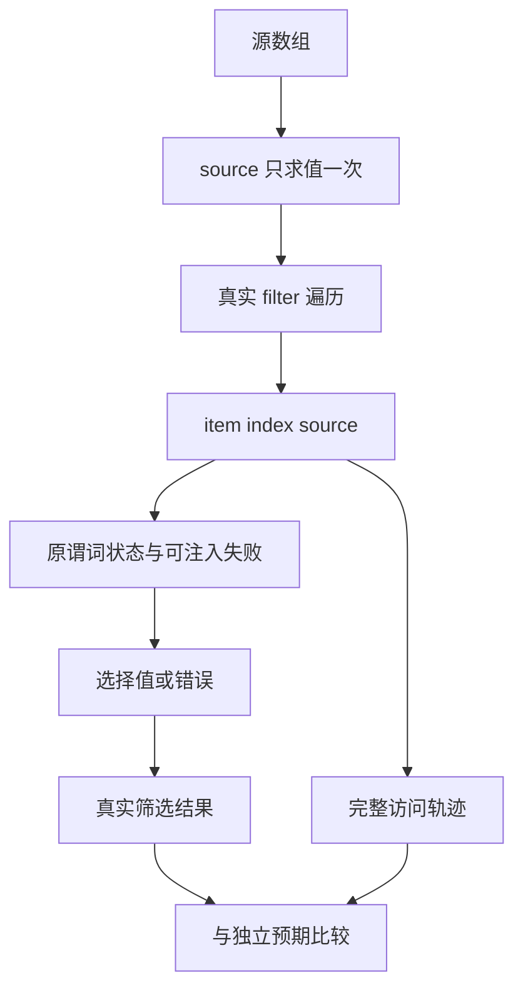

# 筛选回调顺序与单次访问

## IDEA

- **Intent：** 完整适配四份 Test262 filter 回调顺序原文，验证真实 filter 的索引递增、单次访问、源观察、结果顺序及异常停止。
- **Data：** Test262 固定 `7ab7fafa0003f73fc85c1b95d88094d33f7eb8bd`；四份原文未登记。zxc 固定 `cba7e1c375df418fb695367a3ebd3650669c3ec7`。现有 callback_arguments 的 host 没有保留原文有状态谓词，不能直接关联现成 true/false 用例。
- **Edges：** 仅修改测试包和本目录，不修改生产实现。不改写 filter 为 reduce；测试原生 host 只观察真实生成程序的参数并实现原谓词，不解释 zxc 源码。完整产物为静态 Zig，不增加专用运行库。此批不支持 holes、prototype、species 或动态 JS 对象。
- **Answer：** 三类具名目录、四份完整原文适配；Debug/ReleaseSafe × 源码/独立编译库消费均实际执行；归档证据，英文 Conventional Commit 后 push。

## 执行步骤

1. 保留原文完整字节和身份；普通/严格模式使用官方 harness 执行。
2. 建立 cursor、ordered、violations 三种通用观察器规则，保留原条件及状态变化；JavaScript oracle 使用真实 Array.filter 产生独立完整预期。
3. ZX 直接调用 source.filter((item,index,source) => host.visit(...))。观察器记录每次实参，测试宿主核对源指针、长度、元素、哨兵、回调次数、完整结果与错误。
4. 补充空、单、重复、逆序、负数、长列表、不同 cursor 与回调失败位置。内部组合不计作额外原文。
5. 新建固定工作树，重新生成 83 个模块；通过生产分析、IR 校验、独立编译库消费、静态编译和签名执行全部目录。
6. 全目录审计、严格 TypeScript、生成器 --check 及精确发布核验；仅确认的新实现缺陷发送授权实现会话。

## 架构图

## 数据流图

## 自我批判

原文标题中的 to 不表示回调直接访问内部输出游标；原回调实际读取 idx。本批只验证其真实观察。原文 ii-4 单独的长度相等断言存在零调用盲点，额外完整轨迹与次数控制用于增强观察，不改写原断言归因。失败注入是本地补充，不当作上游原文。完整 Test262 与全部语言特性仍未完成。
