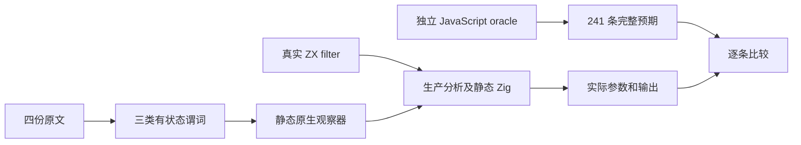
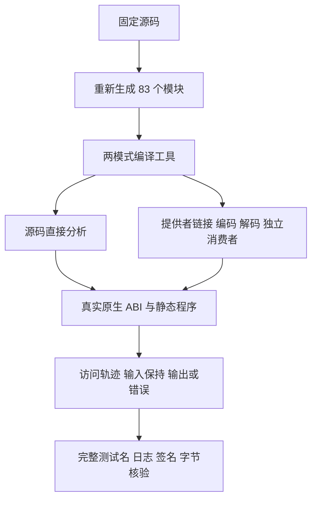

# 筛选回调顺序与单次访问执行记录

## IDEA

- **Intent：** 完整保留四份 Test262 filter 原文的有状态谓词及全部观察，验证真实回调顺序、每索引单次调用、源关系和失败停止。
- **Data：** Test262 `7ab7fafa0003f73fc85c1b95d88094d33f7eb8bd`；zxc 固定 `cba7e1c375df418fb695367a3ebd3650669c3ec7`。原文原始字节、SHA、官方 harness 观察、最终源输入与完整命令均保存。本批于 2026-10-09 启动，执行跨入 2026-10-10；记录目录按启动日期保留。
- **Edges：** 仅修改测试包及本目录，不修改生产实现。观察器状态位于显式静态测试原生模块，不等于 ZX 任意可变外层闭包已支持。没有 hole/getter/proxy，不能扩大为底层内存只读取一次或直接观察 filter 内部输出游标。
- **Answer：** 241 个新增具名用例、四份完整原文适配；三个目录在两种模式和两种消费路线实际执行，证据核验后英文 Conventional Commit 提交并 push。

## 原文与完整适配

| 原文后缀    | 原输入      | 状态谓词                                     | 原文全部断言            |
| ----------- | ----------- | -------------------------------------------- | ----------------------- |
| 9-c-ii-4    | 0/1/2/3/4/5 | index 等于 cursor 才推进并选择               | 结果长度等于 called     |
| 9-c-ii-5    | 11/12/13/14 | 重复或前序未访问则选择；正常访问才标记       | 结果长度 0；called 为 4 |
| 9-c-iii-1-5 | 0/1/2/3/4   | index 等于 cursor 才推进并选择               | 结果长度 5；called 为 5 |
| 9-c-iii-1-6 | 11/12/13/14 | 重复或前序未访问则拒绝；正常访问才标记并选择 | 结果长度 4；called 为 4 |

四份原文在普通和严格模式下使用固定官方 sta.js/assert.js 执行，共八次执行、14 次实际 harness 断言。原始文件保留在上游原文目录，未通过格式化改写。三类状态谓词逐分支保留；ii-5 和 iii-1-6 的违规分支都不标记 seen。没有把它们换成恒 true/false 谓词。

ii-4 自身存在零回调也能满足长度相等的盲点，适配保留此观察并增加完整结果与访问轨迹。原文标题中的 to 仍是回调读取 idx，不能据此声称观察了生成程序内部写入游标。

## 目录与通用控制

| 目录       | 新增具名用例 | 内容                                           |
| ---------- | -----------: | ---------------------------------------------- |
| cursor     |          157 | 两份原文，顺序游标、不同起点、正反序与失败位置 |
| ordered    |           42 | 正常单次访问才选择，一份原文及失败控制         |
| violations |           42 | 重复或缺失前序才选择，一份原文及失败控制       |

十种输入包括空、单元素、双元素、重复值、逆序、负数、257 与 1024 长数组。failure=0 不失败，1/中间/末次观察异常停止，length+1 验证不应触发失败。不同 cursor 检查前缀拒绝与后续保留；补充控制不额外计为上游原文。

JavaScript oracle 实际调用 Array.filter，记录每次 item/index 并生成完整预期；Zig host 不计算预期，只实现原状态谓词和记录实际参数。ZX fixture 直接执行 host.source(in).filter(...)，不存在 reduce 模拟。

测试宿主把输入复制到可写哨兵存储，再检查全部 storage 未变。每次回调的 source 必须指向实际输入起点、长度和内容相等、item 等于 source[index]；成功和 CallbackFailure 路径都检查。source 调用次数要求为一。Native 观察器按实际 native.json import_name 和 identity ABI 静态链接。

## 架构图

## 数据流图

## 执行结果

生成工具六个实际步骤均退出 0，重新生成 83 个模块。21 项最终静态检查通过，包括生成器 --check、严格 TypeScript 和全目录审计。正式 test-filter-traces 入口也已接入 --check，跟踪模型、适配数据及目录，避免只手动核验而漏掉日后漂移。

最终 Debug 与 ReleaseSafe 均终态退出 0。每种模式 cursor 源码/库消费各 157 个，ordered 各 42 个，violations 各 42 个；每种模式 482 次，两种模式共 **964 次具名执行**，对应 241 个不同新增用例。十二个实际测试二进制均严格签名核验通过，逐条名称与目录完全一致；没有使用 --test-no-exec。

本轮没有确认新的实现缺陷，未向实现会话发送消息。

编译库路线由既有生产 helper 链接、编码、解码后释放 provider/library，毒化编码字节，再独立分析消费方。完整 Build 图未在本批实际执行，正式接线的行为执行由相同公开编译器及运行器完成。

全目录审计目前为 129369 个具名目录用例；adapted 840、equivalent 103、excluded 2081、unreviewed 50573，关联用例 6970。审计不测量运行，本批实际范围只限上述三个目录。

## 自我批判与恢复边界

有状态观察器是测试探针，不是 zxc 专用运行库，也不解释输入源码；不能把它证明为语言任意外层可变状态。完整轨迹证明回调参数、次数与顺序，不证明 getters、proxy、动态原型或 species 协议。CallbackFailure 验证异常传播与停止，不等于所有 allocator 失败、零临时分配或整体所有权成本均已证明。

只读审查发现正式生成一致性入口缺失，已增加对 --check 的依赖；没有因静态审查通过而跳过实际执行。

首轮两模式均在测试源码语义编译时发现宿主轨迹类型接线错误：既有通用 literal 发射器把对象编码为指针，而 expected.visits 声明成了值结构体数组。该轮没有执行具名用例。两进程均终态后，保存旧输入、宿主、发射源码、实际命令及完整诊断，将字段改为指向只读结构体的列表；不改通用发射器契约和生产源码。21 项最终静态检查重新通过后，复用同版本已生成的编译器模块，重新执行两模式完整路线。此问题属于测试接线，没有报告为实现缺陷。
输入与执行固定，超时只代表观察结束，继续追踪原进程，不重启或覆盖结果。

仅确认的新实现缺陷发送授权实现会话。完整 Test262 和全部 zxc 特性目标保持未完成；每完成本部分后独立提交推送，标题和正文均为英文。
