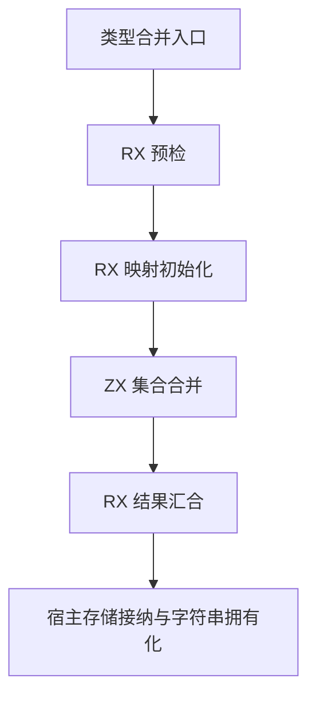
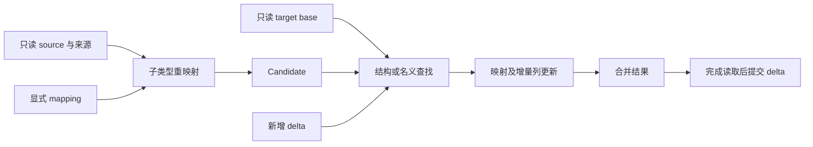

# 类型合并状态自举

- **Intent：** 将正式类型合并的映射、引用重映射及类型/名义来源追加状态迁入 RX/ZX，移除 `merge_writer` 专用桥；保持统一模块与静态 Zig 生成。
- **Data：** 正式 `modules/link/types.appendFrom` 仍构造 Writer。Writer 写入 mapping、TypeStorage、Origins.Storage，并通过 references 桥重映射子类型。已有 `types/find`、`types/nominal/find` 支持 base/delta；`constructing/delta` 可以直接追加 Candidate。
- **Edges：** 不复制整个既有目标表；新字符串须独立拥有生命周期。保留 seed 引导实现。`compact` 的生产调用当前在 seed，但现有专项直接验证 generated 模式的同底层别名及指针不变契约，因此也必须维持。禁止新增测试及全量测试。
- **Answer：** RX 展示预检、初始化、合并与结果汇合；ZX 使用显式 State 完成内聚集合算法。验证生成代码中的缓冲复用、名义冲突顺序、原地压缩与分配失败，再删除原生桥并提交。

## 架构图

## 数据流图

## 状态与职责

只读输入包含 source、origins、origin_indices、target base、target origins、first。显式 State 包含 mapping、新类型 delta、新来源 origin_delta、当前引用 scratch、index、status。引用 scratch 按行复用，不逐行复制整个状态。映射只能读取已经处理的前缀。

复用查找和列追加原子，不调用 constructing/update：后者会重新排序并按结构查找，可能改变名义规则及诊断顺序。缺失来源、名义冲突与前缀不匹配保持原错误语义。

## 所有权与压缩边界

合并期间 source/base 保持只读，避免原地写入覆盖尚未读取的 source 尾部。新列写 delta，读取完成后再通过已有 appendDelta 接纳；动态 first 为 delta 局部侧列偏移，只在接纳时调整一次。compact 保留容量，成功及失败时既有列指针均不得改变；失败只恢复约定 prefix，不恢复原完整尾部。

映射及生成数组的分配器生命周期必须明确，禁止让临时 arena 切片逃逸。新增字符串必须在长期 pool 中独立拥有，不能以零复制之名借用被释放的 module 字符串。base 不复制；新增 delta 的列接纳是当前宿主存储契约边界，后续如迁移长期存储 owner 再消除该次搬运。

## 实施顺序与验收

1. 从正式源码形成草稿，接入显式模型、引用重映射及候选值读取。
2. 核对 RX 编排与 ZX 原子职责，先编译观察 buffer lanes；如按行复制状态，修正通用生成路径或表达方式后再继续。
3. 迁移宿主接纳，核对失败时已合并前缀的可观察行为，清理 Writer 及该入口对 references 的依赖；其他消费者保留。
4. 构建并运行现有 type_merge 的身份、前缀、批量、压缩、资源专项，不扩展为全量测试。
5. 检查所有 ZX 不超过 120 行、生成产物无专用运行库、源码及传递调用中无本职责专用状态桥。

## 自我批判点

显式 State 并不自动等于零额外复制；需查看真实生成代码。迁移 Writer 也不等于宿主链接器已全部自举。只记录本次真实移除的职责，保留对未迁移存储及编排的明确边界。
