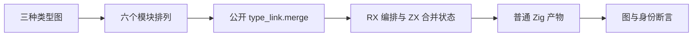
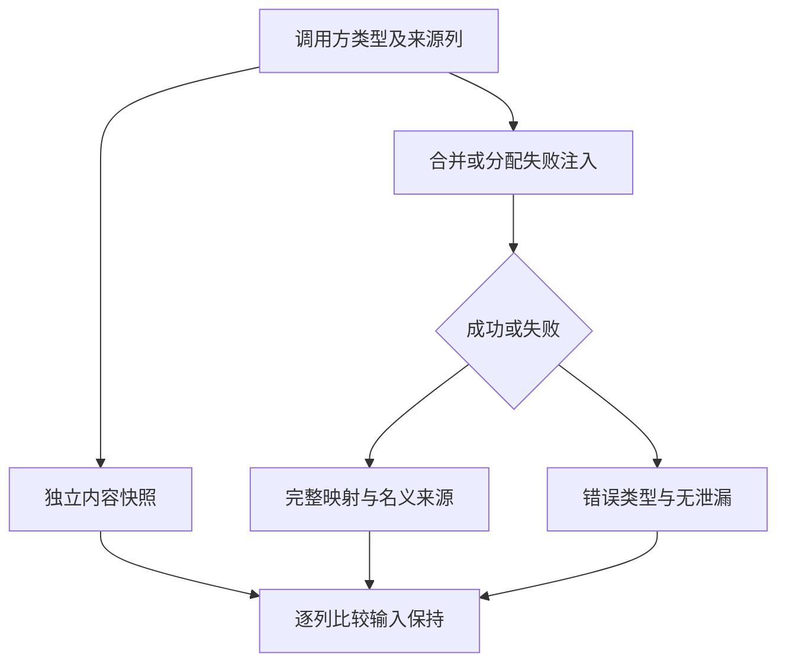

# 类型合并顺序与失败保持

## IDEA

- **Intent：** 验证 RX/ZX 类型合并状态迁移后，多模块类型身份与依赖图不受输入顺序影响；失败及分配失败不修改调用方输入。
- **Data：** 固定实现 `93579f3a932aa7b456a75365bc30d24826262f38`；既有 bulk fixture、graph/origin 检查器与两模块测试；只读审查确认正式依赖图已移除 extract、merge_writer 桥。
- **Edges：** 仅修改 packages/test 与本目录。手工 IR fixture 验证类型联结接口，不冒充 ZX 解析或 Test262 原文执行。保留 seed 引导依赖，不宣称完整自举。不会把内部目标表回滚当作公开契约。原有未提交文件保持原样。
- **Answer：** 新增多模块排列、末尾名义冲突/来源缺失及分配失败测试；在 Debug、ReleaseSafe 执行实际签名二进制，保存命令、输入/产物哈希、完整测试名和日志。通过后以英文 Conventional Commits 提交并 push。

## 实施步骤

1. 固定工作树与源码哈希，重建标准目录、词法器和 86 个 parser/semantic 输出，共 87 个 generated 模块。
2. 三个完整图包含基准图、局部 ID 偏移及重复别名图、单一语义变化图；每项变化遍历三模块的全部六个排列。检查完整递归图、名义来源、标量前缀、映射长度、类型共享/分离与精确去重计数。
3. 三个合法模块后追加冲突或缺失来源模块，比较全部输入列；通过分配失败注入核对资源释放及输入保持。
4. 执行新测试及既有类型合并门禁；核查正式源码与执行草稿一致、发布范围、提交及远端 SHA。

## 架构图

## 数据流图

## 自我批判与验收边界

排列枚举只能证明这些完整图的有限组合，不能证明任意类型图。精确行数断言来自类型语义和既有独立 graph 检查，不使用实现输出生成预期。两优化模式都必须真正执行，缓存或构建成功不能替代测试结果。Test262 的完整对齐与其他语言特性仍为持续目标，本部分不会改变其完成状态。
