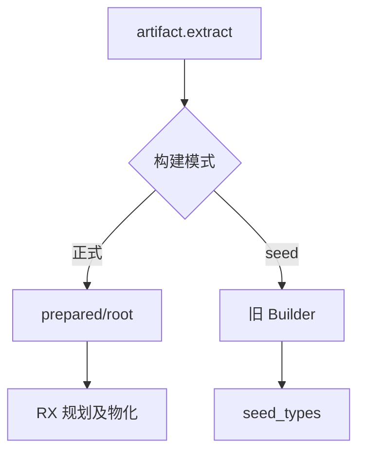
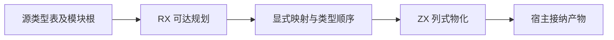

# 类型提取旧桥清理

- **Intent：** 移除已被 RX 规划及物化替代的增量类型提取桥，令正式构建依赖与真实执行路径一致。
- **Data：** `artifact.extract` 在 generated 模式直接返回 `prepared/root.extract`；唯一 `TypeMap.collect` 构造来自旧 Builder；旧 Types 在 seed 模式直接调用 seed_types。因此 `generated_type_extract` 在两种模式下都没有执行消费者。
- **Edges：** 不重写既有 planning/materializing，不修改类型合并，不声称整套模块提取已自举；保留 seed 引导算法、共用依赖遍历及名义来源校验。不新增测试、不跑全量测试。
- **Answer：** 删除旧入口、专用桥及生成接线；显式限制 collect 分支为 seed；构建与已有类型提取相关专项检查通过，记录实际结果并提交。

## 架构图

## 数据流图

## 实施与自查

删除必须覆盖 generate_parser 输出、parser Sources/模块组装及 compiler imports；删除两个输出后同步调整输出参数位置。保留 extracting 的 dependencies、pending、origin、planning、materializing。确认 extracting/copy 无其他消费者后删除。共享 Nodes 的 collect 分支在正式模式编译时不可调用 seed；不能仅删除桥后把正式路径悄悄退回 seed。

构建成功仅证明接线一致；可达性证据才说明这里是旧桥清理，而非新增一次算法迁移。最终自举仍需继续迁移可达的 merge_writer 等状态与宿主规则。
