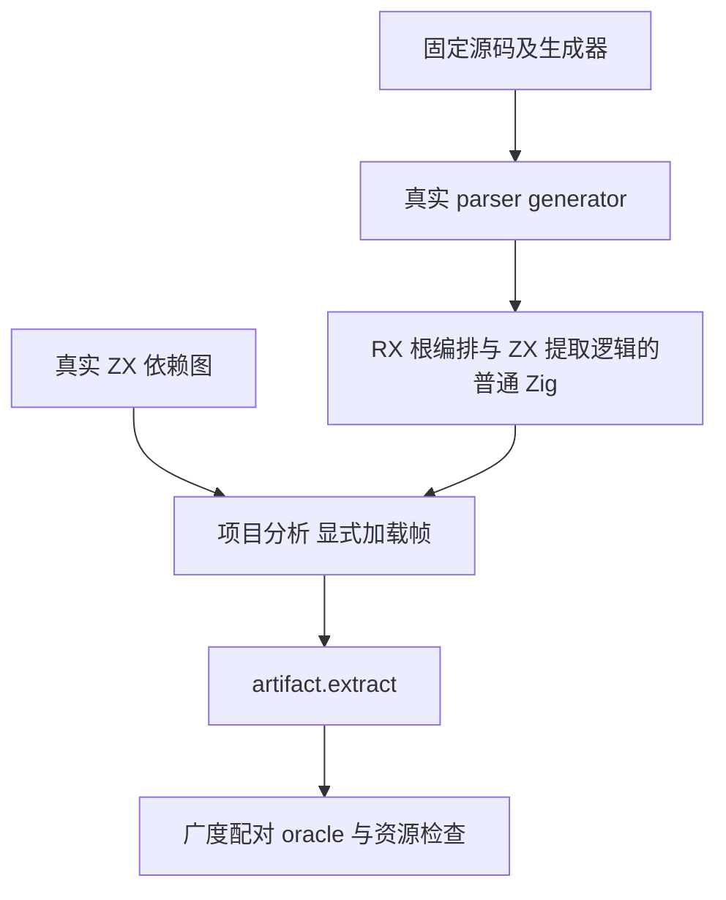
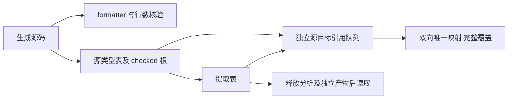

# 类型提取深依赖修复复验

## IDEA

- Intent：完成共享依赖前沿测试，验证模块加载显式帧修复后，合法深度、超限诊断、提取闭包及资源所有权。
- Data：旧 c3c147245 的 Debug 有 34/36 检查通过，深度 129 在真实 project.analyze 中崩溃；def60b406 改用显式加载帧。当前冻结候选 25cc3108d 同时包含 591e59acc 的 RX 类型根提取迁移。
- Edges：只发布测试包新增六个文件及构建注册。旧执行检出不移动、不修改。生成 ZX 使用真实源码与真实 formatter，保持每文件不超过 120 物理行。原生启动恢复使用已核验的签名 Zig 副本及空 entitlements，不修改系统策略或生产源码。
- Answer：九个新增具名测试、七个选定测试根在 Debug/ReleaseSafe 的真实运行、来源与输入 SHA、原始日志、独立闭包 oracle、自我批判、英文 Conventional Commit 和 push。

## 阶段与验收

1. 在独立管理检出复制未发布测试，修正生成器中相邻类型 import 的格式，不改变图规模。
2. 从当前检出重新编译并执行真实 parser generator，生成包括 artifact_roots 的编译模块；不得复用旧生成语义冒充最新迁移。
3. 冻结源码、工具、外部模块及生成产物。真实 formatter 检查所有规模的 ZX，统计实际物理行。
4. 直接编译七个注册测试根，验证签名后运行。两个模式各应完成 36 个具名检查；参数矩阵与分配失败轮次不增加用例数。
5. 核对独立广度配对 oracle、输入释放后的所有权、独立产物释放和所有分配失败的输入不变性。完成后仅发布本批文件。

## 自我批判

本批验证具体输入及选定测试根，不证明完整自举或全仓生产就绪。签名恢复只解决原生启动条件，不改变语言语义，也不能把旧未终态进程计为完成。若真实测试继续失败，保留原始失败证据，只向实现聊天报告已确认的新缺陷。
