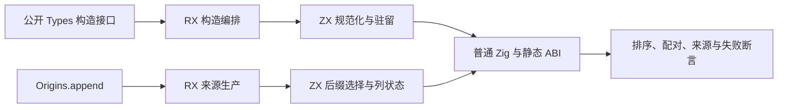
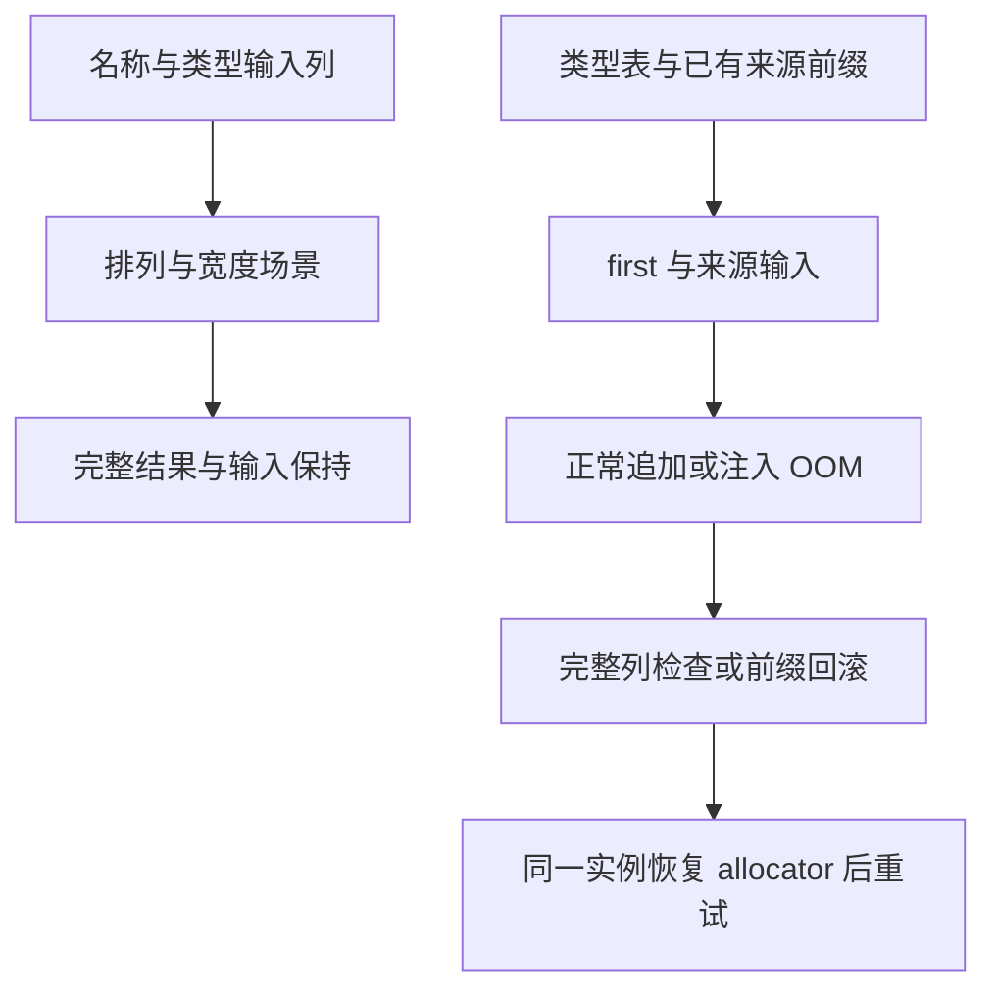

# 类型规范化与来源追加

## IDEA

- **Intent：** 复验死桥移除后的正式类型构造/映射，以及名义来源状态迁移的边界和失败契约。
- **Data：** 固定 `7cdb8d5e682440cb79c19b68543d5ab17f5e5a2e`，包含名义来源状态自举、名称排序和旧类型重映射桥清理。当前 parser 输出 82 个，加 lexer 共 83；上次 384 次执行只覆盖更早版本。
- **Edges：** 只修改 packages/test 和本目录；不修改生产实现。不把 seed 的标准库排序当作正式排序算法。保留 generated_artifact_remap 活跃职责；本轮不新增 Test262 原文适配，不宣称完整自举或生产级验收。
- **Answer：** 新增字段/错误集规范化及来源追加边界测试；使用新生成模块，在 Debug、ReleaseSafe 执行原 31 组及相关现有门禁，逐项核对完整测试名、源字节和产物哈希，英文 Conventional Commit 后 push。

## 步骤

1. 固定独立工作树，从当前接口重建标准目录、lexer 和 82 个 parser/semantic 输出。
2. 规范化：六个带前缀、数字后缀和大小写后缀的合法名称遍历全部 720 个排列；检查对象名称/类型配对、规范化身份和输入数组保持。错误集独立检查名称顺序。宽对象覆盖空、单元素和多种容量边界。
3. 来源追加：遍历合法 first 边界、空后缀、已有前缀、三种来源及多批次；检查仅 enum/native reference 被选中，所有列保持对齐。逐次分配失败后检查原前缀并重试，来源字符串在调用方修改后仍有效。
4. 汇总执行全部相关根，保持 fixture 模块边界；整理实际证据及自我批判，核对发布范围并提交 push。

## 架构图

## 数据流图

## 自我批判

有限排列不是任意名称的证明，零补齐数字名称只用于独立构造明确的预期字节序，不用于生产代码。直接构造接口测试不能替代真实 ZX 文本、制品、库消费及运行门禁，因此同时复验现有项目分析链路。失败回滚只约束来源逻辑长度/内容，不承诺容量或地址不变。owner Arena 在生命周期末统一回收，不能由此宣称一般 allocator 下逐块无泄漏。类型 label 仍借用输入，不扩大来源 owner/member 的复制契约。此输入保持门禁只针对 generated_parser=true；seed 的原地排序行为不在本次通过范围。
