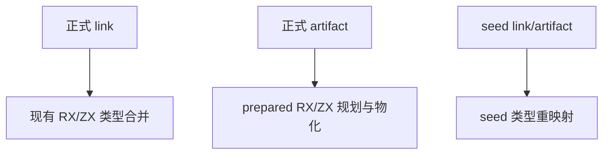
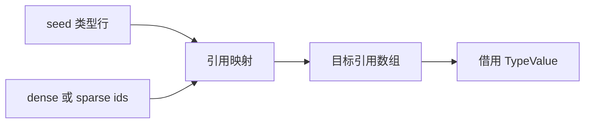

# 类型重映射旧桥清理

- **Intent：** 删除无正式消费者的 references Buffer 与 generated_type_remap 过渡桥。
- **Data：** remap.value 只有 link/seed_types 与 artifact/seed_types 消费；正式 link 进入 semantic.merge，正式 artifact 提前进入 prepared/root，Nodes.TypeMap.collect 在正式构建中为 void/unreachable。
- **Edges：** 保留 seed 的 dense/sparse 映射、目标数组分配和 TypeValue 重建。不得误删活跃的 artifact_remap；其职责是正式 IR 重新编号，与此单行类型 seed 桥不同。
- **Answer：** 移除死 RX/ZX/原生接口与输出注册，核对生成参数，构建与既有映射专项通过后提交。

## 架构图

## 数据流图

## 实施范围与自我批判

删除 semantic/remap.rx、types/remap.zx、native/references.zig、references.d.zx 与 remap.zig 的 generated 分支。清理 type_remap/remap_abi/reference_view 的专用模块接线，保留 seed 必需的 Mapping 和 value.borrow。后续位置参数整体前移两项，必须逐项核对。

该项是过渡实现清理，不能计作新迁移活跃语义；原生接口清单清空也不能证明自举完成。下一真实候选是 artifact 输出函数合法性规则，继续按正式调用闭包审计。
