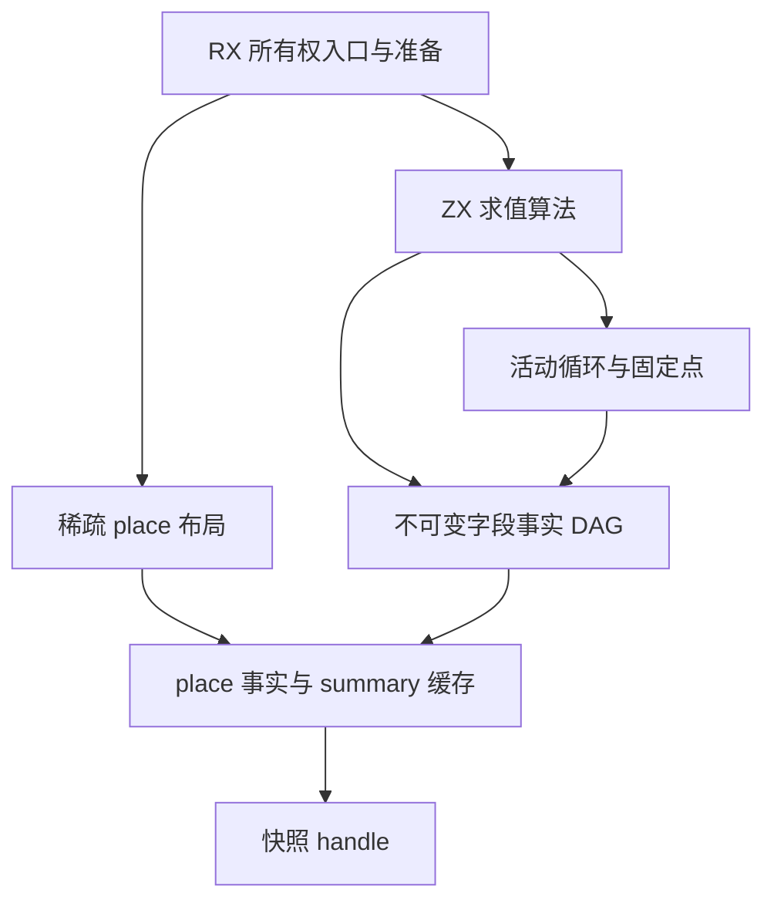

# 聚合字段所有权执行计划

## Intent：最终目标

保留对象与元组的逐字段所有权，使普通赋值、投影、分支和循环不再将独立拥有的字段误判为借用。集合转换已降为普通循环，本次修复作用于通用所有权分析，不识别 map 或具体用例。

## Data：可用证据

- 现有模块输入专项的两个失败均来自 identity map 返回值被判为 borrowed；前一提交的正式生成依赖也复现相同失败。
- `runtime/execute/objects.zx`、`values.zx` 只汇总结果的单个 State；`scope.zx`、对象缓存及循环参数向整棵 place 树写入该状态，丢失字段差异。
- `places/combine.zx` 对 Copy/Owned 不满足交换律，不能直接作为控制流固定点的 join。
- 布局仅建立实际出现的字段投影。直接展开全部静态类型会使共享类型 DAG 指数膨胀，且放大每次快照成本。
- 当前快照释放只检查 place 的整体 Loaned，无法处理整体 Borrowed、内部某字段 Loaned 的聚合事实。

## Edges：边界与限制

1. 保留稀疏 place 与现有表达式 memo 的职责。事实 handle 不表示表达式已经求值，禁止写入 memo 绕过下一轮求值。
2. 事实为不可变、可共享 DAG。统一状态以小整数表示；产品节点只保存直接字段，不递归展开类型。
3. 产品必须独立保存容器自身状态和字段状态。空对象或仅含值字段的对象仍有容器所有权，不能只汇总字段。
4. Memory 的 fact 是权威数据；states 是 summary 缓存。所有赋值、借用、冻结、快照更新与恢复必须同步两者。
5. 对象与元组保存字段事实；列表、任务和未有字段契约的调用结果保守保存整体事实。optional 的 none 可为 Copy，但 Copy 不表示未知或未分析。
6. 不新增用例、不改既有用例期望、不执行全量测试、不做浏览器验证。只使用相关已有专项及正式构建。
7. 所有编译器规则仍写入 RX/ZX，ZX 每文件不超过 120 行；不增加专用原生桥或产物运行库。

## Answer：交付与成功标准

按三个依赖阶段实施。草稿先于正式源码；阶段未接入不能宣称已修复失败。当前事实存储、快照、表达式结果与循环固定点已接入正式源码；正式构建与 7 组现有相关专项已通过，实际证据见执行记录。

### 一、事实与存储

- 新增 uniform 编码、产品装配、字段投影和独立的状态 join 原子算法。
- 稀疏布局增加 type_id 和父字段编号；更新子 place 时重建祖先事实，从完整字段重算 summary。
- 快照保存 handle；不复制字段树，不截断仍被引用的事实存储。
- Borrow、Freeze、ReleaseAllLoans 和 ReleaseNewLoans 遍历已物化 DAG；通过 handle 或 handle 对缓存复用，避免共享路径重复展开。

### 二、求值传播

- 保存不可变 value fact，所有跨表达式 continuation 同步保存事实。
- 对象与元组按规范字段顺序装配，scope、constant、destructure 和缓存绑定保留完整事实。
- 分支按字段 join，调用契约不具备字段证据时保持保守。

### 三、循环固定点

- 每个活动循环独立保存 head、累计出口、外部根事实与初值求值后的入口快照。
- 同一贷款释放边界下对 head、body 与外部相关状态执行单调 join，直到语义稳定。
- 前置条件循环在 condition 完成后记录零次 body 出口，保留 condition effects；后置条件循环至少执行一次 body 才记录出口。
- join 结果未改变左侧语义时返回左侧 handle，不能以新分配编号判定不收敛。

## 自我批判与验收

不可变事实增加了编译期状态模型，必须通过单一写入边界控制复杂度。保留两份可独立写入的事实和 summary 将比当前模型更危险；接入时必须检索所有 states 写入点。聚合 summary 与路径 join 即使使用相同优先级，也必须保留不同语义入口，不能再次将容器、字段和控制流混成一个操作。

验收需同时确认字段传播、借用释放、循环收敛与既有专项结果；只有编译成功或两个失败消失不足以证明完成。大 feature 完成后按英文提交并 push。
