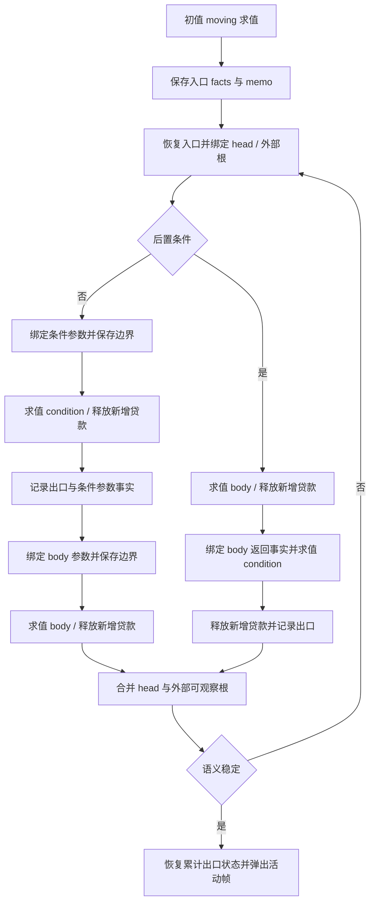

# 聚合字段所有权执行记录

## Intent：本节点目标

建立保留产品字段事实的所有权状态模型，先完成统一存储、位置更新和快照边界，再接入表达式结果传播与循环固定点。本节点已完成下文所列正式构建与相关专项验证；完整语言与最终自举目标不据此标记完成。

## Data：源码接入记录

- `places/join.zx` 明确 Copy < Owned < Loaned < Borrowed < Moved 的路径合并顺序，不改变既有 State 枚举序号。
- 稀疏布局新增逐位置 `types` 与 `field_indices`。symbol、对象求值缓存根和实际字段投影分别写入对应元数据，没有展开静态类型树或改变位置编号。
- `facts/` 已从草稿接入正式源码。统一状态用 handle 表示；产品节点保存 type、独立 shell、整体 summary 和直接字段 handle。持久替换重建父路径，原事实不变。
- `facts/rewrite.zx` 使用显式工作栈处理 Join、Borrow、Freeze、ReleaseAllLoans 和 ReleaseNewLoans；单次调用的哈希缓存复用共享子图。未变化的子树递归保留 left handle，为后续固定点提供语义稳定判断。
- Memory 保存 forest、facts、states、memo 和 trail；facts 是权威状态，states 是按事实产生的摘要缓存。
- `runtime/place.zx` 统一 Assign、Borrow、Freeze。`facts/bind.zx` 在一个内聚的树更新算法中完成父链重建和稀疏子树刷新，同步事实与摘要。
- 借用来源遍历保留表达式查询逻辑，具体位置状态修改改走统一 place 操作，已去除旧的独立祖先状态传播分支。
- 快照保存不可变事实 handle。restore、join 和 release 按根处理，然后重建已有字段缓存；不根据根 summary 跳过内部 Loaned 字段。RestoreMemo 不回退事实存储，drop 不截断 forest。
- 快照 update 同时返回 memory 与 snapshots，match 和 selection 的全部调用点接回两者，保留 join 产生的新事实节点。
- 当前值与暂存值已改为 u64 fact handle。需要判断所有权时读取 summary，返回契约仍汇总为既有 State；不再维护独立的结果摘要副本。
- 对象按 canonical 字段编号、元组按位置装配事实；scope、constant、缓存和调用绑定直接传递事实，解构投影对应子字段。
- 聚合装配现通过 builder 一次性预留直接字段区间，字段结果写入本次未发布区间，完成后由 publish 扫描摘要并发布节点。嵌套 builder 有独立 first/count，Object/Tuple 不再占用 values 栈；List/Template 保留其既有暂存方式。已发布节点的区间不可再写。
- 现有 IR 对象校验保证字段数量等于产品字段数、字段编号合法且不重复；元组校验保证长度一致。因此合法 IR 下发布前每个预留字段均完成写入，不靠默认 Copy 掩盖缺失字段。
- 新增 Project continuation，补齐未命中存储位置时的字段投影。结果事实不写入表达式 memo。
- 新增 Read 事实转换，仅将临时 Loaned 字段变为 Borrowed，保留独立 Owned 字段；显式 scope 借用仍对源和结果分别执行永久借用与 Freeze。
- conditional、binary、match 结果使用逐字段 join，并保留新 forest。Some/OptionalValue 透传 payload 事实，None 为 uniform Copy；产品形状来自事实中的类型。
- Capture 已独立处理为“先求载荷，再构造错误与结果二元组”，字段事实为 Copy 与载荷事实。Some/OptionalValue 才透传载荷，避免 Capture 的产品形状错误。
- 循环绑定域已接入 RX prepare 并传入执行上下文。完整子边查询覆盖现有 36 种表达式；域计算从当前 condition/body 逆拓扑遍历，收集 Scope、Iteration 与 Transform 的局部声明，不沿 Reference 追溯外部定义，也不纳入当前 initial 的声明。
- 普通调用缺少字段返回契约时仍保守使用整体事实。循环活动帧与固定点已接入，详见后文；尚无编译验证，不能据此宣称既有失败已修复。

## Edges：初期验证范围与限制（后续结果见文末）

- 所有权目录 106 个 ZX 文件的 120 行限制、相对导入文件存在性与目录内导入无环检查通过；本次 diff 空白检查通过。
- 四轮只读源码审查分别覆盖事实重写、正式 Memory 接入、精确结果传播和一次性聚合装配，未发现确认的缓存扩容、状态同步、句柄生命周期或借用释放遗漏。审查结论依赖同类型合法产品、独立 shell 和非引用字段状态归一化，不能替代语义编译。
- `zig-out/bin/zxc --help` 尚未完成，进程处于系统等待状态 U，没有输出。没有重启编译器，也没有把无输出视为成功。
- 批量接口接入前尝试 Grit；`grit --version` 的底层进程同样处于 U 状态。调用点改用有匹配断言的脚本生成草稿，并复核对应 diff。
- 未新增测试用例、未修改既有用例预期、未运行全量测试或浏览器验证。尚无本节点语义编译与专项结果；原有两项失败仍按未修复处理。
- 尚未提交或 push 本 feature。草稿保留正式源码的相对导入，既有 analysis/IR 依赖由仓库源码提供；草稿目录不是独立可构建包。

## Answer：接入后的验证顺序

1. 已接入独立循环活动帧和固定点，并通过文末所列正式构建与现有相关专项。
2. 核查生成代码中的聚合分配和复制成本。源码算法已消除逐字段 persistent replace，但静态检查不能替代实际生成物证据。
3. 工具进程恢复后已完成当前源码正式构建与相关专项；保留实际生成依赖证据，不使用旧生成缓存代替验证。

## 自我批判

此前 `bind.rx` 草稿假设 ZX 能直接调用本地 RX。实际检查 `modules/project.zig` 的路径解析后确认，本地 ZX 导入只解析 ZX，该草稿不能作为可调用实现，已删除。字段替换与缓存刷新属于同一个树更新算法，现合为原子的 `bind.zx`；没有为此新增跨语言加载机制或运行时调度。

当前 Memory、结果传播和循环参数均已使用事实模型。分支快照 update 已按根位置汇合，与 apply 的根恢复及字段重建边界一致；无需对投影缓存再次递归 join。当前仍缺正式编译与专项验证，不能将闭环接入等同验收完成。

## 固定点接入边界复核

- head 保留已捕获初值的 mixed fact，但 Owned 不等同独占复用许可。genz 的同 region、exclusive、引用次数及已分配来源证明保持不变；不能以 Freeze 原绑定替代这些证明。
- 不在进入循环时无条件永久借用 initial；现有永久借用 Call 会追踪其所有参数，可能扩大冻结范围。
- 条件参数绑定 head 后保存快照，非 moving 求值条件，相对该快照释放新增 Loaned，再读取条件参数的最新 fact 进入 body。不能先 Read 再释放，也不能恢复入口而丢掉 Borrowed/Moved 与其他有效变化。
- 前置条件的零次出口也包含条件效果；后置条件至少先执行一次 body。两者的出口候选都来自条件处理后的状态。
- 收敛域应包括 head 和循环外可观察的根事实，排除按真实 IR 绑定归属识别的局部槽、对象 memo 缓存、builder、values/work 栈及 forest 长度。不得用“入口状态为 Copy”推测局部归属。

Capture 修正来自进一步核对 `expressions/rules/tasks.zx`，此前源码审查遗漏了它的二元组结果契约。该漏项已经修正，但说明只读审查不等于完整正确性证明。循环域依赖的 child_id < parent_id 契约已核对 typed、task 和 iteration 校验；后续仍需以真实编译和相关已有专项补足证据。

为诊断持续的编译器等待，启动了只读进程采样；采样命令同样尚未完成，没有可用采样结论。没有据此修改系统设置或重启其他会话进程。

## 循环固定点正式接入

Intent：移除固定次数重试，用字段事实与外部可观察状态共同收敛；保留前置和后置条件的真实执行顺序。

Data：正式 `loops/activations` 新增活动帧、入口恢复、出口汇合、反馈汇合和出栈；`runtime/execute/callbacks/iteration` 按准备、启动、回调完成、反馈与结束拆分。所有代码均先写入本目录草稿，再接入正式源码。

Edges：初值以 moving 求值，之后保存入口；不把 Owned 当作生成器独占存储证明，不改 genz 缓冲转移准入，也不无条件冻结初值来源。循环域来自 IR 的真实绑定，入口活跃 memo 的缓存根仍保留为外部可观察根。每次恢复保留最新不可变事实 forest；不把 forest 长度、工作栈或临时构造器纳入收敛。

Answer：新增 IterationRound / IterationAdvance 已接入 family 和 callback 路由。head 与外部根 join 不再变化时结束；出口另行累积，Moved 出口报告 ownership 失败。正式实现已接通，但尚不能宣称既有两个失败已修复。

静态核验：所有权目录 106 个 ZX 文件均不超过 120 行；相对导入目标存在；ZX 依赖无环；git diff --check 通过。只读审查未发现确认的阶段顺序、快照边界、嵌套活动帧、收敛判断或导入错误。

验证限制：既有 CLI、Grit 与进程采样会话再次轮询仍活跃且没有输出，没有重启这些进程；尚未获得编译或专项运行结果。未新增测试、未执行全量测试、未浏览器验收、未提交或 push 本 feature。

自我批判：源码审查只能支持结构与局部数据流结论，不能证明生成器能正确编译新增状态结构，或固定点在实际 IR 上按预期收敛。当前仍须取得编译结果并运行已授权的现有专项；不得把静态检查通过写成问题已修复或完整自举完成。

## 分支快照合并范围收束

源码核对确认快照事实只由 apply 在根位置读取；字段缓存从根事实重建。update 原来对每个字段位置重复 join，造成相同产品子树重复遍历。现向 update 显式传入 Layout，只更新 parents 为零的根；三个调用点同步接入，快照长度、索引和释放边界不变。草稿先行，未新增测试。此优化只消除编译期冗余工作，不据此声称应用产物零复制或完整验证通过。

本轮再次观察：CLI 的既有会话仍活跃无输出；ps 显示 CLI 与 Grit 均为 U 状态，累计 CPU 时间均为零。该证据不能定位系统等待的根因，没有重启进程或改变系统设置。

## 工具阻塞审计

连续多个目标轮次中，同一 CLI 启动等待与 Grit 启动等待均经活跃会话重新核验。本轮进一步通过 ps 和 lsof 确认：PID 98262 是当前工作树已存在的正式构建，其工作目录与 PID 27079 的 CLI 启动探测相同；构建已等待约 6 小时 49 分钟，状态 U。其他会话的 Zig 命令亦处于 U，不能将问题归因于本次所有权算法。只读采样仍没有结果，系统等待的具体根因未确认。详情见工具阻塞状态.txt。

本 feature 已完成当前可依据源码实施的事实模型、表达式传播、循环固定点及根快照合并；下一步需要实际构建与现有专项诊断。继续叠加未验证代码不能弥补这一验收缺口。目标按工具阻塞记录，未标记完成，未提交或 push；没有杀进程、重启任务、修改系统安全设置或干扰其他会话。环境恢复后先核验这些已有进程的终态，再正式构建当前源码，不将早于修改启动的构建自动视为当前源码验证。

## 环境恢复后的正式构建修复

按更新后的 AGENTS 要求读取主目录用户目标索引，沿 2026-10-03 原文核对模块机制与完整实现目标，并以当前会话最新授权继续本任务。原 PID 及会话句柄已不存在，系统中当时没有 Zig 构建，因此启动当前工作树的正式构建，未重启活跃任务。

新构建工具已正常执行并返回源码诊断。第一轮发现导入顺序不符合内置规则；逐文件以 zxc fmt 先格式化草稿再同步正式源码。格式化解析又发现 containers 的 Tuple 分支缺少闭合括号，正式生成校验发现 children、declarations、snapshots/apply、runtime/place 的嵌套三元条件违反语言规范。现补齐分支并改为 match 或独立中间值，全部 106 个 ZX 的 formatter 处理通过、120 行限制和 diff 空白检查通过。

这说明此前自写行数、导入存在性与图检查未覆盖实际语法和内置风格约束，不能替代编译器验证。当前正在复验三日志所记录的正式构建中处理后续诊断，不能将格式修复视为构建已通过。

## 字段专项暴露的循环初值分配

Intent：保持条件细化宿主的零字节临时 arena 契约，修复丢弃结果的深层循环多余初值分配。

Data：正式构建 36/36 通过；输入模块已有 6 项全部通过，包括此前两项 map 所有权失败。字段专项 27/35 通过，8 个分支用例因 refinement_assume 的初值 allocator.create 失败。旧生成目录 e1d31fd5d0a4cd44f6de6bf8828eae71 中存在完全相同的分配，说明缺陷早于此次事实模型。生成器 iteration.zig 的 deep 模式已支持 discard，但 direct_initial 错误地只允许 consume，导致 discard 先分配普通对象再转换为局部值状态。

Edges：保留 deep 与 initialValue 的身份和操作安全检查，不扩大可逃逸结果的栈化范围，不改宿主 FixedBufferAllocator，不加入编译器模块名或具体用例特判。deep 本身只在投影消费或丢弃结果模式成立。

Answer：移除 direct_initial 的重复 consume 限制，复用已有上下文生成深层初值。草稿先行；由既有字段分支专项检验零临时分配，之后继续其余相关专项。只读审查确认此门槛与失败生成物一致。修复未完成复验前不声明字段专项通过。

## 归约累加器绑定语义修正

修复初值分配后，正式构建再次 36/36 通过，输入 6/6、字段 35/35、临时借用 13/13 通过。归约 15/16 通过；剩余失败要求 map 产生的 Owned 初值经过 push/pop 条件回调后仍为 Owned。

根因位于集合降级的 step：所有回调参数都使用 borrow=true，包含 reduce 的累加器。Scope 的明确借用语义会 Freeze 其事实，pop 因而正确地返回 Borrowed。这不是固定点应当放宽的状态，而是降级时把循环携带值误标成了借入元素。

现在仅让 reduce 的第零参数按值绑定，传递上一轮 accumulator fact；item/index/source 和显式捕获仍维持原借用行为。初值本来 Borrowed 时仍保持 Borrowed，不以函数名称或测试文本伪造 Owned；genz 独占转移规则不变。具体草稿在草稿/collections/step.zig。既有归约专项保留全部断言，待重新验证。

## 本节点验证与交付

正式构建 `zig build -j2 --verbose --summary all`：36/36 步骤通过。全部专项使用该构建的实际生成模块、ABI 与原生依赖；生成依赖摘要记录了 92 个生成文件的 SHA-256，没有复用历史命令中的旧生成路径。字段、归约的失败原日志保留，修复后重新执行原用例，没有改动测试源码或预期结果。

| 现有专项 | 通过数量 |
| -------- | -------: |
| 输入     |        6 |
| 字段     |       35 |
| 贷款     |       13 |
| 归约     |       16 |
| 缓存     |       50 |
| 返回     |       53 |
| 循环     |        2 |

合计 175 项通过。未新增测试、未执行全量测试、未做浏览器验收。所有权模块 106 个 ZX 文件均不超过 120 行；正式编译已覆盖语法与内置风格检查；草稿与本次正式实现同步，diff 空白检查通过。

最终改动包含逐字段不可变所有权事实、表达式与快照传播、循环入口与出口的固定点汇合、根级分支快照合并，以及两项由专项暴露的必要修正：discard 深层循环直接生成安全初值，reduce 累加器保留上一轮事实。没有修改宿主零字节临时 arena，没有改 genz 独占缓冲转移资格，没有新增运行库或用例特判。

自我批判：前期源码审查遗漏了实际语法、内置导入风格以及 lower 阶段 accumulator 的借用角色，编译和原有专项才暴露这些问题。现在的通过证据覆盖本节点明确列出的路径，不能推广为全仓回归通过或完整自举完成。生成依赖中仍有既有原生桥，最终迁移和阶段自编译继续按自举完成标准推进。

远端新提交 f9a897ce1 仅修改测试与执行证据，与本节点源码范围无交集；提交时保留该提交。用户目标已按索引与本会话最新指令核对，未缩小完整目标。
