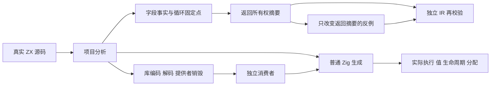
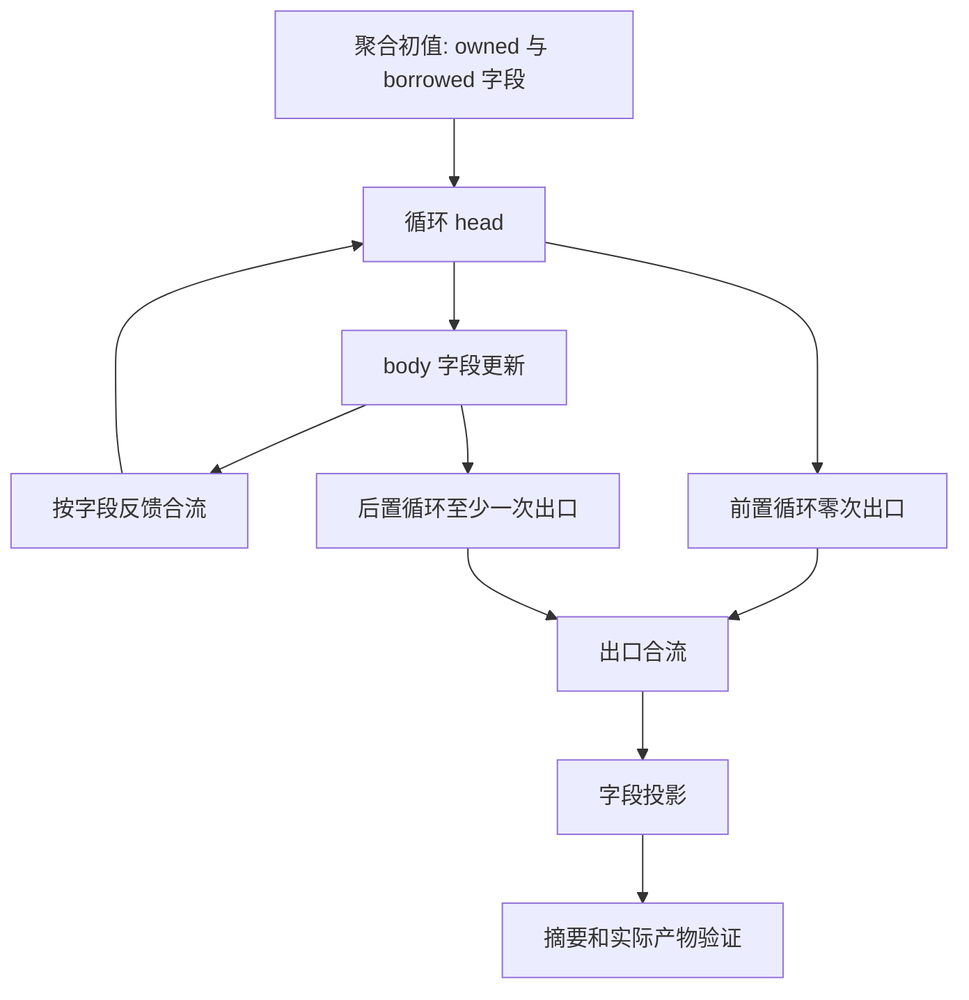

# 聚合字段所有权专项

- **Intent：** 为 `f5657370c` 的逐字段所有权和循环固定点补充独立测试，验证借用字段不会污染拥有字段，真实合流和零次路径又不能被忽略；验证 deep discard 初值没有不必要的临时分配。
- **Data：** 首轮测试基线 `ecfef68d6258c3b07d110f2a759557a84c6f32b9`，最终修复验收基线 `872106c3981af68fa4049452f583d535af3b7551`；实现记录 `../聚合字段所有权/执行记录.md`；普通值持久不可变、返回摘要和空 reduce 规则见 core IR 契约。成熟样例为 ownership/reduce/check.zig 与 collections/aggregate_loop。
- **Edges：** 仅修改测试包；不写生产代码，不按假定的私有结构制造通过。普通持久值可继续读取，不能按过时的线性列表语义设计拒绝用例。分析摘要、IR 再验证与运行时内存行为分别检查。静态链接、无专用运行库；ZX 物理总行数不超过 120。固定新工作树，不移动旧引用。
- **Answer：** 交付按投影、分支和循环职责组织的分析用例与真实源码/编译库产物门禁；执行 Debug、ReleaseSafe、精确命名和分配失败检查；仅发送确认的新缺陷；证据、恢复驱动和自我批判落盘，完成后英文 Conventional Commit 并 push。

## 实施步骤

1. 核对实现与既有覆盖，使用一个只读分析子 agent 协助找出合流和契约验证缺口。
2. 草稿优先，构造正反控制：同一聚合不同字段、两分支的所有权差异、pre/post 循环、reduce 初值与回调结果。
3. 生成 85 个当前编译模块。使用真实分析和 IR 校验，控制修改 output_ownership 验证非法摘要会被拒绝。
4. 源码与独立编译库消费者执行真实产物，检查输入及旧输出保存、边界错误、深层丢弃循环的零字节 arena 契约。
5. 逐项整理实际结果和限制；校验字节和范围，保留外来改动；正常 hooks 后复验，再提交 push。

