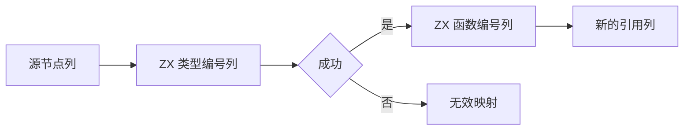
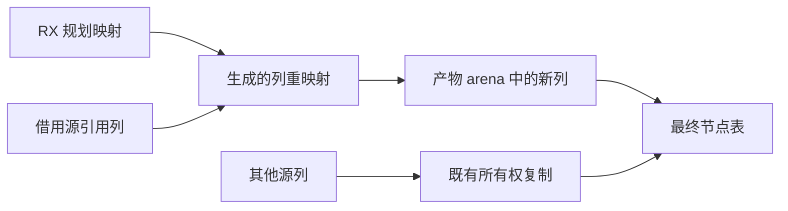

# 节点引用列重映射

## Intent：最终目标

将正式产物路径的符号、Store 和表达式引用列变换迁入 RX/ZX，继续使用已有节点所有权复制，避免先复制数值列再原地逐项重映射。正式函数、原生映射直接借用 RX 规划，不再转换整张临时 nullable ID 数组。

## Data：可用证据

bbc16a941 的 Nodes.symbols/stores 按行调用 Types.include；expressions 先复制全部列，再对 types/call_functions 逐项改 ID。正式类型映射已经是 u64 零哨兵计划，函数和原生映射仍为了旧 Nodes ABI 额外转换。原产物 arena 已覆盖整个内容生成生命周期。

## Edges：边界与限制

保留 seed、链接器和缓存恢复的原 nullable ID 映射接口语义。共享的映射视图只统一已有编码的读取，不改变源编号或生成顺序。正式 Nodes 的生成重映射使用产物 arena，输出列直接交给最终表；其他列继续按照既有生命周期取得所有权。不可用临时 arena 返回悬空数值列，不可把缺失映射当类型 0。输入的类型与函数列分别属于不同编号域，RX 必须明确这两次调用及失败短路。

## Answer：交付与成功标准

一个 ZX 编号列算法、RX 类型域→函数域编排、只读编号视图、正式 Nodes 接线及构建注册。复用已有产物、Store、缓存、联结和分配失败专项，不新增测试、不执行全量。新增 ZX 每文件 ≤120 行。未迁移的宿主选择和复制继续明确记录。

## 自我批判

普通编号读取不是完整节点自举。验收必须确认正式 Nodes 实际调用生成模块、没有保留数值列的多余副本，并标记仍在宿主中的节点结构复制及总流程。为了兼容旧调用点引入的编号视图必须保持小而直接，不能发展成动态调度层。

## 兼容调用点调整

编号视图涉及十处既有 Nodes 构造点，包含 library 和 RX 路径。优先尝试 grit，但该环境的 CLI 连 help 也停在不可中断进程状态、未输出帮助；取消本次启动后，按明确的 Nodes 构造点执行限定替换，每个文件要求恰好一处，未对其他 IR functions/native_modules 字段做全局替换。旧 nullable 表进入 indexed 分支，正式规划进入 planned 分支；不改变旧映射的读取语义。

只读复核发现最初限定在 zx/modules 的搜索漏掉 library/initializers、library/link、rx/analysis/module_native、rx/analysis/program/builder 四处构造点。补齐后对整个 compiler/src 与现有测试目录检索 ArtifactNodes 和 nodes.zig 导入，确认调用范围；该遗漏说明共享类型变更不能仅以当前迁移目录为检索边界。
