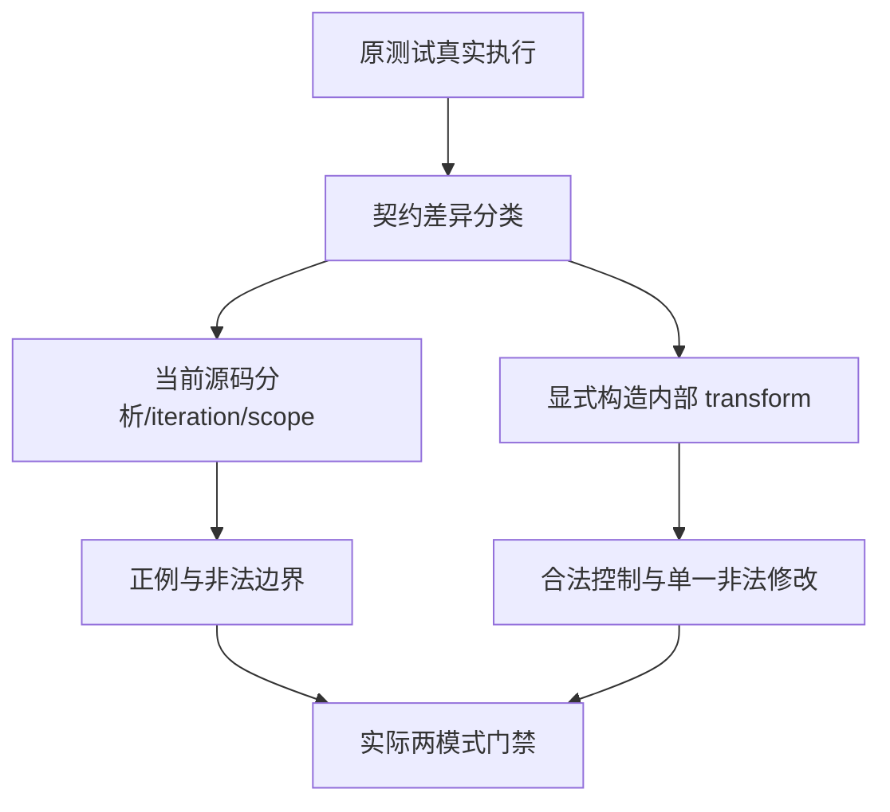

# 谓词分析契约迁移

## IDEA

- Intent：让旧谓词分析回归与当前源码参数/捕获/iteration 契约一致，保留内部 transform 校验，补充正负边界。
- Data：固定 a5a530222。源码 every/some 参数为元素、索引、源数组，可省略后缀；词法捕获合法；源码展开为 iteration/scope。旧测试仍拒绝两参数、捕获，并查找 transform 或 predicate_ 字符串。
- Edges：先实际运行原测试确认失败，诊断来自旧测试预期还是实现要分开。不能删掉 transform 兼容性验证，也不能仅把所有拒绝改为成功。ZX 每文件最多 120 行，正式修改只限测试包，编译器不改。
- Answer：保留原门禁失败证据；源码参数、错误/Task/重复绑定/捕获作用域边界和独立内部 transform IR 控制组；两模式实际门禁通过后英文 Conventional Commit 与 push。

## 自我批判

失败不能自动当编译器缺陷。源码不再生成 transform 时，兼容性测试需明确构造旧内部节点；合法控制组先过才能解释非法输入拒绝。结构校验、生成文本和实际执行各有边界，本批不据此宣布全仓库通过。
