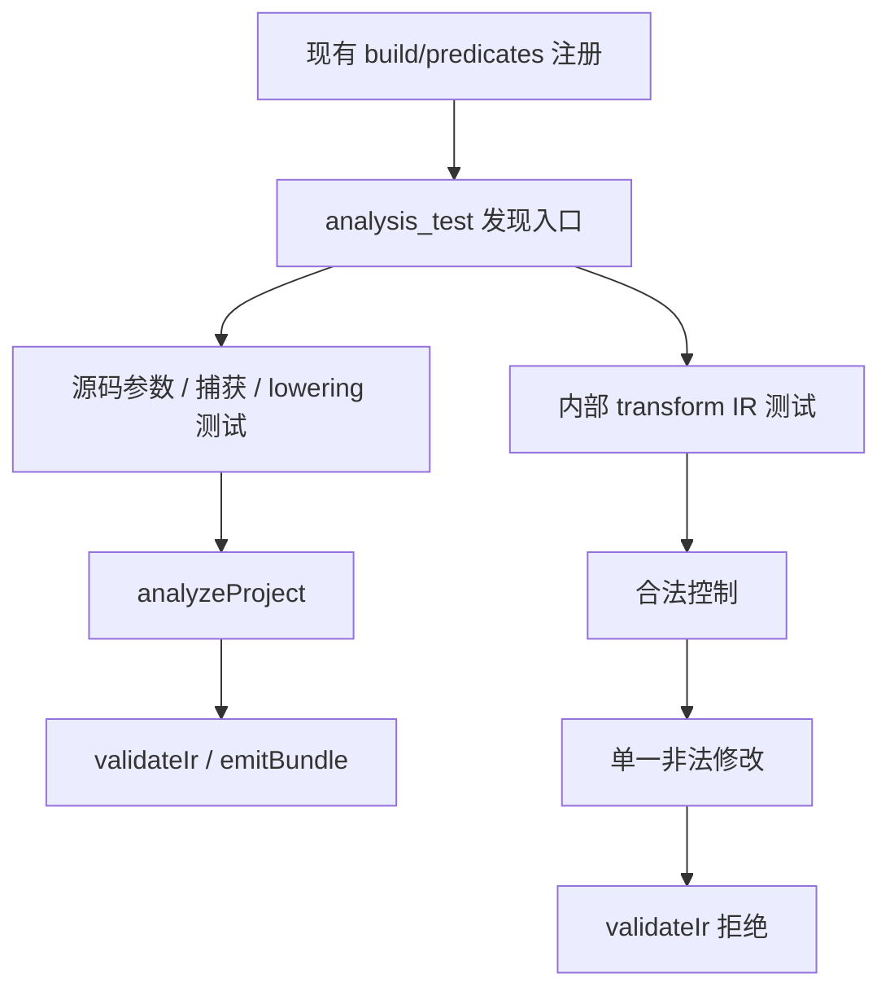
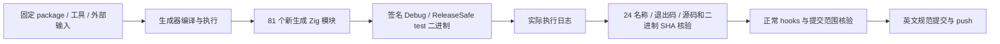

# 谓词分析契约迁移执行记录

## IDEA

- Intent：恢复当前源码谓词分析的有效回归，保留内部 transform 兼容性负例。
- Data：固定 a5a530222cf649781c13a38277c653015a58afd9；新生成 81 个模块；原测试 Debug 实际 2 通过、4 失败；最终 Debug 与 ReleaseSafe 各 25 项全部通过，其中各 24 项命名行为测试和 1 项发现入口。
- Edges：正式改动仅 7 个测试文件，不修改生产实现、Test262 分类或生成源。直接 Zig API 门禁不代表完整 zig build 或全仓库回归。没有新增已确认实现缺陷，不向实现会话发送消息。
- Answer：24 个命名测试及发现入口在 Debug / ReleaseSafe 实际执行；保留原失败、探针、两次预备失败及最终日志；正常 hooks、字节与范围保护后 commit / push。

## 当前源码测试边界

参数测试覆盖零至三参数、u64 索引和源数组类型、忽略的第二实参、超额参数、缺少或非 lambda 回调、非 bool 返回值及第三实参。捕获测试覆盖外层标量、参数遮蔽、两种嵌套捕获、未知名字、重复参数与外层 Task 消费拒绝。

结构测试确认源码使用 iteration，不再依靠旧 transform 或生成器私有变量名。嵌套与常量回调经分析、IR 验证和 Zig bundle 生成；本项生成检查不单独宣称执行生成的谓词。实际运行值、短路、原生错误、求值顺序、借用与容量检查见前两批集合记录。

内部 transform 由独立小型 IR fixture 构造。每项非法修改前先验证合法控制：无 context / 显式 context、无容器错误集；非法初值与参数配对、非 bool body、非 list target、自引用 body 逐项拒绝。测试 fixture 的全表使用 arena 管理，不引入生产代码复制。

## 原测试失败与误通过

原 6 项测试中，参数约束、predicate_ 字符串和查找 transform 的断言已过时。捕获测试虽然通过，但真实原因是源码格式诊断，不能证明不捕获语义。独立探针保留了该诊断和修正格式后无类型注解的 0 与 i64 元素不兼容的诊断。

纯源码谓词的错误集现为 IndexOutOfBounds 与 OutOfMemory。lower.zig 将谓词展开为对象状态、受条件保护的索引；error_effects 对对象 / iteration 记录 OOM，对索引记录越界。此前实际容量门禁已证明固定初始化分配存在，因此源码错误集为空不再成立。索引规则是当前通用 IR 汇总；本批未证明需要精确消除该效果，也不将源码错误集改成固定 2 项来替代语义验收。内部 transform 的原无容器效果契约仍保留独立验证。

## 预备阶段修正

1. 首次草稿编译失败：ir.Span 非公开。改用公开 zx.Span；原日志与草稿保留。编译失败产生的占位输出未签名，不计为已执行门禁。
2. 第二次草稿实际执行 25 项：20 通过、5 失败。无 context fixture 多声明了未绑定 context symbol，scope 验证正确拒绝。按语义只放入实际参数符号；未削弱合法控制或负例。原日志与草稿保留。

## 架构与数据流

## 矩阵计数

独立 audit_matrix 实际结果：128614 个目录用例；53597 个上游文件；已分类 adapted 823、excluded 2081、equivalent 103，仍有 50590 个上游文件未审查；6953 个目录用例具有上游关联。本批 native 分析测试不新增上游分类，计数未变化。audit 的计数不证明执行通过。

## 自我批判

测试数量包含每模式 1 个发现入口，只有 24 个命名行为测试，不将入口计为新增功能用例。源码生成成功不能证明生成程序运行正确；本部分修复分析门禁，运行语义使用已有独立矩阵。原有失败保留，防止迁移仅凭改名或删断言制造通过。整个 Test262 / 生产级目标仍未完成。
