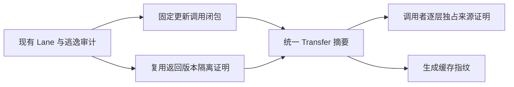

# 跨阶段缓冲来源证明

## Intent：最终目标

让已被独占消费的产品缓冲经过固定更新阶段返回后，继续传入后续 RX 阶段，保持普通值语义和原缓冲复用，为多根类型提取状态迁移补齐通用能力。

## Data：可用证据

bfcada50e 已支持完整产品字段路径及独立 fresh 输出。buffer_call 的 Lane 已描述 input/output、updates、appends、pops 与 calls，且已有版本及逃逸审计；但 fresh 判断无法识别经参数传回的产品字段。现有 buffered 声明能把同一 Builder 传入嵌套调用。

## Edges：边界与限制

- 必须逐层满足调用者的独占引用证明，最终追溯到 fresh 根；不能把普通借用输入标成全新分配。
- 不允许扩容或释放；闭包内不得有 append/pop，嵌套调用也必须满足。已证明的起点为零的 prefix 可以缩短视图，不获得完整分配所有权。
- 复用有效 Lane 内的版本证明：facts.retains 对每条返回路径要求旁支不含 version/borrowed/stale。经源码及独立只读审查确认，不再增加重复的 may 输出审计。
- 拒绝不明 optional/list 嵌套引用形状，沿用 fresh.product 的形状限制。
- 所有中间生产者必须纯、无外部实现、无合同、无 Store；祖先整体逃逸和重复输入继续拒绝。
- 新摘要同时用于生成和缓存指纹，避免摘要变化后调用者仍复用旧生成结果。
- 不新增测试、不跑全量。使用真实提取模块和既有缓存专项，报告未覆盖边界。

## Answer：交付格式与成功标准

新增编译期 Capability 摘要：index_only、writable、forwardable，按已有函数拓扑顺序计算。index_only 沿选中 callee lane 归纳无增长写入；writable 表示当前或嵌套存在索引写入；forwardable 额外要求纯、无原生实现/Store/合同及产品形状。输出隔离直接复用 Lane 的既有版本证明。exclusive 在当前函数 Graph 中逐个生产者回溯，所有观察者校验成立且到达 fresh 根才接受。全部静态编译为普通 Zig。

先保存草稿，独立只读审查安全边界，再更新正式代码、编译真实模块和既有专项；证据成立后提交推送。完整提取状态迁移另行验收。

## 自我复核重点

非目标返回字段的条件别名、跨嵌套调用长度改变、旧版本在旁路被观察、摘要变化导致缓存漏失效，均不能仅凭编译成功排除。

## 实施节点

已将真实类型规划从单根扩展为 roots 布尔掩码批次，按源类型索引递增访问，沿用原 artifact 初始根循环顺序；每根仍调用原子 visit。RX build 连接 initialize → roots。此模块将用于核查经过嵌套调用的三列缓冲，不新增人工测试流程。尚未接入迟到原生扫描与正式宿主。

## 原生扫描与指针 ABI

新增 artifact/planning/initial.rx 的真实阶段：initialize → roots → native_selection → expand_native。expand_native 在 RX 检查 Ready 后调用 native_types；失败时返回已有状态。native_types 按原模块顺序检查即时 mapping，命中 NativeReference 才纳入该模块全部类型，并记录 selected 掩码；不会回头重新扫描之前模块。该模块依赖宿主已验证的源表及模块形状，尚未替代宿主入口。

实际生成暴露另一处限制：普通 pointer call 对非 fresh、未 represented 的结果不能借 callValue 后重新装箱，否则可能改变无修改分支的聚合根身份。已撤回该捷径，新增保持普通 ABI 的 callBufferedPointer／function_N_buffered_pointer，复用同一缓冲绑定逻辑但按普通 function 生成。普通调用在独占资格成立后使用此出口；参数求值一次，不 construct 返回根。layout 消费者可以解引用该返回指针；state/value 与临时 iteration 表示切换时保存并暂停 pointer 模式，退出后恢复。bundle 与分模块输出同步接入。

此变更仍需真实入口编译、身份相关既有专项以及缓存专项确认；生成字符串出现 helper 名称不是语义通过证据。
