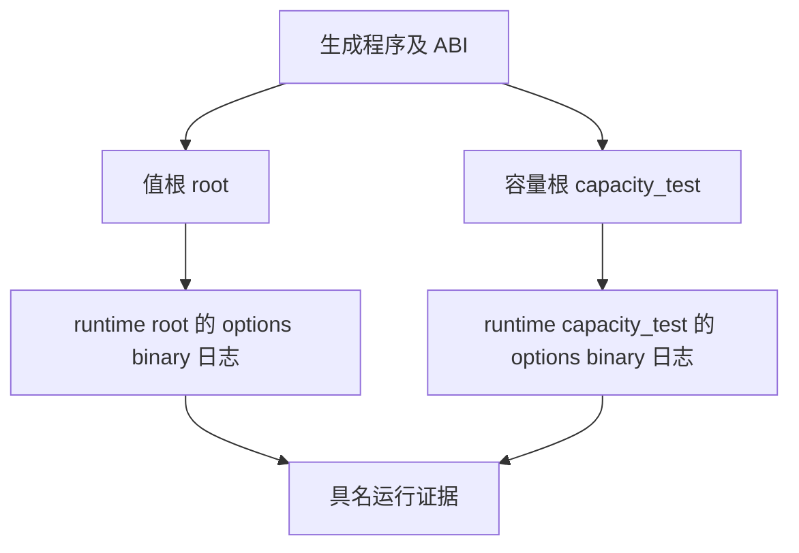

# 容量回归门禁整理

## IDEA

- Intent：把已确认的对象捕获容量缺陷变为正式测试门禁，并保持值与指针观察。
- Data：294a5cbab 下两模式值检查通过、容量矩阵 16 项失败；原始失败断言保持 4096 次保留容量不得大于一次。实现会话正在提交修复。
- Edges：新草稿单独保存，旧冻结工作树和执行源不改变。两个根测试复用生成程序时，执行 binary、options 与日志必须按 root 分目录，避免构建并行时覆盖。生成模块目录保持只读。
- Answer：每模式 24 个六项值测试根、12 个单项容量根；具名检查按实际根源码提取并核验，不能让 compile-only 或跳过测试被视为通过。修复新版本冻结后再执行、发布。

## 自我批判

原 runner 固定六条，不能直接用于单项容量检查；原执行输出目录复用会让两个根发生竞争。本批只拓宽真实根协议并隔离各根执行文件，不引入新语言运行机制，也不放宽容量断言。
