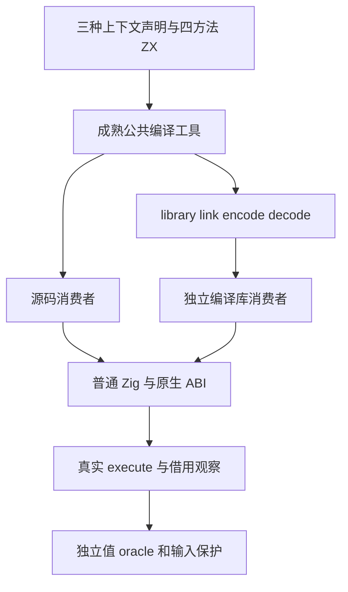
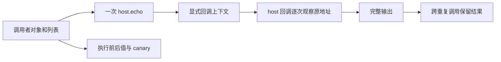

# 集合上下文借用与库消费

## IDEA

- Intent：验证显式 object/list/nested 上下文的共享借用及源码、编译库两条消费路径，确保上下文不被隐式复制或修改。
- Data：固定 d3d7410b4f8079a6fab44762ca92aa3a1f5ba9fc。IR 契约规定非 reduce 的 initial 为共享借用；已有 predicates 编译工具能完成源码分析及 library link→encode→decode→独立消费者，已有 borrowed_runtime 支持不可变 ABI。
- Edges：测试宿主使用声明的普通静态原生模块，不引入语言运行库。对象指针、列表基址、嵌套列表和别名分别观察；原生输入保持只读。每个 ZX 最多 120 个物理行，所有正式测试在 packages/test/tests。
- Answer：四方法×三上下文类型×两消费路径的实际程序执行；Debug/ReleaseSafe，输入/生成源/日志身份核验，正常钩子后英文 Conventional Commit 与 push。只有确认新的实现缺陷才通知实现会话。

## 阶段

1. 复用成熟 library 编译工具，不复制已有 link/codec 总控；通过实际声明与 fixture 提供新语义。
2. 固定新工作树和包输入，核验生产输入后显式复用之前生成的编译器模块。
3. 独立构造上下文数据，host 观察 echo 次数、每次 callback 的原对象和 payload 地址、完整值与错误边界。
4. 运行两模式的实际消费者，不把 link 或 codec 成功当运行证明。
5. 保留 IDEA 记录、自我批判、失败与原始证据；核验准确范围后提交 push。

## 自我批判

指针相同不能独自证明内容正确，必须同时核对完整值、长度与嵌套别名。源码消费者成功不能代表库消费者；两路径都必须运行。测试的动态参数矩阵不能额外算成具名测试。当前只验证这些结构和消费路径，不由结果推断全部上下文或完整 Test262 对齐完成。
