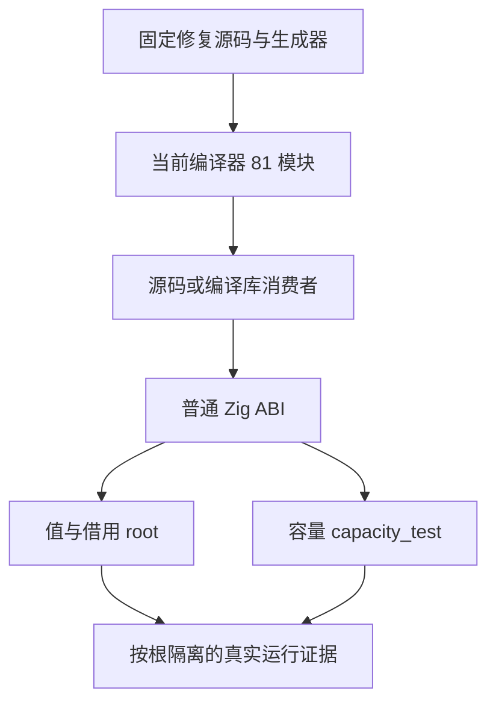
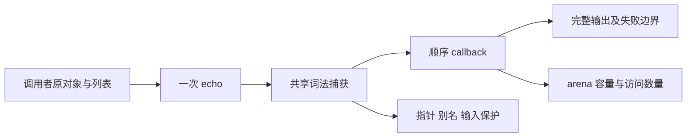

# 集合捕获借用与容量修复复验

## IDEA

- Intent：完成词法捕获 object/list/nested 的共享借用及零成本回归，固定源码与编译库两条路径。
- Data：修复版本 e2ab4035fa2e536890b95fc0b690828e23156b7f。294a5cbab 下值/借用 288 项通过但容量 16 项失败；实现会话修复了循环身份及原生捕获分配。当前版本重新生成 81 个编译器模块和真实消费者。
- Edges：保留原对象、payload、嵌套别名与重叠切片观察；容量断言仍为 4096 次不得超过一次。常数初始化分配与完整自举是单独边界，不宣称零分配或自举完成。旧冻结工作树及日志不变，修复前证据归档到修复前捕获分配阶段。
- Answer：两模式各 24 个六项值/借用测试根、12 个单项容量根；合计 312 项具名检查、72 个实际运行二进制。代码、日志、生成源、参数、源码身份和发布范围核验后正常钩子提交 push，英文 Conventional Commit。

## 阶段

1. 固定新工作树 e2ab4035f；源码草稿包含正式容量文件及 builder 注册。
2. 测试 runner 按根名隔离 options/binary/日志，防止同一消费者两个测试根并行覆盖；严格提取实际根的具名检查和成功终态。
3. 重生成编译器模块，执行三个结构、四方法、source/library 的所有真实消费者。
4. every/some 各增加容量根，保留空、1、64、257、4096 的容量记录、原指针与回调次数。
5. 对比失败版本证据，不只搜 create 文本或使用目录数量；完成后最小范围提交 push。

## 自我批判

曾只观察值和捕获指针，漏掉隐式状态与参数包分配。修复复验保留实际容量门禁，不能把绿色值检查替代零成本要求。容量不是精确分配字节和时间基准，当前断言只证明这批标量谓词执行的容量不随遍历长度增长；必须保留对象身份，不能通过删除观察规避。
