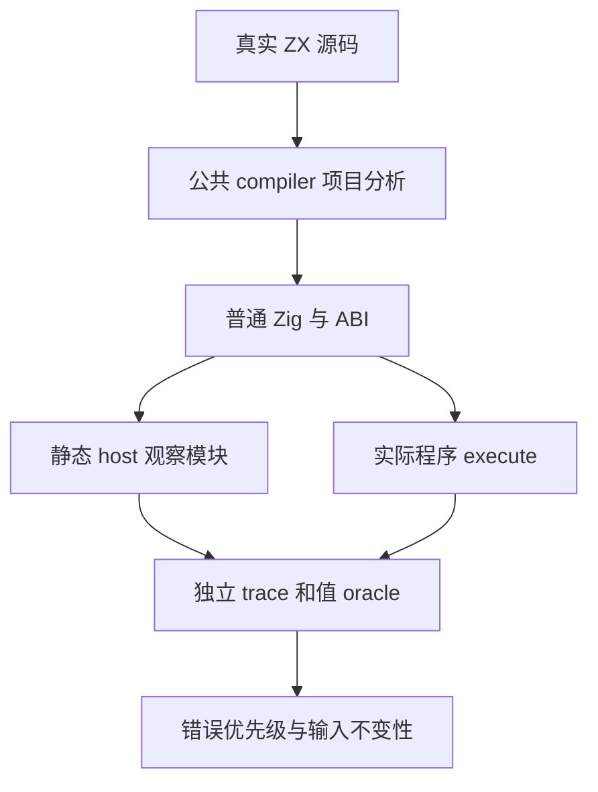
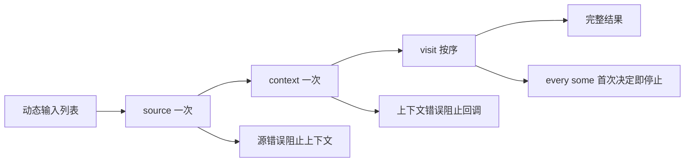

# 集合上下文求值顺序

## IDEA

- Intent：覆盖 map/filter/every/some 显式上下文的真实求值次数、顺序、未使用参数与错误传播，补齐既有字段值测试未观察的副作用。
- Data：固定 39d4bf10000fad24023478b59bd727942a317887；IR 契约规定 target 与 initial 在外层依次求值一次，非 reduce 的 initial 按共享借用处理。transform/context.zig 在上下文未使用时仍生成 discard。已有原生谓词测试的 host trace 与动态输入作为同职责样例。
- Edges：使用显式静态链接的原生观察模块，不能把观察函数当语言运行库或动态调度层。ZX 每文件最多 120 行；按 LF 读取 JSONL。标记 source/context/visit 三个阶段，保留完整输出、输入不变性及错误优先级。只新增测试包文件，不改并行生产实现。
- Answer：八个 ZX 程序（四方法×使用/未使用上下文），具名原生检查，两模式实际执行、冻结输入及原始证据、英文 Conventional Commit 和 push。确认新实现缺陷时才通知指定实现会话；所有特性与上游对齐目标保持完整。

## 阶段

1. 冻结新 worktree，逐字节比较生产包输入后复用上一部分生成模块，并明确记录复用来源。
2. 使用原生 source/context/visit 记录真实调用顺序，检查空输入、多个元素、短路、三个阶段失败及重复执行。
3. 编译实际 ZX，保留普通 Zig 与 ABI，运行 Debug/ReleaseSafe 实际二进制。
4. 核验具名测试与源码身份，保护并行工作，正常提交钩子及提交后范围核验后 push。

## 自我批判

调用计数不能独自证明正确上下文传递，必须同时检查 visit 接收到的值和完整结果。短路后的错误不能按整个列表长度判断可达性；oracle 应从输入语义独立算出决定位置。多组参数遍历不虚增具名测试计数。本批只检验实际覆盖的求值语义，不从通过推断其他上下文类型或完整 Test262 完成。
