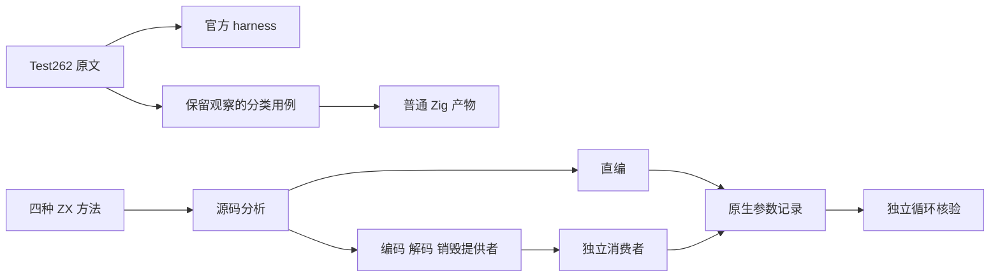
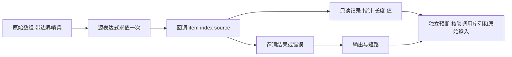

# 集合回调参数

- **Intent：** 验证 map、filter、every、some 的真实回调元素、零起始索引、源数组借用及短路行为，并保留 Test262 原文的关键观察。
- **Data：** 固定源码 `f9a897ce156c6523ada12585f08d602bc2ff2738`；官方 Test262 固定版本 `7ab7fafa0003f73fc85c1b95d88094d33f7eb8bd`；现有 reduce 参数和集合上下文宿主测试作为组织样例。
- **Edges：** 只修改测试包；不修改生产编译器。静态同质稠密数组不代表动态对象、稀疏数组或 thisArg。只将完整保留原始观察的两条稠密数组原文计为 adapted；其他参数相关原文保留待审核。源码、生成器与工具输入固定；不移动旧工作树；实际执行 Debug、ReleaseSafe 产物，不以目录数量代替通过证据。
- **Answer：** 新增分类纯值目录和原生参数观察测试；两条原文实际执行 normal/strict；两种优化模式下执行精确命名的纯值用例与四种方法的源码/编译库消费；校验源码、日志、二进制与发布范围，按英文 Conventional Commits 提交并 push。

## 执行步骤

1. 全局核对 review 去重、完整保存原文及 SHA，使用官方 harness 执行。
2. 草稿优先：生成纯值目录；原生宿主记录源求值和每次 item/index/source，独立循环计算预期结果。
3. 新工作树生成当前 85 个编译模块；编译宿主工具，执行源码和库路径的真实生成物。
4. 执行所有命名门禁、失败边界、重复和长输入控制；核对生成幂等、类型及格式。
5. 自我批判并收集证据；保留全部外来修改，精确提交本次文件，提交后复核字节再 push。

