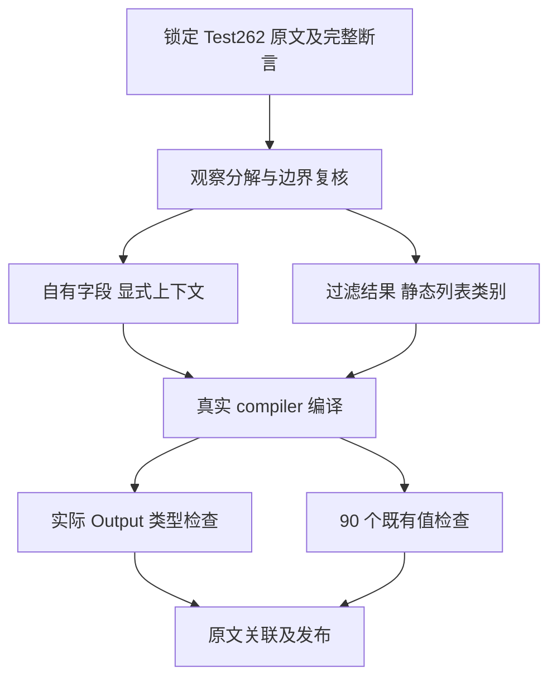
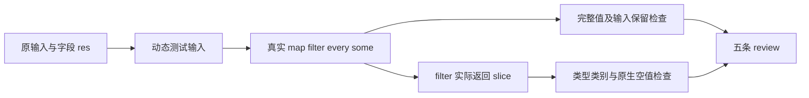

# 集合回调数组原文观察

## IDEA

- Intent：完成五条 Test262 原文观察的明确适配，保持真实输入、字段访问和结果断言，并补齐 filter 结果容器的原生证据。
- Data：固定上游 7ab7fafa0003f73fc85c1b95d88094d33f7eb8bd。四个方法的 5-3 原文创建 Array，再写入自有 res=true，回调只读取 this.res；filter 5-27 只断言返回数组品牌。已有字段上下文及恒 false 用例可复用，5-27 的 [11] 已与恒 false/single 对应。
- Edges：不能把数组动态属性机制、JS this、未使用的 idx/obj 或动态 Array.isArray 宣称已实现。自有字段观察投影为静态对象上下文；隐式 undefined 的无副作用谓词采用已有明确 false 映射；结果类别通过实际生成程序的 Zig slice 类型与真实执行验证。不得使用 JSON 外层数组包装或恒 true 品牌函数冒充证据。
- Answer：五条无重复 review、两项正式原生容器检查、既有 90 个 catalog 用例的两模式执行、全部五条原文 normal/strict 执行、输入 SHA、IDEA 记录、英文 Conventional Commit 与 push。catalog 数量保持不变。

## 工作阶段

1. 逐条读取原文与锁定元数据，在全局 review 集合中排除重复登记。
2. 保存原文 .js.txt 与许可证，真实运行原始 harness 的全部断言。
3. 将观察链接至原有四个 context_true/single 与 filter/constant_false/single，不复制已有测试数据。
4. 对 filter 添加实际 Output 的 slice/i64 类型检查及 [11]/空输入执行，保留输入不变断言。
5. 固定编译器源码及工具，运行四个上下文 catalog 与恒 false catalog，两模式各 90 个原有值检查，再运行两项新增容器检查。
6. 仅在真实执行、原文与类型证据全部通过后提交；保留并行实现，记录执行源码与发布基线的差异。

## 自我批判

原文描述 thisArg is Array 不足以证明测试观察了 Array 品牌；本批按实际代码只投影自有字段读取，属于 adapted，不是等价支持整个机制。filter 的 slice 类别是静态列表映射，不能推出 instanceof、prototype 或 species。复用目录用例不增加 catalog 数量，审计数量不代表执行通过。
