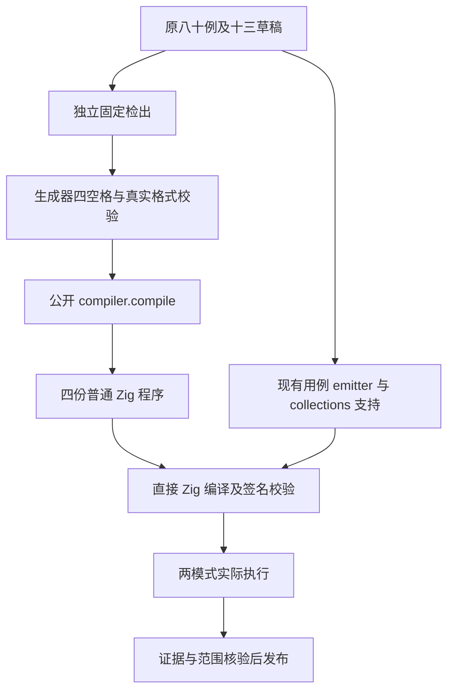
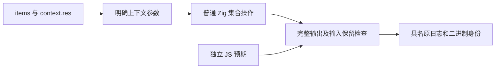

# 集合显式上下文独立执行

## IDEA

- Intent：恢复真实生成代码执行，完成待验八十个字段上下文用例，不等待旧的未签名进程自行恢复。
- Data：10-08 已冻结四种方法的八十个具名动态用例，原文八次执行和八条断言、生成器及矩阵通过。10-09 官方 Zig 的签名副本 version 成功，十七个非 LINKEDIT 段未变；带空 entitlements 的直接编译产物签名核验和启动成功。独立既有 ReleaseSafe 二进制六检查通过；签名后的 129 层深度重放仍 SEGV，未掩盖语言缺陷。
- Edges：旧检出、SDK、缓存和原门禁不修改，旧句柄仍保持真实等待记录。新检出初始从 c3c147245 与原十三个测试草稿建立，实际执行前更新为已提交的深依赖修复 def60b406，再冻结 5743 个包输入。生成器从源头使用四空格缩进；格式核验由真实 compiler.format 执行。独立驱动使用公开 compiler.compile、现有 emit_control_tests 和 collections 支持，生成并执行普通 Zig；不实现专用运行层，不硬编码输入结果。只证明字段上下文的八十例，不冒充 CLI/整包门禁、一次求值、Task 或所有生命周期边界完成。
- Answer：原十三路径的最小正式 diff、冻结新输入、四份真实编译源和生成 Zig、Debug/ReleaseSafe 八十例各一次的实际二进制/原日志/签名身份、旧与新签名差异边界、英文规范提交并 push。实际运行前，编译后产物须通过系统签名验证；所有用例数从完整原日志核对。

## 自我批判

直接公开编译 API 路径能证明源码、IR 降低和生成 Zig 的行为，不能证明 CLI 打包或完整 build 图。编译 metadata 签名不改变语言语义；版本探针成功不够，必须取得真实八十例的执行证据。原格式核验发现类型前沿生成器把相邻 type imports 分成了两个空行块，属于未发布测试夹具格式问题，不发送为实现缺陷；其旧字节仍冻结保留，后续独立批次从生成源头纠正。
