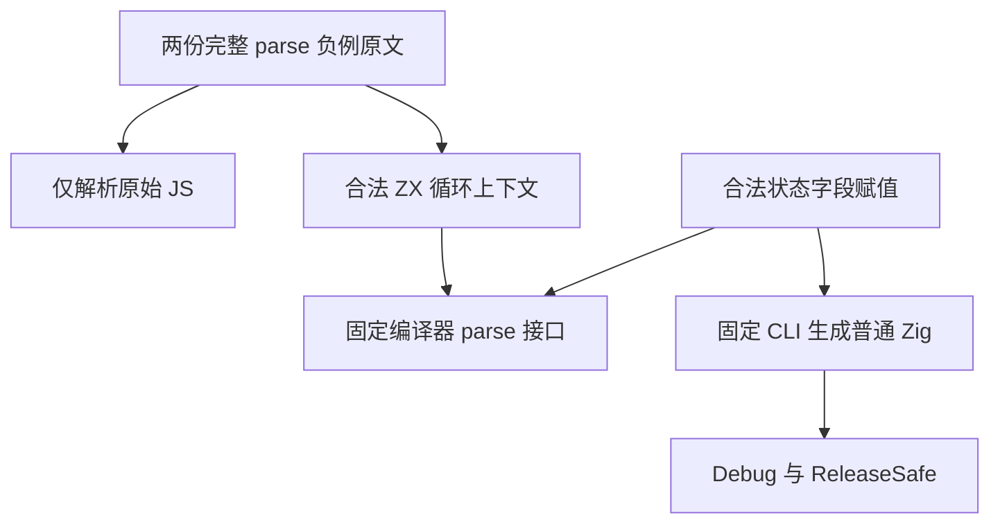
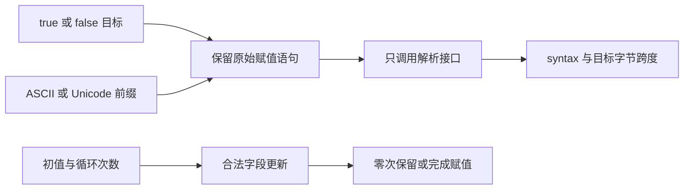

# Boolean 字面量赋值负例

## Intent：最终目标

遵循 IDEA 框架，完整保留 S8.3_A2.1 与 S8.3_A2.2 对 `true = 1`、`false = 0` 的解析期拒绝要求。检查语法诊断和精确字节跨度，以合法循环状态赋值证明测试上下文本身有效。

## Data：可用证据

固定 Test262 上游为 `7ab7fafa0003f73fc85c1b95d88094d33f7eb8bd`。两份原文已完整读取，negative 元数据均为 parse/SyntaxError，并有 DONOTEVALUATE。原文应只解析，不执行其程序。

复用现有 assignment_boundaries 的真实 loop 更新语法、frontend 目录格式、具名测试发射器和 compiler.parse 接口。独立解析原始 JS，核对确为 SyntaxError；固定编译器版本的解析接口检查 ZX 诊断，而非只观察 CLI 非零退出。

## Edges：边界与限制

- ZX 通过合法函数与 loop next 块承载赋值语句，保留无效字面量目标和原始右值；不把目标换成名称绑定或一般赋值表达式。
- 除 ASCII 原始映射外，增加 Unicode 注释前缀对照，确保期望跨度是 UTF-8 字节位置。
- 合法状态字段赋值需正常解析、生成普通 Zig 并实际运行；零次循环保留输入，一次与两次循环完成对应赋值。
- 所有真实运行限于固定版本，明确区分解析阶段、运行阶段与 canonical 构建接线。未运行不得计入通过。
- 不新增运行库、分支或生产实现。原始输出和身份留在本机外部目录；只提交正式测试及中文 Markdown。

## Answer：交付格式与成功标准

交付分类 frontend 负例与合法对照、合法赋值运行夹具及生成源、现有构建注册和两条完整原文 review。解析接口准确拒绝两个字面量赋值，合法对照通过；具名输出与冻结目录一致。完成独立核验、自我批判后，以英文 Conventional Commits 提交推送。

## 架构图

## 数据流图

## 自我批判

CLI 非零退出、spacing 拒绝或分析期类型错误都不足以证明原 parse 负例。必须直接核对解析接口，并用相同上下文的合法字段赋值通过证明拒绝来自目标语法。Unicode 前缀应以字节偏移计算，不能照抄 JavaScript 字符索引。
