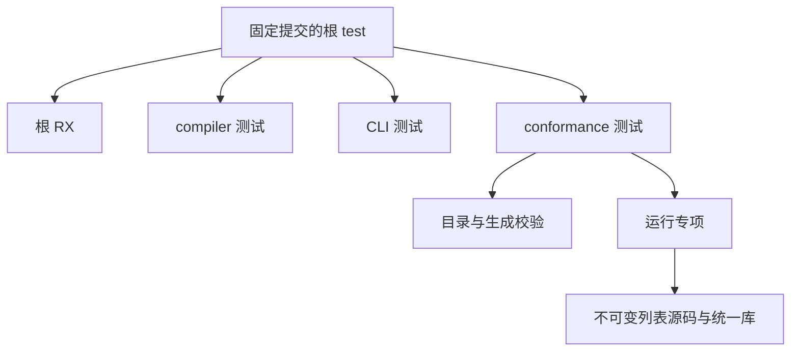
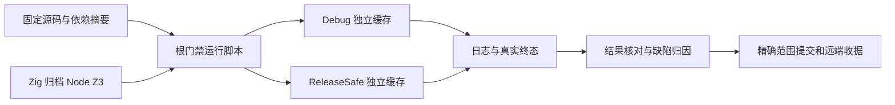

# Indexed 入口完整根回归

## Intent：最终目标

在固定提交 `bbd92b5c536139a6a36ce3ad4e0062768bf1337f` 上执行真实仓库根 `test`，检查 Indexed 分析入口及其签名编排进入 compiler、CLI 和测试包后的完整默认回归。分别执行 Debug 与 ReleaseSafe；本轮不新增测试用例，不修改生产实现。真实执行发现测试驱动误杀冷编译后，只对该安装阶段修正超时设置，随后另行取证。

## Data：可用证据

- 根 `build.zig` 的 `test` 连接根 RX、compiler、CLI 和 conformance 测试。
- `packages/test/build/runtime.zig` 已连接不可变列表专项，其四项操作各有源码和统一库两条运行路线。
- 上一轮不可变列表专项在 `13abc0312` 完成；后续 `17e262516` 的签名编排变更需要新提交上的真实根回归。
- 根默认优化模式是 safe，因此两轮都显式指定模式。
- 使用已校验的 Zig 0.17.0、本地工具链归档及 Z3 5.1.0；Node 25.8.1 满足测试包要求。
- 只读审查已确认：`zig build` 使用 `ZIG_GLOBAL_CACHE_DIR` 环境变量隔离全局缓存，不能照搬直接 Zig 编译命令的全局缓存参数。

## Edges：边界与限制

- 固定工作树：`/Users/xiewendao/.codex/worktrees/indexed-root-regression/zxc`。执行中不修改源码、工具或运行脚本。
- 主工作树中的其他修改与未跟踪文件不属于本轮交付。
- 每模式使用独立本地和全局缓存；只预置不可变 libyaml 依赖，不复制编译或测试结果。
- Node 依赖引用已有安装并记录内容摘要；嵌套构建及测试自身管理的缓存需按真实日志判断，不能一概宣称完全冷启动。
- 使用原始根构建图和 `-j2`。超时、长编译及缺少终态不算通过，也不直接判为实现缺陷。
- Zig 本体签名不代表所有子产物签名；仅在实际失败后诊断具体执行边界。
- 根 `test` 不包含独立的 dist 或硬件评估目标；通过也不代表 Test262 全面对齐、自举完成或生产质量已经达到。
- 仅向已授权实现会话报告有真实执行证据的实现缺陷。

## Answer：交付格式与成功标准

保存源码与工具摘要、精确命令和环境、启动状态、完整日志、实际退出码及终态摘要。两模式均取得真实终态后，按结果记录通过和失败，不重复计算缓存节点或相同 RX 测试为新增用例。完成本部分后使用英文 Conventional Commits 标题和正文提交并推送，核对远端提交。

## 架构图

## 数据流图

## 自我批判

专项通过不足以证明后续分析器变更的完整兼容性，因此本轮回到真实根入口。缓存隔离只能排除已知的外层复用，不能替代实际运行节点取证。完整根图可能先暴露构建或环境问题，需区分执行条件、测试夹具与语言实现，不能为了得到绿色结果绕过失败节点。
