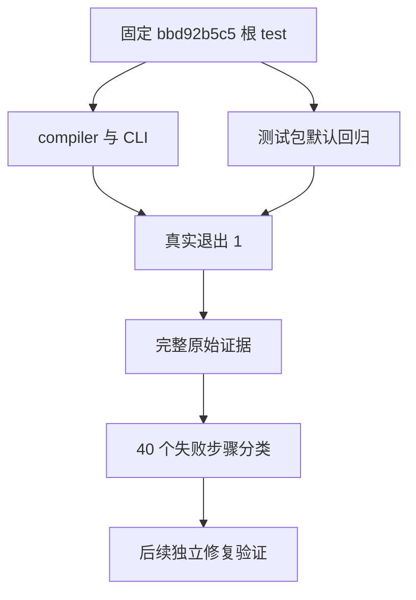

# Indexed 入口根回归 Debug 终态归档

## Intent：最终目标

封存已结束的旧版完整根 Debug 回归，逐项解释 40 个直接失败步骤，保留后续维护可用的准确版本、命令、终态和完整日志。记录遵循 IDEA 框架；本部分不新增或修改测试和生产实现。

## Data：可用证据

固定提交 `bbd92b5c536139a6a36ce3ad4e0062768bf1337f` 的真实根 `zig build test -Doptimize=debug` 已退出 1。其起点含 6,645 个源码文件、451 个 Node 依赖文件、19,501 个 Zig 标准库文件及工具摘要；终态报告这些输入未变化。

早期阶段证据保留在 [Indexed 入口完整根回归](../Indexed入口完整根回归/执行细节.md)。本目录另存完整终态，不覆盖当时仍在运行的历史快照。

## Edges：边界与限制

- 旧版回归的失败不会被新版本专项成功改写。
- 构建步骤、Zig 测试汇总、可见具名输出和唯一语义用例是不同计数，分别记录。
- ReleaseSafe 根回归尚未启动，仍属未完成验证。当前先完成已识别问题的独立专项，资源队列与固定运行基线保持不变。
- 后续修正有的已发布，有的仍在等待实际终态；不将静态推断或 Debug 成功扩展为两模式完整成功。
- 只向授权实现会话报告确认的实现缺陷；本部分没有发现新的独立实现缺陷。

## Answer：交付格式与成功标准

无损归档原起点、运行脚本、启动、终态、完整日志和进程记录，复算日志 SHA、40 项失败和 10 项失败 Zig 测试。核验固定源码与依赖，交付失败分类及后续验证索引，单独以英文 Conventional Commits 提交推送。本批成功标准是准确封存失败结果，不是宣称根回归通过。

## 架构图

## 数据流图

## 自我批判

完整回归持续四小时，途中日志已显示失败，但没有终态时只能保存观察。现在终态允许准确封存；仍不能仅凭总通过数满足超过 30,000 个唯一用例的执行验收。后续专项来自不同固定提交，需要分别核验版本和覆盖范围。
