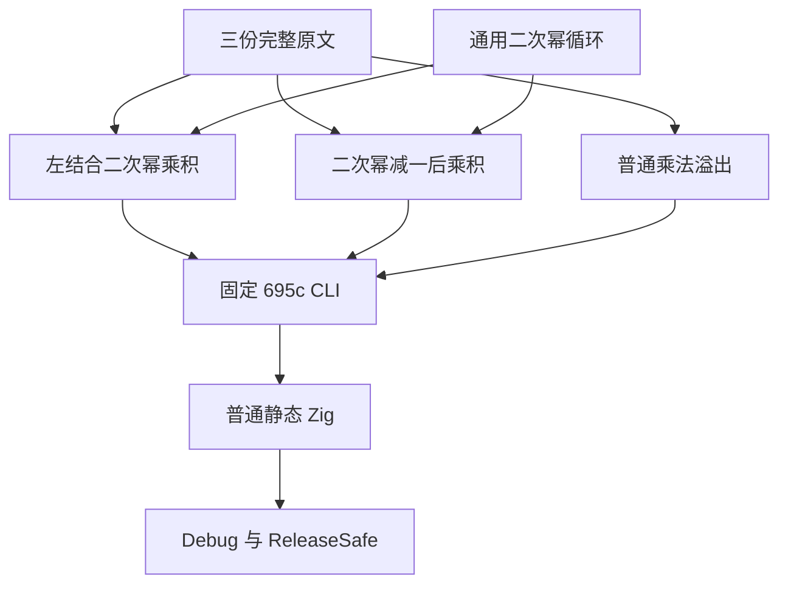
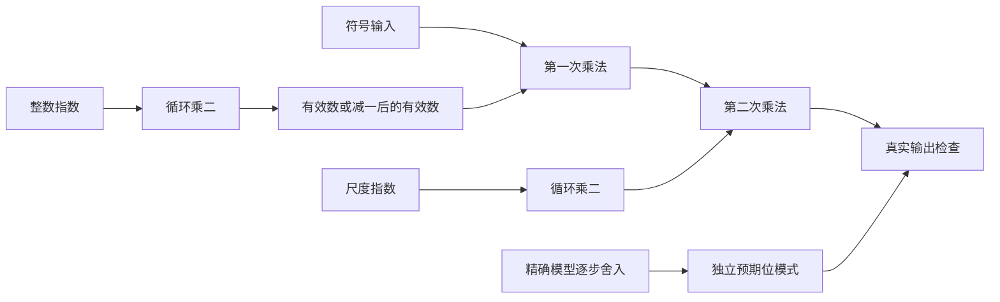

# Number 二次幂与溢出原文适配

## Intent：最终目标

遵循 IDEA 框架，完整保留三份 Test262 Number 原文的七条数值断言：最大有限值、正负大有限值以及两种正负溢出计算。真实执行二次幂、减一与按原顺序相乘，原文全部运行成功后才登记 review。

## Data：可用证据

固定上游为 `7ab7fafa0003f73fc85c1b95d88094d33f7eb8bd`。已完整读取 `S8.5_A13_T2.js`、`S8.5_A14_T1.js`、`S8.5_A14_T2.js`，原文分别有三、二、二条断言，SHA 与上游索引核对后冻结。

复用现有 IEEE/Rational 的二次幂、乘法、减法与 binary64 编码模型，以及 floating_unary、floating、floating_ternary 支撑和具名用例发射器。以 Node 的实际 Math.pow 与运算结果逐步交叉核对模型。现有普通循环更新用例提供 ZX loop 语法样例。

## Edges：边界与限制

- 二次幂算法接受 0 至 1024 的整数指数，以实际循环乘 2 计算；该范围内有限二次幂均可精确表示，1024 按 binary64 溢出。此适配不宣称一般 Math.pow、负指数或动态对象转换协议已实现。
- 保留 `sign * power(2, exponent) * power(2, scale)` 的左结合顺序；最大有限值路径先执行 `power(2, exponent) - 1`。
- 原文比较对象是有限非零数或无穷；位模式检查与原文数值相等观察在这些输入上等价。补充边界不计作原文断言。
- 不新增编译器实现、运行库、动态调度或测试专用结果表；使用固定 695c CLI 源码路线显式运行 Debug 与 ReleaseSafe，独立注明 canonical 接线是否实际执行。
- 原始输出、工具和输入身份、原文 harness 与终态存放本机外部运行目录，不提交 docs 下的数据或日志。不得把目录规模当作实际执行规模。

## Answer：交付格式与成功标准

交付原子二次幂入口、两条组合算式入口、普通溢出乘法入口，生成源、参考模型、分类用例、构建接线与三条完整原文 review。逐项核对七个原始观察，补充指数零、普通指数、有限极值与溢出边界。所有登记用例需真实运行且具名输出与目录一致，记录失败时保留真实终态。完成后核对本次 diff，用英文 Conventional Commits 提交并推送，不创建分支。

## 架构图

## 数据流图

## 自我批判

不能把预先计算的二次幂输入替代本批必须观察的幂计算，也不能将最终乘积相同当作运算顺序等价。循环算法只在声明的整数指数域内对应原文 Math.pow 数值观察；若编译器生成或实际运行揭示缺陷，应记录并发送给指定实现会话，不以修改预期规避。
