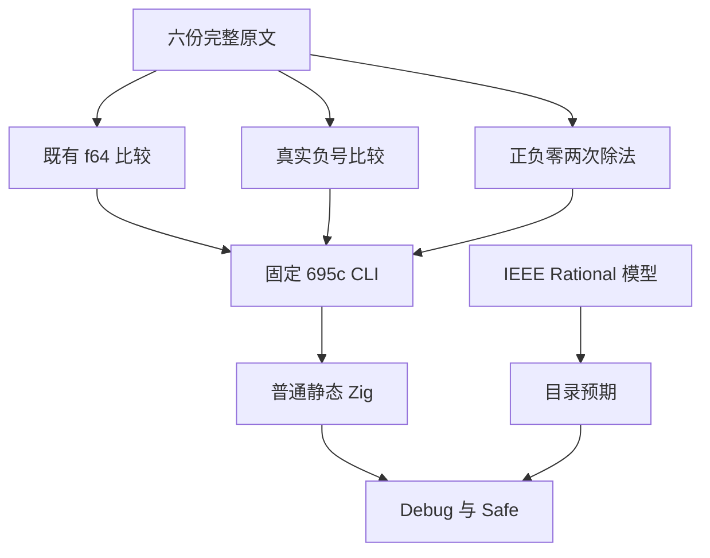
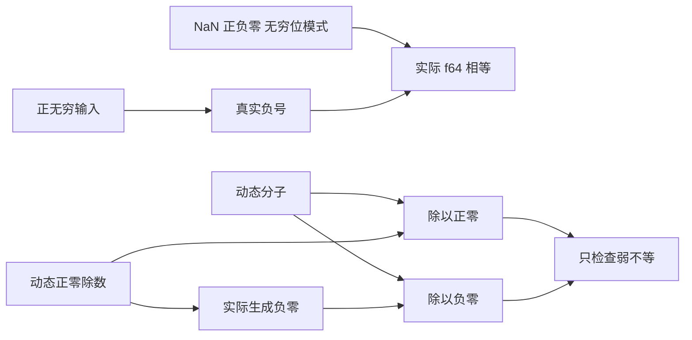

# Number 特殊值原文适配

## Intent：最终目标

完整适配六份 Number 原文的十一条数值观察，保留正负零除法后的弱不等断言及真实无穷值取反。记录遵循 IDEA 框架，实际执行后才登记 review。

## Data：可用证据

固定上游为 7ab7fafa0003f73fc85c1b95d88094d33f7eb8bd。六份原文均已完整阅读，缓存 SHA 与索引相同，当前 reviews 未重复登记。

| 原文           | 完整观察                                       |
| -------------- | ---------------------------------------------- |
| S8.5_A1.js     | 两个 NaN 相等比较为 false，一条                |
| S8.5_A11_T1.js | 1/+0 与 1/-0 不相等，一条                      |
| S8.5_A11_T2.js | 五条正负零同型相等，含重复比较                 |
| S8.5_A8.js     | +Infinity 与 Infinity 相等，一条               |
| S8.5_A12.1.js  | +Infinity、Infinity 分别与正无穷常量相等，两条 |
| S8.5_A12.2.js  | 真实负号作用于正无穷后与负无穷相等，一条       |

既有 f64 comparison、f64_negated 和 control support 可保留这些数值观察。固定 IEEE/Rational 模型可独立计算除法结果，生成器将模型的弱不等结论与 Node 逐项对照。

## Edges：边界与限制

- Number.NaN、Number.POSITIVE_INFINITY 等在原文中只提供固定数值，没有 getter、descriptor、修改或转换协议断言；用相同 binary64 位模式输入保持本数值域，不宣称对应全局对象 API 已实现。
- 字面量正号保持其固定 Number 值；负零除法和负无穷比较保留真实一元负号。
- A11_T1 只检查两个实际除法结果不相等，不将更强的 Infinity 位模式断言替换进运行用例。
- A11_T2 的五条断言逐项登记，第三条即使重复第一条也不丢失。
- 负无穷沿既有 f64_negated 入口实际计算 -right，再与负无穷 left 比较；相等比较交换两侧不改变这份原文的无副作用数值观察，映射明确披露。
- 新增零分子补充对照应返回 false，防止入口始终返回 true。补充对照不是新原文断言。
- 使用固定 695c CLI 的源码路线显式执行 Debug/Safe，不宣称当前 HEAD、统一库路线或 canonical build 目标已通过。

## Answer：交付格式与成功标准

扩展既有负号比较生成源的对称无穷输入，新增一个原子正负零除法入口与生成器，保持已有比较目录。执行全部相关 f64 comparison、negated 和 signed-zero 用例，原文 harness、生成普通 Zig、真实输出、终态及身份保留在本地外部运行目录；登记六条 review，仅代码和中文 Markdown 记录按英文 Conventional Commits 单独提交推送，不提交 docs 下的数据或日志产物。

## 架构图

## 数据流图

## 自我批判

不能因常量来自 Number 全局对象而机械排除其纯数值观察，也不能反过来宣称已支持对象协议。既有 negated 目录此前只有正无穷方向，未覆盖本原文要求的负无穷方向，需从生成源补足并实际执行。不同层级的模型 bits 对照、运行弱断言和 review 映射必须分开记录。
