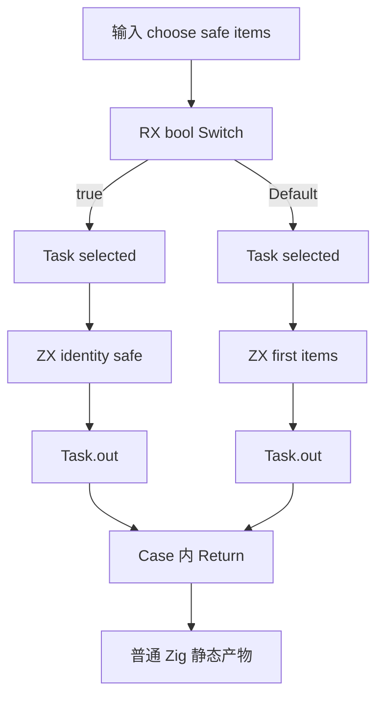
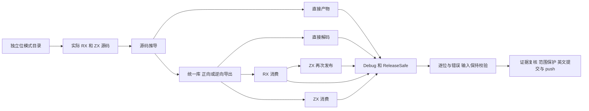

# RX 浮点任务与惰性分支执行计划

本文采用 IDEA 框架。基础提交为 `1859d4642c88e1959aedd6e4e27124c7d1cae581`。

## Intent：最终目标

验证 f32/f64 数据在 RX 的真实 Switch、顺序 Task.out 与 Return 编排中保持数值语义，并穿过统一编译库的导出、RX/ZX 消费与再次发布边界。继续推进 zxc 自有特性覆盖；本批不代表 Test262 全面对齐。

## Data：可用证据

- RX README 和 RX 开发约定承诺 bool Switch、Task.out、顺序 Return 与统一库消费。
- IR 契约包含 f32/f64 与严格浮点语义。
- 现有 control/error_test.zig 验证整数分支错误惰性；Task.out 和 Parallel 已有整数、字符串、列表覆盖。
- 对 runtime、task_output、inference 的只读检索未找到对应浮点位模式测试。
- 复用 parallel/library 的 archive、import 消费语义和成熟执行参数构造器；全部使用当前源码新生成的 83 个编译器模块。

## Edges：边界与限制

- 只修改 packages/test 与本记录目录；不修改生产实现或其他会话输入。
- Switch 的 selector 和 Case 标签为 bool，浮点只作为 payload；不扩大浮点标签契约。
- 先验证顺序 Task，Parallel 浮点汇合留待独立批次；本批不宣称线程覆盖。
- 正负零、子正规、正规边界、最大有限值和无穷值逐位比较；NaN 仅比较分类，不承诺 payload。
- 本批属于 zxc 特性验证，不新增 Test262 原始用例适配数。
- ZX 原子函数仅 identity 与 first，每文件最多 120 行。RX 显式连接选路、调用、任务聚合与返回。
- 所有实际测试使用带签名的 Debug/ReleaseSafe 二进制；禁止把目录条数或编译成功当成执行证明。

## Answer：交付格式与成功标准

1. 每精度 756 条命名用例：18×18 个 safe/first 组合分别选择两条分支，另有 18 个空列表和两种增长长度的双分支对照。
2. 两精度共 1,512 条目录用例，经 9 条路径、两模式执行，计划 27,216 次命名执行和 36 个测试二进制。
3. 校验空列表未选中时成功、选中时 IndexOutOfBounds，以及输入位模式、指针、长度、边界哨兵和同 arena 后续调用保持。
4. 保存正式输入、生成源码、命令、日志、退出状态、实际测试名称、二进制 SHA 与签名验证；发布前独立复核。
5. 静态检查、生成目录 --check、范围保护、正常 hooks、英文 Conventional Commits 提交并 push；只在确认实现缺陷时通知实现会话。

## 架构图

## 数据流图

## 执行后自我批判要求

核对实际执行名称与目录逐项对应；区分用例数、路径重复执行数和函数调用次数。检查 oracle 是否依赖被测结果，空输入是否被 harness 错误假设干扰，以及源码与库路径是否真实重新推导和释放上游存储。只报告已运行的范围。
