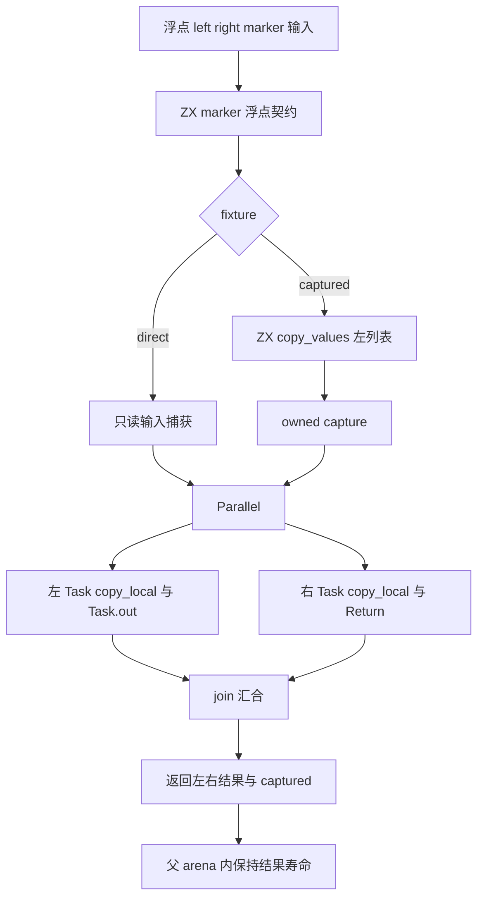
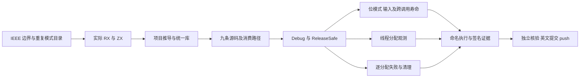

# RX 浮点并行捕获与结果寿命执行计划

本文采用 IDEA 框架。上一轮分类为 progress：提交 `84be0c937bf1e0336e5080d1cc96aab14eb60844` 已推送并独立核对远端。

## Intent：最终目标

补齐 f32/f64 的 Parallel Task 输入捕获、Task.out 与 Return 汇合、独立复制结果、旧列表跨调用寿命以及分配错误清理证据。继续推进所有 zxc 特性的细粒度覆盖，不缩减 Test262 对齐目标。

## Data：可用证据

- RX README 269—277 行承诺纯 Task 的真实线程、只读共享输入、父 arena 内输出寿命、join 与错误传播。
- 现有 parallel/results_test、task_borrowed_test、thread_test 已验证相应整数行为；当前相关测试未覆盖浮点位模式。
- IR 契约承诺 f32/f64；上一轮覆盖顺序 Task.out、bool Switch 与九条统一库消费路径。
- 复用真实 RX 文本解析、项目推导、IR 校验、库 archive/import 与带签名执行工具。
- 当前 Parallel 不生成 executeValue，这是已有入口资格边界，不是本批实现缺陷；本批使用公开 execute(arena,input)。

## Edges：边界与限制

- 只修改 packages/test 与本记录目录，不修改生产实现及其他会话输入。
- 两种实际 RX fixture：direct 直接捕获只读输入，captured 先复制 owned 列表，再供左 Task 读取；右 Task 读取另一输入。ZX 分别负责显式 concat-copy 与 marker 恒等传递，后者为标量提供明确浮点契约。
- 正负零、子正规、正规边界、有限极值及无穷按位比较；NaN 输出比较分类，输入原始位模式必须保持。
- direct 大列表线程控制要求底层观察到两个非父线程；owned capture 控制仅要求至少一个，因为 arena 缓冲复用可能隐藏另一线程的分配。记录实际数，不将观测数等同于线程总数。
- 分配失败检查复用成熟 checkAllAllocationFailures，覆盖请求 arena 向受控底层 allocator 申请存储的失败点；不注入操作系统线程创建或独立标准库分配，不编造失败次数或把注入失败当作实现缺陷。
- 为复用 RX 测试驱动，只增加可选 ZX 源文件参数；必须重跑上一轮完整浮点顺序矩阵，不仅检查新路径。
- 不新增 Test262 上游适配数，不宣称完成所有特性；ZX 每文件最多 120 行。

## Answer：交付格式与成功标准

1. 两精度、两种 capture 结构，共四套新目录。每套 452 条：90 条长度与 marker 边界、324 条左右 singleton 组合、36 条单边空列表、1 条真实线程控制、1 条完整分配失败扫描。
2. 新增 1,808 条用例，计划在九条路径及两模式完成 32,544 次命名执行。另重跑已有 1,512 条顺序用例的 27,216 次执行；总计 59,760 次执行、108 个测试二进制。
3. 检查真实输入、左右 marker、列表顺序及位模式、复制结果指针、borrowed/owned capture 指针差异、调用后输入哨兵以及下一次调用后旧输出。
4. 保存 83 个重新生成的编译器模块、正式输入、每步命令/日志/退出状态、实际测试名称、线程观测、二进制 SHA 与签名；独立核验全部证据。
5. 正常 hooks、准确清单与其他会话输入保护通过后，以英文 Conventional Commits 提交并 push。只有确认实现缺陷才通知实现会话。

## 架构图

## 数据流图

## 执行后自我批判

核对目录数量与实际执行数量、既有回归与新增覆盖，不能重复计算。检查线程计数是否受 arena 缓冲影响、allocator 观察器是否仅位于宿主测试端，以及 old output 是否真实包含列表而非只能按值保存的标量。错误注入必须达到真实函数与真实清理路径。
