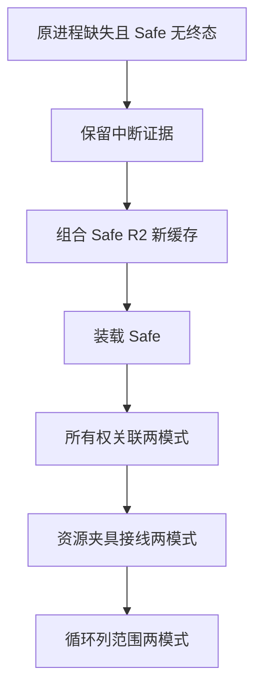

# 中断后门禁续跑

## Intent：最终目标

继续取得已冻结专项的真实两模式终态，保留中断记录，避免将缺少终态误计通过。记录遵循 IDEA 框架。

## Data：可用证据

恢复时确认组合与后续四个队列原 PID 已不存在。组合 R1 Debug 已完成 90 步骤、226 个 Zig 测试；R1 ReleaseSafe 留有启动和部分日志，没有终态。原日志与队列状态另存到外部 gate-resume-20261010/r1，并保留 SHA。

## Edges：边界与限制

- 不重写 R1 的启动、日志或终态文件，不因观察超时重启。续跑前已有两次进程检查确认原运行及其子进程不存在。
- 组合 ReleaseSafe 使用 R2 独立新缓存，复用同一固定源码、六个 overlay、工具和依赖身份；不声称 R1 成功。
- 后续尚未启动的门禁继续使用其冻结 R1，所有真实驱动均先校验原源码和依赖。
- 队列串行执行，某部分 Safe 仅在其 Debug 实际退出 0 后进入；不同部分的已确认失败不阻止其他独立门禁取证。
- 以独立进程会话启动长期队列，记录准确 PID、脚本 SHA 和进度，避免依赖已失效的工具句柄。用户要求停止时仍按准确 PID 管理。
- 原 fc 所有权关联六项目标含未修正的旧循环列范围断言，可能失败；后续单文件修正的循环列专项另行验证，不改写前者结论。

## Answer：交付格式与成功标准

按顺序执行组合 Safe R2、装载 Safe、所有权关联 Debug/Safe、资源接线 Debug/Safe、循环列范围 Debug/Safe，保存每阶段真实命令、终态、输入 SHA 和完整日志。预检失败、编译语义失败、中断缺少终态分别报告；每个完成部分单独用英文 Conventional Commits 提交推送。

## 架构图

## 数据流图

## 自我批判

上次执行依赖工具会话及其进程树，主动中断后长期队列也已停止。独立进程会话改善续跑的可观察性，但不能保证宿主关机或外部终止后继续存在；仍需以准确进程及真实终态检查，不能只看状态文件。
