# 主分析器整块自举实施记录

- **Intent：** 继续完成整个 indexed syntax 到 IR 分析器，保留 RX 的阶段编排与 ZX 的内聚算法。
- **Data：** 昨日[整体方案](../2026-10-09/整体自举方案/设计方案.md)、当前 Control 列约束、旧 statements/iteration/captures 的真实行为及本轮源文件差异。
- **Edges：** 不运行全量测试、不新增用例、不按小文件提交；完整主体仍未替换正式 Analyzer，静态检查不能冒充编译验证。
- **Answer：** 控制列写入、块暂存/恢复、状态块、捕获算法，以及表达式叶子与类型提示遍历源码；整块闭合后集中构建和针对性验证。

## 本轮实现

core 新增 Control 的各类 statement 写入、行复制与 block 发布。与表达式列一样，写入只操作普通 ZX 数据，重新计算目标 payload 索引，不调用 Zig Storage。

普通块使用独立的 pending owner。为避免复制一套数据定义和写入算法，pending 复用 Control 的列布局；它在暂存期间不是已发布的合法 Control。每块保存分组长度标记，发布自身后缀后恢复父块前缀。分组标记覆盖所有现有列，空的 parallel/block 列沿用既有布局，没有因此新增 ZX 的 Parallel 语句能力。

普通块帧保存 source_block、局部语句顺序、游标、pending/active/facts 标记。进入块时仅整理该活动块的语句 ID；离开块时恢复可见符号和事实，保留已生成符号/表达式。返回事实按已发布 BlockId 追加缓存。当前块后缀的终止检查与已发布子块的返回事实使用各自边界。

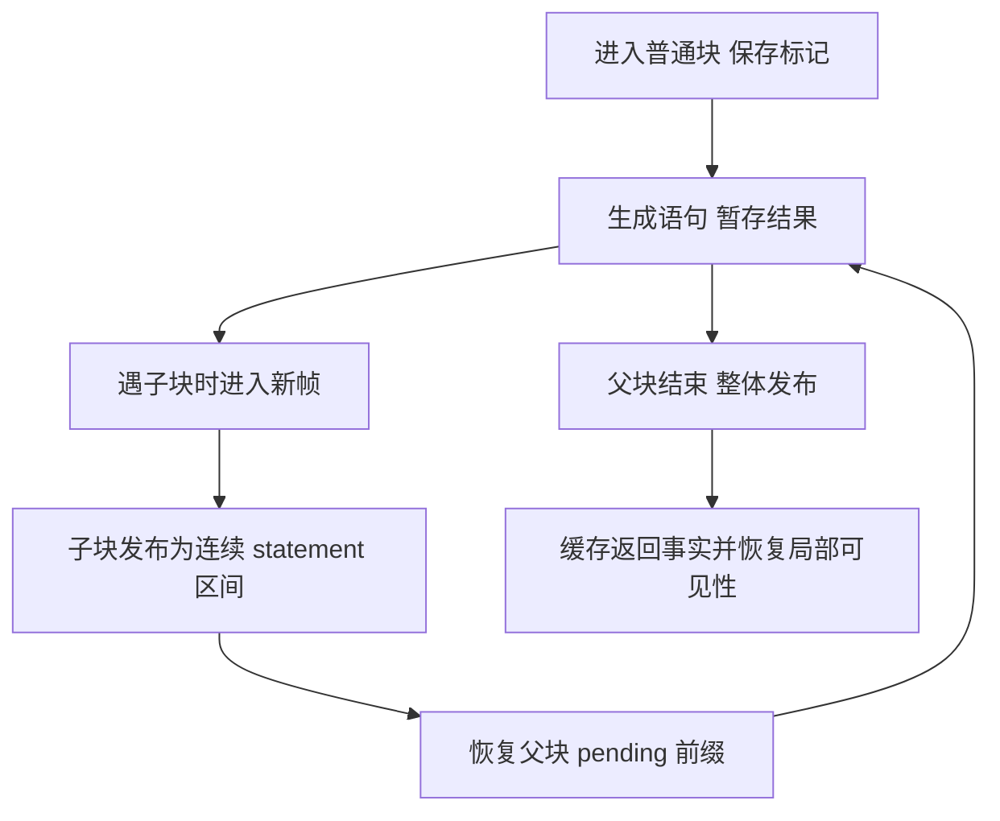

## state_block 的独立数据路径

state_block 保存 symbols/values/borrows 三列绑定和当前状态符号，最终生成 scope 表达式，不生成 Control block。已实现进入、绑定、临时值、状态推进、无绑定 evaluate 和完成恢复的原子操作。

临时符号保留在 Symbols 表但从 active 弹出；advance 仅在绑定成功后更新当前状态符号。绑定借用判定复用旧规则：reference、field、tuple_field、index、optional_value。状态参数重声明与普通保留名分别校验。

## 捕获链与共享类型视图

捕获帧保持稳定索引；frames 保存 starts/floors/parents 与 first/last，bindings 保存 sources/targets/values/next。父子捕获可以交错追加，按帧链查找和收集，不扫描所有历史捕获、不移动别人的绑定，也不重用已经退出的帧 ID。

解析顺序为局部可见名称 → 集合回调捕获链 → 禁止捕获的外层绑定诊断 → 未知名称诊断。捕获解析先找到祖先来源，再从祖先向内逐层去重/绑定；保持原有 Task 捕获限制和 Borrowed 符号标记。

refinement 的 type_of 接口改为读取 base/delta 双表；旧 host 传入原表和空 delta，新分析器直接传已有类型视图。规则只有一个实现，不为新入口复制 optional 细化逻辑。符号列追加收口到 core，普通绑定和捕获共同使用。

## 表达式叶子与类型提示遍历

表达式请求以 source bytes、indexed ExprTree、node ID 和 expected type 表达。leaf 识别注入的值/void 路径、普通名称、布尔、字符串、数字、null 与负数字面量；独立 lambda/state block 保留旧入口的上下文诊断。复合节点交给后续子表达式调度，不回调旧 Zig Analyzer。

注入路径从字段末端向根标识符比较源码 span 与路径字节，不拼接临时字段路径。查询保留局部遮蔽规则；void 路径先查，普通注入绑定在解析实际名称时继续使用原有捕获与细化规则。

类型提示查询已形成独立、可执行的显式栈遍历。Probe 读取节点，Fallback 只在已有结果为空时展开后备节点，Field/Index/Task/Optional 在子结果产生后投影类型。match 的结果分支按源码顺序尝试，最后才使用字面量提示；浮点提示优先于负整数提示。查询不生成 IR、不新增类型，也不改变可见绑定。

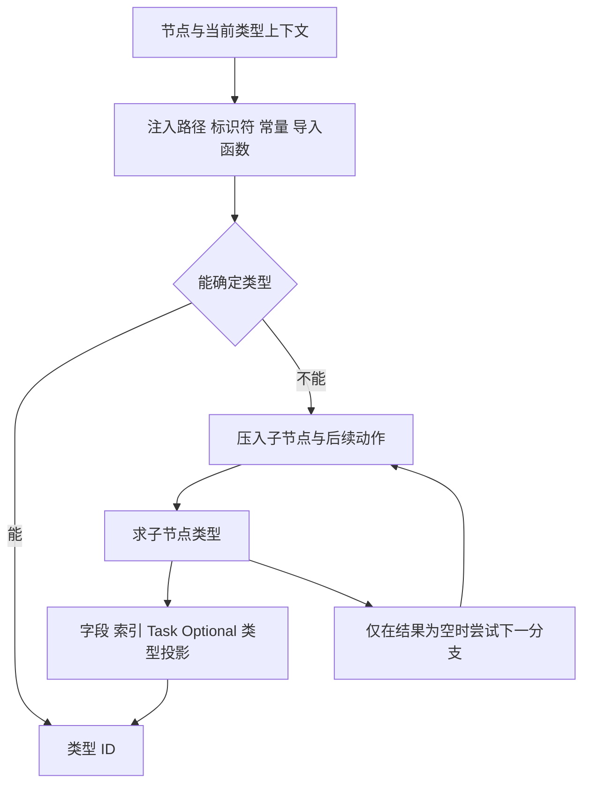

二元运算区分左侧提示、右侧上下文与最终 IR 写入：`??` 在分析右侧之前检查左侧 optional，逻辑运算在右侧分析期间引入条件事实。最终规则保留 optional 聚合只能与 null 比较的限制。后续 continuation 批次已连接事实标记与恢复，right 原子操作本身仍不承担完整短路分析。

字段访问先识别 Store、枚举与有限错误成员，再进入普通对象访问。Store getter 共用 slot 授权检查，保留回调捕获限制与读权限检查。普通字段与索引的完成操作只消费已分析的子表达式；索引目标检查必须在调度索引表达式之前执行，元组索引必须是整数 IR 且在范围内。

## 表达式 continuation 与聚合接入

`expressions/traversal` 现在提供 initial/advance 入口。Evaluate 阶段统一登记外层 Coerce 动作，然后处理叶子或安排子表达式；Complete 消费子结果并执行归并；全部动作完成后进入 Done。动作与载荷分开保存，按 unary/field、index、binary、conditional、match、sequence、object 的职责维护各自帧，避免一个万能帧承担所有数据。

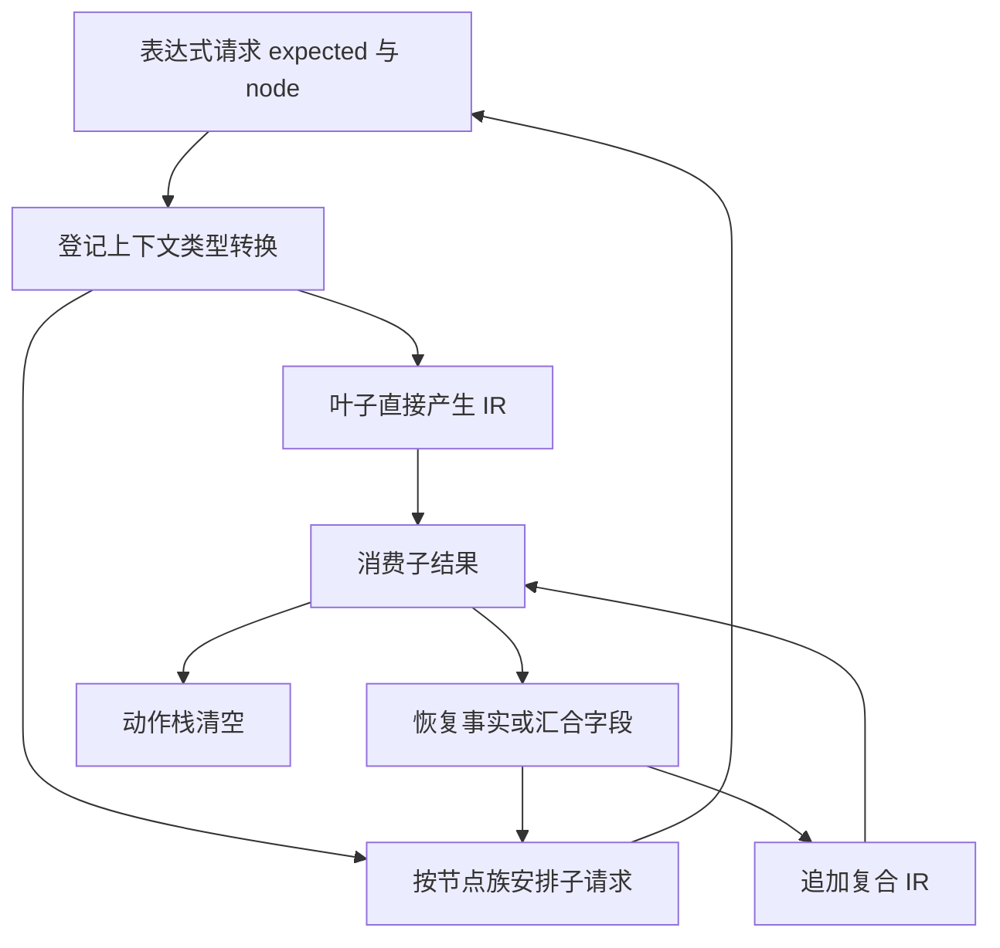

二元运算在左侧分析后保存事实标记，右侧完成后恢复；条件表达式先分析 bool 条件，再在真/假事实下分别分析两支，第二支接受第一支确定的结果类型。索引先分析并验证目标，再分析 u64 索引。所有完成结果统一经过调用者登记的 expected 转换。

match 的 subject 使用 parser 规定的零值缺省／非零 ID + 1 表示；条件和结果按源码顺序求值，逐支更新结果类型，最后分析 fallback。没有 subject 时条件期望 bool；有 subject 时提前拒绝非 scalar/enum/有限 error 的类型。

列表在分析元素之前校验目标类型与 tuple 长度。tuple 按位置提供类型上下文；无上下文的非空 list 从首元素确定类型，空 list 必须已有类型。构造通过已有 constructing/update 写入同一类型 delta，不复制另一份容器规则。

对象按源码字段顺序处理：显式字段先校验上下文字段资格，再求值；spread 先求值，检查对象类型，再投影字段。entries 保留首次字段位置、后出现的同名字段覆盖值；evaluation 保留每次源表达式求值，不能因覆盖而删除。最后校验/转换必需字段、补 optional 空值、拒绝多余 spread 字段，再构造规范对象类型并映射字段编号。

后续批次已接通 parallel、async 与 capture，并删除 Compound 暂停态。当前 parser 的表达式种类均有对应分析路径或原有上下文诊断；这只代表表达式源码调用链闭合，完整主分析器仍需普通块、契约和发布阶段。

## 调用分派、列表基础操作与模板

调用分派现在先检查 generic 参数，再区分普通名称、namespace 导入和集合方法。普通名称依次检查局部遮蔽、捕获遮蔽、导入函数和内建 loop/parallel。捕获遮蔽仍经过实际 resolve，保留捕获诊断优先级。namespace 已知但成员缺失时直接报错，不退回集合方法。

导入函数在求值参数之前拒绝未授权 Store 签名，再检查参数数量。原生 tuple 展开按位置传递参数类型；void Input 的零参数调用生成 unit；其他普通调用接受一个 Input 参数。所有参数按源码顺序求值后追加普通 Call IR。

集合方法先分析目标，再拒绝 clone、检查 list 类型。push/pop/sort/reverse/splice/concat/with 已接通，参数类型上下文及结果 tuple 保持原语义；sort 的元素资格检查先于参数求值。map/filter/reduce/every/some 的回调与 lowering 在后续批次接入，见下节；源码连接不等于完成编译验收。

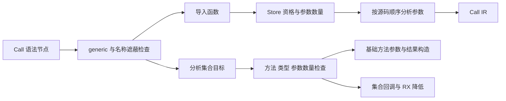

模板字符串按源码 part 顺序处理，文本复用模板转义解码，插值使用同一表达式遍历器并要求非 void scalar。await/cancel 在操作数分析后验证 Task 类型，再生成结果/void 节点；async 的捕获扫描与有限错误契约仍待迁移。

## 集合回调与 RX 降低

transform 在 1–2 个参数检查后先分析第二参数，再进入第一个 inline lambda。reduce 的第二参数使用返回上下文；其他操作的第二参数虽不决定结果，仍保留求值。参数数量检查先于作用域进入；callback 参数按类型是否包含 list 设置 symbol ownership，捕获复用已有父帧机制。

callback 结束后收集 captures，恢复父作用域，再确定 map 的结果 list 类型。callback.body 继续引用原参数与捕获 target 的 symbol ID；降低阶段通过 scope binding 重绑定这些符号，不克隆或重写回调表达式。

`collections/lower.rx` 显式组织外层 source binding、初始结果、初始 state、状态参数、循环条件、step 与最终 scope。`collections/step.rx` 显式组织回调 bindings、结果更新、下一状态和内层 scope。ZX 原子操作各自生成一个内聚 IR 子图，未用单个 ZX 总控代替这两层 RX 编排。

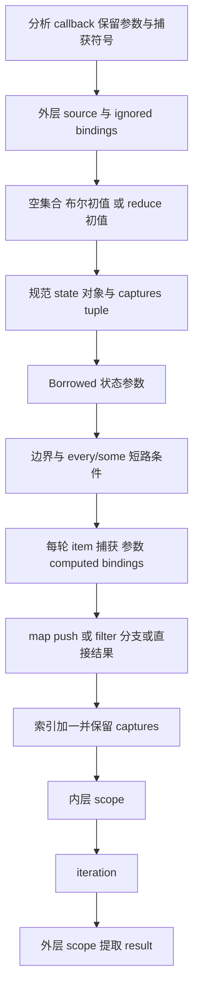

symbol ownership 与 scope.borrow 分别保留：状态参数和捕获 target 为 Borrowed；source、ignored、item、捕获绑定为 borrow；reduce 的 accumulator 参数绑定不借用，其余 callback 参数绑定借用；computed 和 iteration 结果绑定不借用。对象 evaluation 保留传入顺序，字段布局按规范类型顺序生成。

无初值 reduce 在初始状态构造时读取 `source[0]`，起始索引为 1；不为空集合新增默认值，普通 Index 错误仍会进入有限错误效果分析。有初值时起始索引为 0。空 map/filter、every/some 的结果由初始状态自然决定。

遍历器通过普通包名 `compiler/collection_lower` 调用统一编译库导出。构建脚本新增 analyzer_libraries，先由同一 compiler.library.link 将 RX 功能模块链接为库，再通过既有 compiled_libraries 注入分析器编译。该文件只负责构建期库组装，不实现集合语义、不提供专用运行时。完整状态的名义类型合并、所有权与生成代码仍待集中构建验证。

## loop 规则、作用域与更新位置

loop 调用现在先要求两个参数、确认 inline rules 对象，再按源码顺序完整扫描规则。spread、重复 while、重复 next/do、未知规则和缺失规则均在初始状态分析之前诊断。之后按 initial → while callback → next/do callback 的顺序推进，不以规则字段顺序决定回调分析顺序。

loop callback 独立保存 active/floor/depth/capture parent，进入时关闭集合捕获上下文，参数设为 Borrowed；退出时恢复父上下文。while 结果期望 bool，更新回调必须为单参数 lambda 且 body 为 StateBlock。无效 callback 在进入作用域之前拒绝。

遍历器先接通初值与 while 的 continuation，再把更新 body 交到明确的 StateBlock 阶段；后续批次已接通该阶段的全部语句类型与 IterationStep 归并。源码调用链已连接，但未构建验证，不能宣称 loop 已通过完整运行验收。

更新位置改用显式路径数组，先沿 IR 验证目标最终属于当前状态符号，再从根向叶重建投影。列表索引与必要的父值保存为临时 scope binding；复合更新需要的叶值也只读取一次。替换时从叶向根重建 list/object/tuple，未更新字段通过原容器投影保留。string 索引仍不可变，非当前状态引用仍拒绝写入。

## state block 语句调度与失败退出

表达式 Source 现在显式携带 parser 的 BlockTree；已有 scopes.enter 改为接收实际需要的 BlockTree，不再要求整个 Program。Work 持有 scopes 与按语义分组的语句 continuation，同一动作栈处理表达式、嵌套 loop、if/switch 子块及归并，不产生循环 import。

常量先校验名称、解析可选 annotation，再分析初值并绑定。表达式语句允许 iteration，其余必须转换为 void。解构先保存整个 tuple，再按源码名称顺序投影和绑定，保留 `_` 丢弃与捕获结果细化规则。return 与 Store setter 在 state block 中保留原诊断。

状态更新先分析目标并准备位置，再分析替换值；复合更新的数值资格在替换值分析后检查。替换完成后通过 scopes.advance 绑定同名的新状态版本。if 子块在相应细化事实下分析，退出后恢复父事实，缺少 else 时直接引用原状态；汇合结果再推进父状态。

switch 先检查 subject 类型，每个标签经过原有常量相等算法检查，再分析对应子块。标签与 default 重复检查按源码顺序执行；无 default 时使用原状态引用。分支结果生成 match 表达式后推进父状态。

initial 保存可见符号、scope floor、lambda depth、capture parent 与事实标记。advance 发生诊断时统一恢复这些入口边界并清空本次临时 scopes；不会把中间 IR 当作成功产物发布。这是失败退出清理，不回滚已经追加的 IR 或类型列，后续发布阶段仍必须以 diagnostic 为门禁。

## 有限错误效果与 Task 路径

有限错误算法放回拥有公共 IR 的 core。函数表模型迁到 core/function_table，compiler 保留类型别名；已有类型行视图和控制终止事实算法也统一由 core 持有，旧 compiler 路径转为导入适配，未保留第二份同职责规则。

`core/error_effects/analyze.rx` 显式组织输入/访问状态初始化、可达 IR 遍历和最终错误集规范化。遍历使用表达式表编号与表达式 ID 区分不同函数及契约，不再依赖指针地址。函数调用按 ID 去重；每张实际访问的表达式表使用按访问量增长的开放寻址 ID 集合，避免每次小表达式分析都初始化整张表的访问位图。

表达式边界保持旧规则：capture 只暴露自身 OutOfMemory，Task 构造不展开 body，await 从 Task 类型读取错误集合，parallel 合并各 Task 错误并加入并发资源错误。普通容器、索引、更新、调用、scope、iteration 继续遍历各自实际子项。capture 的解构语句保留旧特殊处理，不再次收集 initializer 的错误。

函数遍历区分原生是否可失败与是否有有限错误声明；无声明的可失败原生函数、Store 函数或 Store/Parallel 控制语句使结果变为未知。内部函数遍历 requires 契约与可达控制块；ensures 不参与旧调用前错误契约。控制块按终止事实停止扫描。最终未知返回 null，已知结果排序并去重；空数组表示已知无错误，不能与未知混淆。

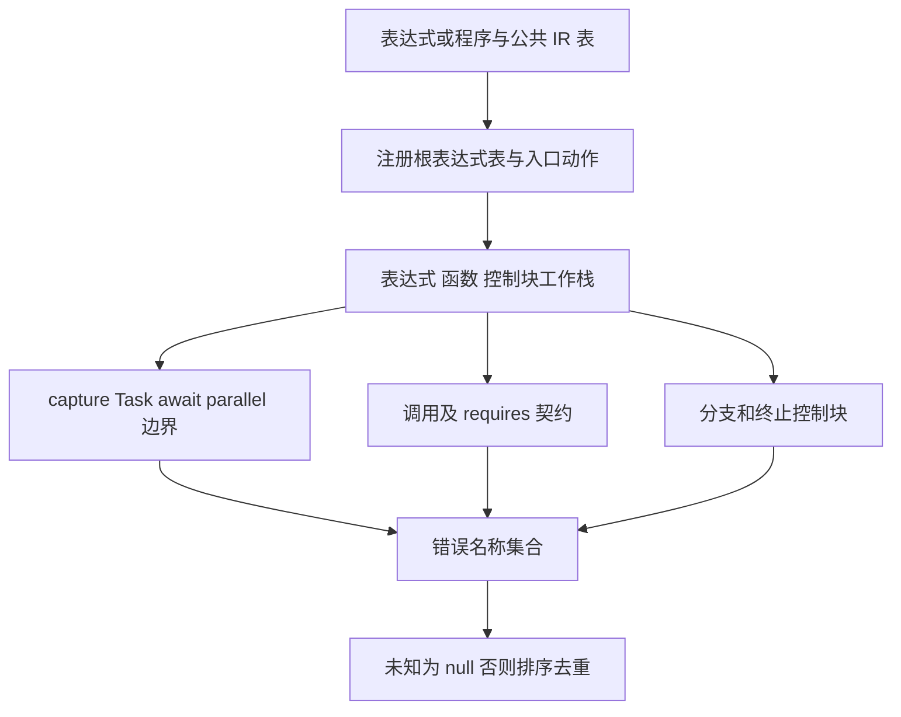

分析器通过普通编译库导出 `compiler/error_effects` 消费该 RX 模块；构建注册表现在把集合降低与错误分析共同链接为 analyzer.zxlib。原手写 core/error_effects.zig 仍由旧正式路径使用，未删除；新分析器接线不能冒充旧正式路径已经迁移。

capture 在分析 operand 后要求有限错误契约，再构造 optional errors 与 optional payload 的 tuple；void payload 保持 void。async 在分析 body 前记录表达式与符号起点，随后扫描新增 IR：收集旧符号引用，拒绝 host reference、Task handle、Store getter 和无并发契约的调用。函数并发事实复用现有 canonical 算法，每个遍历上下文计算一次。

parallel 按源码顺序逐分支检查零参数 lambda 和重名，再立即分析该分支为 Task。void 分支仍保留执行，但不进入结果字段；非 void 字段构造规范对象类型后重新映射编号。async、capture、parallel 均已接入同一表达式动作栈。

## 检查与当前边界

本轮 50 个相关 ZX 源文件完成格式、导入目标、导出和 120 行限制检查，diff 空白检查通过。Zig 仅做限定格式化；尚未运行构建或测试，未提交此次整块工作。

后续表达式批次新增 26 个 ZX 文件，完成格式、导入目标、具名导出和行数检查，最多 73 行；未构建、未运行测试。这里的静态检查不包含类型求解与所有权验证。

continuation 与聚合批次新增 26 个 ZX 文件，完成同类静态检查，最多 83 行；仍未构建、未测试、未拆分提交。调用顺序已另行只读核对旧源码：generic、局部/捕获遮蔽、Store 资格和参数数量检查必须先于参数分析；不同集合操作和回调的求值顺序不可机械统一。

调用基础与模板批次新增 20 个 ZX 文件、修改 5 个遍历器文件，完成格式、导入目标、具名导出及行数检查，最多 97 行。格式解析发现 cancel 是保留字，已将内部字段改为 cancellation；相关两个文件重新格式化通过。本批仍未构建或测试。

集合回调批次检查 27 个相关 ZX 文件与 2 个 RX 文件，ZX 最多 73 行；格式与导入静态检查通过。将统一编译库边展开后的表达式入口可达 215 个源码模块，未发现缺失目标或源码依赖环。两份构建脚本只做 Zig 格式检查；未构建、未测试、未提交本整块工作。

loop 规则与更新位置批次检查 15 个新增或修改的 ZX 文件，最多 78 行；格式、导入目标和具名导出检查通过。源码解析确认当前语法不支持具名类型 import 的 as 别名，已改用职责明确的 IterationFrame 导出名。未为此扩展语言，也未运行构建或测试。

state block 批次检查 20 个新增或修改的 ZX 文件，最多 98 行，完成格式、导入目标和具名导出检查；另对新加入的失败退出及相关模型重新格式化。未构建、未运行测试、未拆分提交。

错误效果与 Task 批次检查 43 个相关 ZX 文件，最多 108 行；格式、导入目标与具名导出检查通过。新增 RX 入口格式通过，三份构建脚本 Zig 格式通过。展开两个统一库导出后的表达式入口可达 312 个源码模块，未发现缺失目标或依赖环。仍未构建、未测试。

基础表达式 dispatcher、match、聚合、导入调用、集合回调与降低、模板、Task/capture/parallel、loop 与 state block 已连接；普通块语句调度、返回路径、导出、契约、所有权和发布仍需接入。正式 Analyzer 入口尚未替换，当前局部调用链不能单独证明完整自举。

## 自我批判

pending 与正式 Control 复用布局，减少了重复定义，但更要求调用关系明确区分两个 owner。集中验收必须确认子块恢复不影响父前缀、最终表没有孤立载荷，且生成器未在跨阶段传递时复制整个表。

捕获稳定索引避免错用旧帧，但存储寿命延长到单模块分析结束；需要在完整调用链下检查内存行为。不能凭普通数据结构或静态检查宣称零额外分配已经得到证明。

类型提示及表达式 continuation 的显式栈是算法内部遍历，不代替 RX 的模块阶段编排。当前 leaf、操作规则与聚合已连接，但尚未由完整主体入口闭合，下一步必须补齐调用、集合回调、语句等节点；不能把新增文件数量或局部遍历可执行解释为主分析器完成。

对象展开时的投影和字段覆盖必须在生成 IR 中同时保持求值顺序与引用身份；当前只是从旧语义迁入同一表模型，尚未检查真实生成代码。类型构造共用旧 ZX 算法，但其跨模块 owner 传递同样需要集中验证，不能仅凭函数复用宣称零复制已经成立。

集合降低目前有真实 RX 调用结构，但编译库消费尚未实际构建，不能把普通包名或无环检查当作 ABI 与所有权正确的证据。失败退出已经增加入口可见性恢复，完整主体接入后仍需核对所有返回路径，防止发布部分类型/IR。

状态更新路径现已被真实语句流程调用，StateBlock 也已成为 advance 的内部可推进阶段。当前证据只证明源码连接及静态结构，嵌套状态的引用身份、索引单次求值和生成代码仍须在整块集中验证时核查。

错误效果的 sparse ID 集合避免了全表位图初始化，但仍需检查实际生成代码的表更新是否复用 buffer；不能仅凭算法结构声称没有数据复制。函数表及 type/control 原子算法迁到 core 后，旧 Zig 适配的 ABI 和统一库名义类型也都需要集中构建验证。

只读源码对照未发现有限错误结果、capture/Task 边界或 parallel 分支规则的确定偏差；这不是运行验证。requires 动作已按逆序入栈以维持源码访问顺序。未知错误集合会提前结束遍历，与旧实现继续收集后返回 null 的分配轨迹不同；结果契约仍为未知，不宣称分配失败序号完全一致。

## 普通语句块的规则接入计划

普通 Control 块沿用已有 pending/frames；先补齐绑定完成、解构绑定、evaluate 完成、return 完成和 Store 写入资格这些原子规则，再由语句遍历器调度表达式和子块。不能复用 loop 的 scope binding 写入，因为它会改变 IR 表示与状态参数约束。

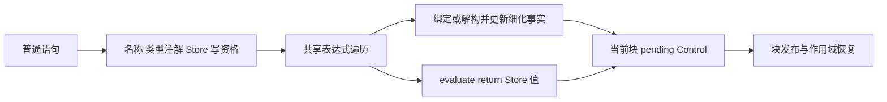

解构直接产生 Control.Destructure，保留可丢弃 slot 与 capture 的细化事实，不增加 tuple 临时值或重复投影。Store setter 同时保留注入 handle.value 与已授权 store.namespace.object 路径；权限检查在分析右值之前完成。完成源码连接后再集中验证，不以规则文件存在代替主体入口完成。

本批已实现六个原子规则：普通名称校验、常量绑定完成、解构完成、evaluate 完成、return 完成和 Store 写资格。常量绑定保留 Task 必须来自 Task 构造节点的所有权检查；evaluate 允许 iteration 语句，其余要求 void；return 的值预期由调用方以 Output 上下文分析，缺省值仅接受 void Output。

Store 的路径匹配复用既有 span/path 比较，不再为校验拼接字符串。解构直接绑定符号并调用共享 refinement.bind，只有成功后才写入 pending Control。部分绑定发生诊断时仍留在局部分析状态，后续遍历失败退出必须恢复入口可见性，且禁止发布失败结果。

本批六个新 ZX 和一个排版修正的遍历模型完成格式解析、导入目标、120 行与 diff 空白检查，最多 83 行。没有运行构建或测试。普通语句总遍历尚未连接这些原子规则，当前只能记为规则实现，不能记为普通块支持完成。

自我批判：本批规则对照旧 Zig 行为，但上下文类型转换、前置名称检查、分支子块和错误退出的调用顺序仍取决于下一步的遍历接线。上述静态检查不证明类型、所有权或运行行为正确。不得将尚未进入正式入口的规则计作完成自举。

## 普通块遍历与 RX 主体入口

普通块现在由独立遍历器连接上述规则。它复用同一表达式工作区，函数并发事实在主体初始化时计算一次；每个表达式请求重置节点、预期类型和失败边界，完成的动作栈继续保持为空，避免逐语句重算全函数表。

if 帧保存条件、第一支 BlockId 与细化标记；两支分别在真/假事实下进入块，离开后恢复分支前事实。终止的分支为父块后续语句引入相反条件事实。缺失 else 发布空块，保持返回缓存与 Control BlockId 对齐。

switch 保留源码 case 顺序、标签/默认分支重复诊断和穷尽性判定。每个标签求值后才分析对应块；子块结束恢复可见性，父 switch 的标签与 BlockId 在独立帧中保留。穷尽性来自默认分支、枚举/有限错误成员数或 bool 的两种值。标签规则继续复用现有共享实现。

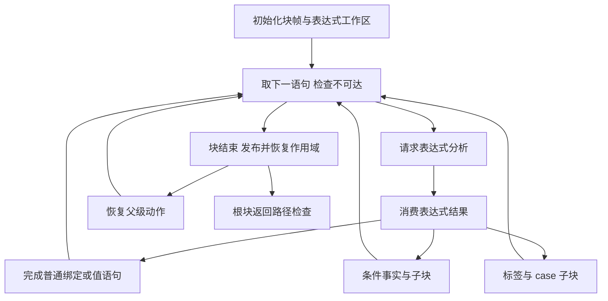

`body.rx` 显式连接初始化、普通块遍历和返回路径验收。失败退出恢复根块入口的可见绑定及细化事实，返回空 root；内部暂存数据不作为成功结果发布。完整模块层的导出、契约、所有权及最终发布仍未连接，正式 Analyzer 仍使用旧入口。

源码复核发现上一批 constant 误将 type-kind 字节解码接口当成类型 ID 查询；已改为共享 row 查询后读取 kind。该问题再次说明格式和导入存在性检查不能代替类型构建验证。

普通块批次已检查 18 个相关 ZX 与 1 个 RX，ZX 最多 74 行；格式解析、具名导出、导入目标、diff 空白检查通过。展开普通编译库后的 body 入口可达 361 个源码模块，没有缺失目标或依赖环。未运行构建或测试，未提交本整块工作。

此阶段的明确剩余项是模块级导出、独立契约表达式分析、所有权验收、发布及正式入口替换。复用 expression Work 的依据是成功分析后动作和各载荷栈清空；这是实现依赖的不变量，集中验证时必须覆盖连续表达式与嵌套 loop/Task，不能仅凭 DAG 检查认定状态复用正确。

只读审计未发现普通块此次迁移的确定语义偏差，核对了父子动作栈、pending 恢复、分支事实、switch 顺序与穷尽性及 Store 授权顺序。明确保留两个待集中验证的条件：主体入口必须接收 local/initial 产生的空 Control，使返回缓存与 BlockId 对齐；所有成功表达式 continuation 必须弹出对应专属帧，才能安全重用工作区。正式模块接线需维持前者，连续复杂表达式验证需覆盖后者。

导出类型收集原子操作也已加入：按声明源码顺序调用同一命名类型解析器，沿用共享 delta/cache，输出名称与类型 ID 两列。只追加成功解析结果，诊断停止收集；尚未连接完整模块发布流程。该文件通过格式解析，共 37 行，未构建或测试。

## 契约迁移设计

契约与主体共享类型增量，但使用独立 Local、符号表和表达式表。沿用旧契约可见性：原别名与模块导出组成类型别名，值仅绑定 in，ensures 额外绑定 out；不给契约提供函数导入或 Store。谓词按 bool 分析后扫描禁止的表达式种类，保持先分析、后能力诊断的顺序。

每条契约的阶段由独立 RX 模块编排，再作为普通编译库公开模块供契约集合遍历调用。它依赖已有集合降低和错误效果库，因此构建依赖按两层静态库顺序准备，不能让同一待生成库自我依赖。该层次只解决普通统一模块消费，不增加专用原生语义桥。

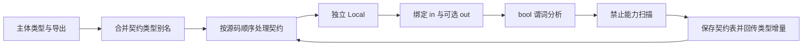

契约源码批次完成 9 个 ZX 和 3 个 RX 的格式、导入目标、具名导出和行数检查，ZX 最多 32 行。展开三项普通编译库导出后，契约入口可达 331 个源码模块，无缺失目标或依赖环；新增 core 契约追加模块已补入构建包注册表，分析器及错误效果源码的普通包引用均有注册。三份构建脚本完成 Zig 格式检查；未编译、未测试、未提交。

只读对照没有发现契约可见性、delta 回写、能力校验顺序或构建生命周期的确定偏差。ensures 分支在独立 Task 中再次调用 append，集中构建时仍须核对 Task 内同名 ctx 绑定解析与名义类型联结，静态检查不能证明这些成立。

下一阶段所有权输入目前仍为单张 Table，而主分析器持有 base/delta 双表。应让已有所有权算法直接消费公共 Tables 视图，并让旧宿主传入原表与空 delta；不为接线复制、重排整张类型表。还需补齐调用函数的 ownership 列，在模块 RX 中消费完整所有权结果后才能发布 ModuleOutput。

## 所有权类型视图接线

已有所有权算法改为直接读取公共 Tables：类型 ID 在 base 与 delta 之间保持统一编号，行查询选择正确物理表，字段/子项索引仍属于选中表。引用性质表按两表总类型数生成；符号和表达式中的类型 ID 不变。旧 Zig 调用入口仅以原表作为 base、空表作为 delta 适配。

此次超过五文件的签名迁移先尝试 Grit import 规则 dry-run；工具未识别 ZX 文件，返回 Processed 0 files。随后限定 ownership 目录与准确的 Table import/参数声明进行替换，再逐项改写直接索引，不把零匹配视为完成。

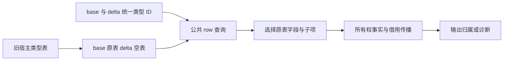

所有权双表批次完成 25 个 ZX 与 1 个 RX 的格式、导入、具名导出和行数检查，ZX 最多 93 行；所有权入口依赖 140 个模块，无缺失目标或环。旧适配器同步借用 base/空 delta 描述符，Zig 格式通过。只读审计没有发现取址或诊断映射偏差；stores_owned 仍由既有 facts 接口消费，新模块 wrapper 只等价于 analyze 输出归属接口，执行错误仍须在正式宿主入口处理。

## 完整主分析源码入口与首次集中构建

新增 `analyzer/analyze.rx`，明确依次连接 prepare、主体、导出、契约、所有权和输出组装。各阶段检查 diagnostic，失败后跳过后续语义工作；失败输出 root 为空，宿主必须先检查 diagnostic，不能提交其中的部分类型或 IR。主体只在 prepare 成功且存在 body 时进入，保证其 Local.control 初始为空。类型声明模块跳过主体，但保留导出与所有权的 type_only 语义。

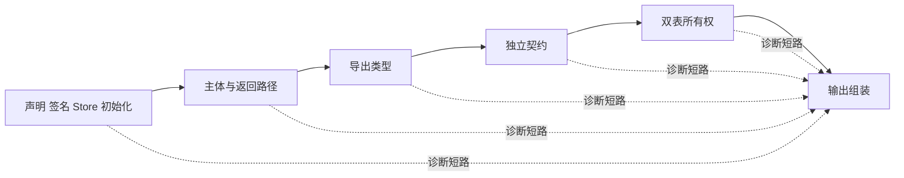

主入口静态依赖展开 527 个源码模块，未发现缺失包注册、具名导出或依赖环。构建生成器新增 analyzer.zig/analyzer_abi.zig 输出，准备独立 ABI 对应标准库模块，并注册 generated_analyzer。**正式 Indexed.analyze 仍调用旧 Analyzer.runView，尚未切换。** 当前生成接线只是为接下来的 ABI 适配提供实际证据。

首次集中执行 `zig build --summary all`，31/36 步完成，在 generate-parser 阶段失败：error_effects/walk 使用了当前语言禁止的嵌套三元表达式。批量 lint 定位本次分析器/错误效果源码 20 个同类文件，已按分派职责改为 match，或提取独立原子值；随后构建发现传递依赖 string_literal/decode 同类问题，也已修正。记录位于[集中构建目录](主分析器集中构建/)。没有运行测试。

广泛源码 lint 另外发现既有源码的排版提示，已保留日志而未顺手重排。它们不等价于构建阻断；同样，此前 fmt 通过也不等价于编译器源码校验通过。必须以真实集中构建继续修复剩余类型、所有权与联结问题，不能再以静态 DAG 检查宣称可运行。

构建继续推进后，普通编译库导入暴露了第二类问题：ValueKind 与 SequenceKind 原先声明在带默认函数的文件里。已将这两个共享枚举迁到 append/model 纯类型模块并更新导入，未改变枚举成员顺序。之后构建到 collections/building/reference 时出现类型上下文不匹配，尚未修复；构建诊断现增加行列与错误代码，继续定位。

语法修正的只读审计发现浮点解析的 match 条件不能继承原三元表达式的 Optional 非空细化，已改成先用单层条件表达式计算 widened，再选择 f32/f64 结果，保持惰性解析顺序。其余分派改写未发现确定语义偏差。不得为使构建通过放宽现有类型导入规则或 Optional 约束。

带坐标的构建已结束并确认当前阻断：collections/building/reference.zx:13:114 的 in.symbol 是 u32，而数组索引要求 u64。应按现有语言规则对 IR ID 使用 integers.widen，保留语法节点等已为 u64 的索引；下一步按模型统一盘点并批量修正，不为自举源码引入隐式数值转换特例。当前无正在运行的本会话构建。

索引修正按模型与只读盘点处理了 86 个文件的 230 处下标，并补齐两处 SymbolId 作为 splice 起点的转换，共 88 个文件。只对确认的 u32 来源插入 widen，语法树 u64、游标、已转换位置和数组字面量保持原样。该批 fmt/lint 均通过，最多 80 行；构建进一步推进到集合条件构造。

下一条真实诊断指向独立 metadata 局部值：无上下文的 type_id:5 被推导为 u64，不能作为 Metadata.type_id:u32。已为它标注公共 Metadata，并统一为相关可空类型提示、含零 ID 的条件结果及浮点 Optional 局部值补上明确类型上下文。新的集中构建正在验证；这不改变默认数值类型或引入隐式转换。

## 集中构建确认的模块身份缺口

接口类型诊断构建已结束：31/36 步成功，generate-parser 失败，未运行测试。首个不同名义类型位于 `FunctionTable.contracts[].expressions[].binary_operators[]`，两端都是 `core/expression_table/kinds.zx` 声明的 BinaryOperator：源码侧 origin 为原声明路径，预编译侧为 `library:18:compiler-bootstrap:` 加原路径。完整取证在[接口类型身份诊断日志](主分析器集中构建/接口类型身份诊断.log)。临时诊断打印已从手写 Analyzer 移除。

当前两层构建把同一源码闭包的中间 RX 模块作为独立发行库重新装载，消费者却仍直接导入同一批 core 源码模型，因此类型身份分裂。库装载器为独立实例重新绑定身份符合发行库契约；不能通过取消枚举名义性、结构强转或字符串前缀幂等来修复。同时，两份产物共用 compiler-bootstrap 实例违反一实例对应一产物的既有规则；只改实例名也不能解决共享源码模型问题。

此前“普通编译库即可解决源码 RX/ZX 互相组合”的判断需要修正。现有 ZX package 源码入口只接受 .zx，RX prepare 先分析所有 Call.fn，而后才推导 RX 图；它无法直接处理 ZX 引用尚待推导的源码 RX 模块。下一块应完善同一次编译的统一源码依赖图，保留发行库实例隔离。具体设计和边界见[统一源码模块编译方案](统一源码模块编译方案.md)。

自我核对：此前静态导入展开无环只证明文件依赖关系，不证明跨源码/发行库身份一致，也不证明真实编译调度可用。主分析器正式入口仍未切换，不将源码已迁移或本次问题已定位描述为完成自举。

## 本批生成链验收

主分析器的 RX 阶段、ZX 逻辑及传递依赖已通过统一源码图进入生成器，实际产出 analyzer.zig 和 analyzer_abi.zig。集中 `zig build --summary all` 退出码为 0，36/36 步成功；没有执行测试。

本批同时完成公共 core 数据模型迁移、混合源码签名与主体调度，并将 genz 循环别名证明改为单调依赖图的强连通分量求值。实现及证据见[统一源码模块编译方案](统一源码模块编译方案.md)与[缓冲区别名分析收敛方案](缓冲区别名分析收敛方案.md)。

正式 Indexed 分析入口尚未改为执行新分析器；因此本批提交只标记模型、源码模块机制与生成链完成。下一块为输入/输出 ABI 边界、正式入口切换及针对性验证，再推进阶段自编译。
