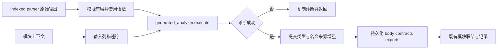
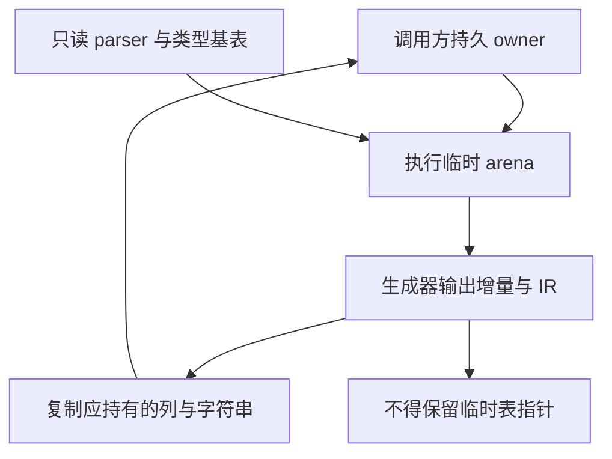

# 主分析器正式入口接线

## Intent：最终目标

让正式 Indexed 模块分析直接执行已生成的 RX/ZX 主分析器，由其完成声明、类型、正文、契约和所有权分析。宿主只适配输入描述符、提交类型增量并持久化输出，不重新调用旧 Analyzer 的语义流程。

## Data：可用证据

- 阶段提交 b635e6cbc 已生成 analyzer.zig 与 analyzer_abi.zig，集中构建 36/36 成功。
- 接线前 module_input.Indexed.analyze 创建语法 View 并调用旧 Analyzer.runView。
- analyzer/context.zx 与 output.zx 已定义完整输入和输出；语法来源是 parser/syntax.Program，公共 IR 列模型位于 core。
- canonical/borrow.zig 已按大小、对齐、字段偏移与枚举映射校验 ABI 借用；semantic/merging/commit.zig 已支持原编号类型增量和名义来源提交。
- analyzeInputIn 与 Project.finishInput 在模块分析返回后仍负责挂接 functions/native_modules、初始器、模块记录及缓存。

## Edges：边界与限制

- 不硬编码生成类型编号，不复制一套 IR 数据模型，不重新解析 Indexed 源码。
- input 的表列和语法使用经布局检查的只读借用；转换后的名称/ID描述列由本次执行 owner 持有。
- 输出诊断成功后才提交 type_delta 和 nominal_delta，不重编号、不重新推导，不伪造 resolver cache。
- 输出 body、contracts、exports 和字符串必须在临时 arena 释放前持久化；contracts 的嵌套表需要真正复制，不能只复制外层指针。
- 保留普通 ZX transaction Store 模式、output_ownership 和 type_only；跨模块环境继续由既有调用层负责。
- Native seed、独立表达式入口及其他宿主模块状态仍分别记录为后续迁移范围。此次入口适配并不自动满足最终自举标准。
- 不新增测试、不运行全量测试；整块接线后集中构建，并按真实诊断修复。

## Answer：交付格式与成功标准

交付输入适配、增量提交、输出持久化和正式 Indexed 入口替换。验收必须实际实例化 generated_analyzer.execute，确认宿主不再通过该入口调用旧 runView，并记录剩余依赖。

## 自我批判

上一轮生成和构建成功未实例化新分析器正文，不能证明其运行语义。此次必须通过真正入口调用触发 Zig 检查；输入输出适配仍是过渡宿主边界，待跨模块调度和持久状态整体迁入 RX/ZX 后继续收口，不把适配器当作自举完成证明。

## 整块接线实现

已新增 host 输入/输出适配：输入借用 parser 的完整索引语法、core 类型及函数列；类型别名、导入绑定和 Store 授权转为描述列。所有生成类型均从 generated.Input/Output 的字段推导，没有固定类型编号。

成功输出沿既有 merging/commit 追加类型和完整名义来源增量；正文平坦列复制持久化，契约额外复制每条独立的 symbols/expressions 表，exports 和诊断字符串按 owner 持有。没有为套用单次 resolver 接口伪造 cache。

Indexed.analyze 现调用 generated_analyzer.execute，外层通过静态 completes_ownership 契约保留其所有权结果，不再覆盖重算。Native 路径仍按原流程完成所有权分析；此差异显式保留为过渡边界。集中构建与现有 CLI 示例已通过，见下方验收记录。

## 集中构建发现与修复

正式调用首先暴露标准库重复注册：生成分析器与类型解析器分别将同一个 standard/src/root.zig 建成两个模块，Zig 拒绝同一文件归属两个模块。分析器当前原生调用均为不依赖 ABI 的 encoding 接口，现复用已有标准库模块，删除重复实例；若未来引入依赖不同 ABI 的标准库接口，需按公共接口统一绑定，不能直接新增同源模块。

完整索引语法借用随后触发编译期求值默认 1000 次上限。pointer 与 slice 入口现采用 columns 已有的 100000 次额度；大小、对齐、结构字段位置与枚举映射仍全部校验。没有跳过布局检查，也没有新增运行时转换。

以上修复后重新集中构建，36/36 步骤成功。

## 验收结果与剩余边界

- `zig build --summary all`：36/36 步骤成功，正式入口实际实例化 generated_analyzer.execute；未执行测试套件。
- 新 zxc 编译仓库现有 `packages/cli/examples/quote.zx`：成功输出 Zig 源码。
- 新 zxc 构建同一示例应用：成功；应用输入 `{"amount":100,"discount":20,"enabled":true,"factor":2}`，输出 `{"amount":80,"factor":1}`。
- 本次 diff 空白检查通过；未新增测试、未调用浏览器、未运行全量测试。

正式 Indexed 主分析器入口已迁移；这不代表全部自举完成。签名预解析、跨模块调度与状态、Native seed、独立表达式入口等过渡依赖仍需收口，stage 1/2/3 自编译及传递依赖闭包尚未完成。本次示例验证只证明所覆盖流程，不替代其他会话负责的回归。
