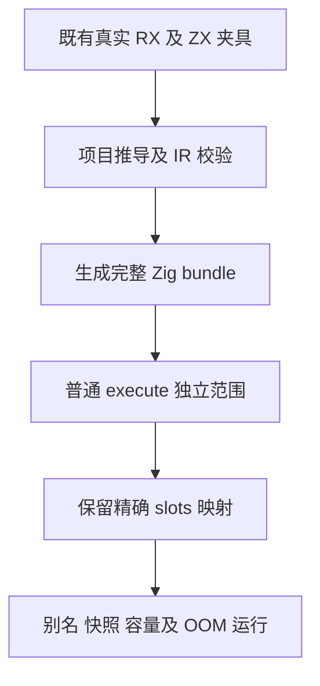
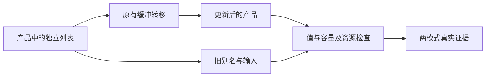

# 产品缓冲转移普通入口门禁

## Intent：最终目标

维护 RX 产品缓冲转移的精确资源检查，使计数对应实际普通入口，恢复独立缓冲、别名快照、容量、输入保持和分配失败的完整既有门禁。不新增业务特判或生产改动。

## Data：可用证据

固定 bbd 根 Debug 的 retained_target、object、nested、growth 四项在生成阶段失败，旧检查对完整 bundle 统计 fromOwnedSlice，分别期望 1/2/2/1，实际为 3/4/4/2。失败前已落盘源与 ABI，独立检查普通 execute 恰为原精确期望；额外出现位于后续值入口。

现行 shape 生成顺序仍为普通 execute 及后续公开入口，打印器用不缩进的顶层结束行。已有聚合循环范围修正已完成严格两模式验证，可以内化同一测试职责的最小范围写法；不复制其夹具规则。

## Edges：边界与限制

修改仅限 `packages/test/tests/rx/runtime/product_transfer/compile.zig` 的计数范围，保留 fixture.slots 对全部九种模式的精确映射、格式检查、120 行 ZX 限制、真实 XML 推导、IR 校验和产物写入顺序。缺少普通入口或结束行明确失败，不引入通用解析器。

与项目诊断五文件维护、现有 SIMD 修复复测共享一次固定编译器构建，仅用于减少重复生成成本。Debug 与 ReleaseSafe 均已真实完成，详见《执行记录.md》。单文件维护已进入 `72a958bb67592cfb4ac192f00bd48ba354cbc396`；本轮单独提交验证记录。合并构建不意味着不同专项互相证明，也不把复测计作新增逻辑用例。

## Answer：交付与成功标准

在固定源码上实际执行 test-product-transfer 两模式，保存全部生成源/ABI、运行节点、命名测试、分配失败和完整终态。精确断言已通过，单文件代码已在历史提交中；两份中文 IDEA 计划与记录使用英文 Conventional Commits 单独提交推送，不重提已有代码。

## 架构图

## 数据流图

## 自我批判

普通入口资源数量已由旧产物证明，但这不是当前两模式运行证据，也不能外推其他初值所有权问题。独占新 Map/Filter 初值的真实动态复制已另行报告，不能用这次范围修正解释或掩盖。
