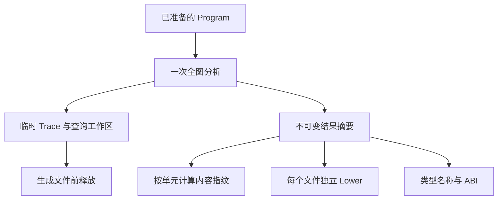
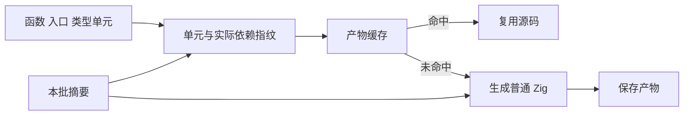

# 函数产物分析复用计划

## Intent：最终目标

使同一个已准备 Program 的函数产物、入口和 ABI 产物共享不可变分析摘要，减少内容哈希命中之前的重复工作。保持既有函数级失效精度、名义身份、生成行为与公开 API。

本项接续编译性能修复；当前尚未实施，不将方案算作收益。自举批量生成仍走整块 emit/emitBundle，本项不能单独解决跨自举入口的重复生成。

## Data：可用证据

- `compiler/backends/zig/modules.zig:functionFilesPrepared` 逐函数调用 `emitPrepared`。
- 有缓存时，`fingerprint.createPrepared` 每次执行全图 value/state、buffer、fresh 与 transfer；fresh 又计算 allocation。
- 未命中时，`genz/modules.functionPrepared` 经 `render.initializePrepared` 再计算全图 value/state、buffer、allocation、transfer、io 与 process。
- `modules.typeNames` 重新计算 state plan；同一 Program 的 entry/types 也重新初始化分析。
- state plan 读取顶层 expressions、contracts、stores 和 output_type，因此不能仅凭函数表相同就将不同 entry view 的全部摘要共用。

## Edges：边界与限制

1. 共享范围限定为同一个已完成 prepare 的 Program 的一次批量生成。不增加全局缓存、动态调度、运行库或跨批次引用。
2. Lower 的 AST 节点、符号数组、表达式缓存、buffer bindings、task declarations 和函数请求队列属于每个输出文件，必须独立。
3. 摘要存储与临时查询工作区分开。Lane 结果含嵌套路径、calls、iterations 等，生命周期不能借用已释放工作区。
4. 内层 arena 使用外层 arena 作为 backing allocator 时，deinit 不保证内存实际归还。须从真正可释放的 backing allocator 分配工作区，验证驻留内存，不能仅加一层 arena 就声称峰值下降。
5. 不将整张函数表或完整 facts 加入每个函数指纹。继续按实际引用写入语义摘要，保留写入顺序、类型名称、state keys 与 callee 能力边界。
6. 函数单元先对完整 Program 分析，再切换 Lower 的顶层视图；维持既有顺序。library 的不同 public view 和 Store initializer 暂各自建立摘要。
7. 不新增测试用例、不跑全量测试；仅用既有模块生成、缓存及原生 ABI 专项验证受影响路径。

## Answer：交付格式与成功标准

拟拆成两个简单职责：genz 提供不可变函数分析摘要及借用初始化；compiler 在批次内连接摘要、指纹与输出。已有单次公开入口保留，内部按同样机制执行一次分析。

缓存启用时，每批只计算一次 fresh outputs，并复用已有 allocation 结果。类型名称导出复用同批 state plan。无缓存时不为 fingerprint 计算 fresh。

验收分别记录：指纹等价、生成产物等价、既有缓存失效专项、冷与热路径时间、工作区释放后的驻留内存。若状态布局随入口改变，必须重新分析该入口，不能追求共享比例而削弱正确性。

## 自我批判

抽出 facts 结构本身没有收益；必须让真实批量调用点共享，且不能保留大工作区。批次化不解决跨 Program 的重复推导，不能据此宣称自举生成已经完成函数级内容寻址。实现之前应先完成共享槽类型的当前专项和独立提交，避免多组改动混淆归因。
