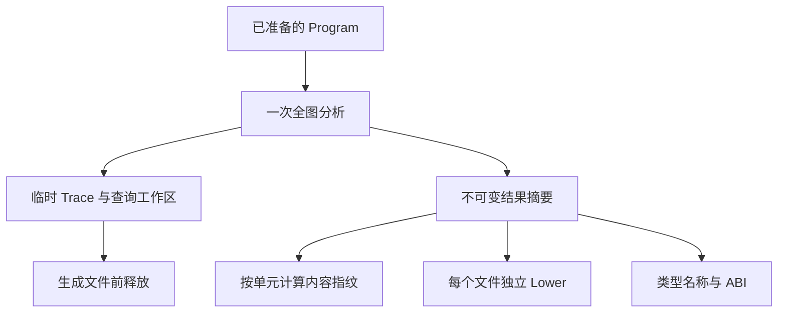
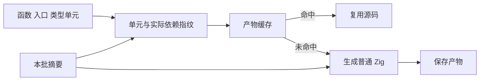

# 函数产物分析复用计划

## Intent：最终目标

使同一个已准备 Program 的函数产物、入口和 ABI 产物共享不可变分析摘要，减少内容哈希命中之前的重复工作。保持既有函数级失效精度、名义身份、生成行为与公开 API。

本项接续编译性能修复；已接入批量路径并通过既有专项，不将行为验证等同于实测性能收益。自举批量生成仍走整块 emit/emitBundle，本项不能单独解决跨自举入口的重复生成。

## Data：可用证据

- `compiler/backends/zig/modules.zig:functionFilesPrepared` 逐函数调用 `emitPrepared`。
- 有缓存时，`fingerprint.createPrepared` 每次执行全图 value/state、buffer、fresh 与 transfer；fresh 又计算 allocation。
- 未命中时，`genz/modules.functionPrepared` 经 `render.initializePrepared` 再计算全图 value/state、buffer、allocation、transfer、io 与 process。
- `modules.typeNames` 重新计算 state plan；同一 Program 的 entry/types 也重新初始化分析。
- state plan 读取顶层 expressions、contracts、stores 和 output_type，因此不能仅凭函数表相同就将不同 entry view 的全部摘要共用。

## Edges：边界与限制

1. 共享范围限定为同一个已完成 prepare 的 Program 的一次批量生成。不增加全局缓存、动态调度、运行库或跨批次引用。
2. Lower 的 AST 节点、符号数组、表达式缓存、buffer bindings、task declarations 和函数请求队列属于每个输出文件，必须独立。
3. 摘要存储与临时查询工作区分开。Lane 结果含嵌套路径、calls、iterations 等，生命周期不能借用已释放工作区。
4. 内层 arena 使用外层 arena 作为 backing allocator 时，deinit 不保证内存实际归还。须从真正可释放的 backing allocator 分配工作区，验证驻留内存，不能仅加一层 arena 就声称峰值下降。
5. 不将整张函数表或完整 facts 加入每个函数指纹。继续按实际引用写入语义摘要，保留写入顺序、类型名称、state keys 与 callee 能力边界。
6. 函数单元先对完整 Program 分析，再切换 Lower 的顶层视图；维持既有顺序。library 的不同 public view 和 Store initializer 暂各自建立摘要。
7. 不新增测试用例、不跑全量测试；仅用既有模块生成、缓存及原生 ABI 专项验证受影响路径。

## Answer：交付格式与成功标准

拟拆成两个简单职责：genz 提供不可变函数分析摘要及借用初始化；compiler 在批次内连接摘要、指纹与输出。已有单次公开入口保留，内部按同样机制执行一次分析。

缓存启用时，每批只计算一次 fresh outputs，并复用已有 allocation 结果。类型名称导出复用同批 state plan。无缓存时不为 fingerprint 计算 fresh。

验收分别记录：指纹等价、生成产物等价、既有缓存失效专项、冷与热路径时间、工作区释放后的驻留内存。若状态布局随入口改变，必须重新分析该入口，不能追求共享比例而削弱正确性。

## 自我批判

抽出 facts 结构本身没有收益；必须让真实批量调用点共享，且不能保留大工作区。批次化不解决跨 Program 的重复推导，不能据此宣称自举生成已经完成函数级内容寻址。实现之前应先完成共享槽类型的当前专项和独立提交，避免多组改动混淆归因。

## 实施记录：2026-10-10

- genz 的 `function_analysis` 收口 value/state、buffer、allocation、transfer、io 与 process 摘要。批次创建时先在独立工作区分析，再保存摘要；Lane 的所有切片及 iteration.path 逐层保留，释放 Trace 等查询数据后开始生成。
- compiler 的 `batch` 持有准备后的 Program、身份、摘要及可选缓存。缓存启用时 fresh outputs 每批计算一次，复用 allocation；逐函数 fresh 查询工作区当次释放。
- 应用入口、函数文件与类型文件共用同批摘要；统一库的公共入口按视图单独建批次，canonical Program 的函数和类型共用。Store 初始化器也单独建批次，并显式传入外层分配器。
- 每文件 Lower 和缓存 key 临时数据使用外层调用者分配器建立工作区，渲染结果写入 Bundle 所有者。单次旧接口保留；调用者若只提供 arena allocator，不能据此承诺向系统归还内存，主要应用/库批量路径已拆分所有者与工作区。
- 指纹写入阶段保持 v42、字段顺序及单元依赖边界；新旧构造路径进入相同写入函数。此轮不变更缓存格式。

自我审查发现并修复一个 arena 所有权风险：不能在结构字面量中先复制 arena，再通过其 allocator 分配其他字段；现在先完成所有摘要分配，最后移动 arena。该问题不应以“所有数据在 arena 内”掩盖。

验证使用既有 `test-native-generation test-semantic-cache test-module-generation`，未新增用例。尚未取得冷/热批量生成的独立性能基准，也未测量工作区释放后的驻留内存，不宣称具体比例。

### 已完成的专项与产物核对

`test-native-generation test-semantic-cache test-module-generation` 已以退出码 0 完成：52/52 步骤、30/30 Zig 用例、1/1 Node 原生 ABI。第五轮 94/94 生成文件与第四轮逐字节一致。

整条命令 668.67 秒，maximum resident set size 5,788,008,448 字节；第四轮同组合为 687.45 秒、5,524,258,816 字节。该命令主要包含生成器和 Zig 后端编译，且受其他会话并发影响，不能据此将墙钟小幅变化当作批次摘要收益，也没有进一步降低后端峰值的证据。

统一库及 Store 初始化器路径以既有 `test-library-link test-library-initializers` 验证，退出码 0：50/50 步骤、72/72 Zig 用例全部通过；整条命令 777.56 秒、maximum resident set size 4,168,495,104 字节。与前三专项组合不同，不横向比较总时长。独立批量冷/热基准仍未完成。自举现有 94 产物保持整块生成，下一组需实际接入统一函数产物才能消除跨入口重复。

### 交付自审

本轮保留单次公开接口和指纹格式，实际批量调用点已经共享摘要；分配失败专项覆盖了应用、统一库、缓冲区及初始化器的清理路径。代码只改变编译期工作区与分析复用，不向应用加入运行库或数据复制。摘要内部必要的深复制用于释放查询工作区，不复制应用运行时集合。

行为验证通过不等于完成性能目标：主自举仍整块生成，后端仍约 5 GB；旧单 allocator 兼容入口也不能保证向系统归还 arena 缓冲区。下一步必须接通共享自举入口并测量，不能以此阶段完成为由结束编译性能修复。
