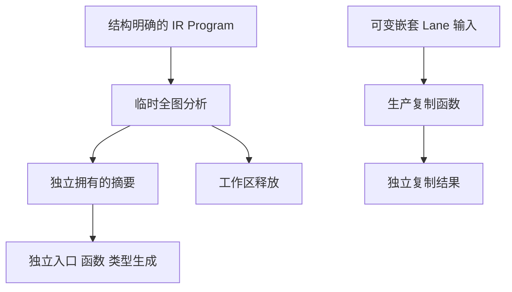

# 函数分析摘要所有权门禁执行计划

## Intent：最终目标

采用 IDEA 框架，为当前函数产物分析复用补齐所有权与批次独立性的细粒度测试。测试目标是同一 Program 的不可变摘要可以在临时分析工作区释放后复用，且每个生成单元的可变状态独立。

## Data：可用证据

当前主分支包含 `d547ddb36` 的函数分析复用：`Analysis.create` 在临时 arena 计算，复制摘要到自有 arena 后释放工作区；Lane 包含输入、输出、追加、移除、更新、调用和循环路径等嵌套切片。既有 module-generation 专项覆盖缓存行为及整体分配失败，尚缺摘要拥有层与嵌套复制的直接独立检查。

同职责样例采用 `build/native_value_boundary.zig` 的内部检查模块组织，以及 `tests/ir/effects/fixture.zig` 的结构化 IR 夹具。测试放在 `packages/test/tests/incremental/function_analysis`，注册独立门禁并接入根 test。

## Edges：边界与限制

- 只新增测试、构建接线与本目录记录，不修改生产编译器或公开接口。
- 摘要夹具使用真实 IR 表和有序函数依赖；校验结构，不借用前端语法失败来证明生成器行为。
- 直接检查 nested Lane 复制只证明该内部复制边界；不能替代真实程序的 lane 推导与运行时语义。
- 使用固定当前源码与本次测试覆盖，分别执行 Debug、ReleaseSafe，保留实际命令、终态、源码和二进制身份。无影响的模块提示直接忽略。
- 两模式重复和 OOM 逐分配扫描不增加独立用例计数。不能把专项通过归于完整 root 或全部 Test262 对齐。
- 已确认实现缺陷才发送给指定实现会话；绿色结果不发送。

## Answer：交付格式与成功标准

交付摘要空表、依赖链、IO/process 能力、独立批次、嵌套 Lane 复制、真实嵌套列表 Program 的摘要拥有与分配失败，以及复用摘要和单次入口生成一致性的命名测试。各语义组独立文件，使用调用方 arena 承担内部复制的生命周期；测试输入不包含业务特例答案。

两模式实际通过全部新命名测试，正常格式与提交钩子通过，外部证据可独立核验，再以英文 Conventional Commit 提交推送。执行记录必须说明内部边界、版本、实际数量及没有证明的范围。

## 自我批判检查点

仅比较新旧入口字节可能共享同一错误，因此同时使用独立的能力预期和可变源破坏来检查内容与所有权。人工 Lane 不代表真实推导覆盖；不能将此内部专项冒充应用运行或性能收益证明。
