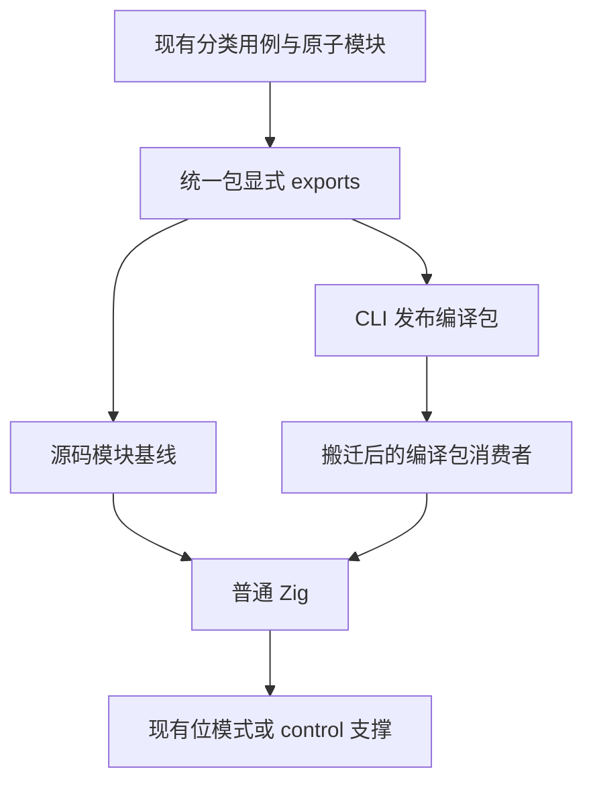
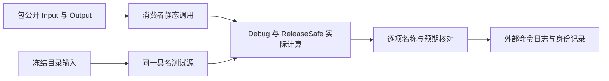

# 原始值统一库路线执行计划

## Intent：最终目标

采用 IDEA 框架，补齐近期 Number、Boolean 和 null 观察的统一包路线。同一目录用例分别经过源码模块基线和编译包公开消费者，实际执行 Debug、ReleaseSafe，拒绝仅凭源码路线扩大结论。

## Data：可用证据

现有 13 个入口、1,270 条逻辑用例已经在固定 `695c654ce3350eaa7f561d661135a2682fcb6ea8` 的普通源码路线执行。范围包括 f64 比较、取反比较、正负零除法、逐步舍入、二次幂及溢出、布尔取反、null 绑定和可赋值字段对照。原始值不经过 JSON 应用入口，继续使用现有位模式及 control 支撑。

现有发布测试证明 CLI 支持显式多模块 exports、公开类型和无源码编译包。复用真实发布及装载契约，公开 Input、Output 从包导入；内部 difference helper 不额外导出。

## Edges：边界与限制

- 只增加测试接线、夹具组织和记录；不修改生产编译器、原用例或 review，不创建分支。
- 一个统一包声明 13 个公开模块。纯原子功能不增加虚假的 RX 编排；这不代表完整统一库架构验收。
- 编译消费者的依赖目录只能包含 `pkg.yaml` 与 `library.zxcir`。原源码工作目录搬离原路径后再加载，拒绝源码回退。
- 两路线复用同一测试源及预期；重复执行计作覆盖，不增加独立用例数。
- 本批模块没有 requires/ensures，使用普通库发布，不额外传入 solver 强制静态证明；形式验证能力单独验收。
- 固定 CLI 的通过只归于固定版本；当前 HEAD、完整 root 和所有 zxc 特性仍需独立验收。
- 原始日志、JSON、归档和二进制保存在仓库外，不提交 docs 过程数据。

## Answer：交付格式与成功标准

新增专项 `test-primitive-libraries`，接入默认 runtime。冻结正式测试输入与工具，每模式真实发布一次编译包，再执行 13 个源码模块基线及 13 个编译消费者，核对全部具名测试、实际退出码、生成源码与二进制身份。失败保留原轮次，修复后另起轮次。

R2 发现源码的类型导入要求纯类型模块，不能照搬编译模块 Input/Output 的导入方式。沿用既有 predicate order 测试的两路线组织：源码直接编译提供方模块，编译库通过公开消费者执行，不复制类型声明或修改原始夹具。本批不宣称源码消费者类型导入与编译消费者完全对称。

执行后核对本轮 diff、TypeScript、格式、无专用 runtime、公开边界和证据完整性。使用英文 Conventional Commits 标题及正文提交并推送准确范围；执行记录说明实际通过及尚未验证的边界。

## 自我批判检查点

库路线通过不能替代原文适配审查，13 个入口也不能证明 RX 编排能力。必须核对编译消费者依赖目录、装载诊断和实际调用，不以发布成功或目录数量代替运行。构建图接线若未实际运行，应明确保留限制。
